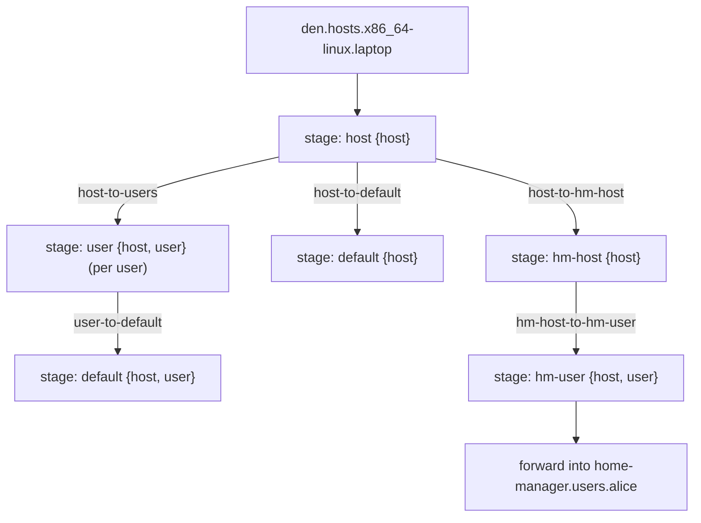

import { Steps, Aside } from '@astrojs/starlight/components';

<Aside title="Source" icon="github">
[`modules/policies/core.nix`](https://github.com/vic/den/blob/main/modules/policies/core.nix) --
[`modules/policies/flake.nix`](https://github.com/vic/den/blob/main/modules/policies/flake.nix) --
[`nix/lib/aspects/fx/pipeline.nix`](https://github.com/vic/den/blob/main/nix/lib/aspects/fx/pipeline.nix) --
[`nix/lib/aspects/fx/handlers/transition.nix`](https://github.com/vic/den/blob/main/nix/lib/aspects/fx/handlers/transition.nix)
</Aside>

## Pipeline overview

When Den evaluates a host, it runs a **resolution pipeline** driven by
[policies](/explanation/policies/) and [stages](/explanation/stages/).
Policies are directed edges that fan context out to downstream stages;
stages bind behavior for each resolved context.



<Steps>
1. **Host stage**

   For each entry in `den.hosts.<system>.<name>`, the pipeline enters the
   `host` stage. The stage's `provides.host` function receives `{ host }`
   and returns the host's own aspect, binding owned configs for the host's class.

2. **Core policies fan out**

   Core policies ([`modules/policies/core.nix`](https://github.com/vic/den/blob/main/modules/policies/core.nix))
   define the fundamental traversal edges:

   | Policy | From | To | Resolve |
   |---|---|---|---|
   | `host-to-users` | `host` | `user` | One edge per `host.users` entry |
   | `host-to-default` | `host` | `default` | Identity (passes context through) |
   | `user-to-default` | `user` | `default` | Identity |

   Each policy's `resolve` function receives the current context and returns a
   list of downstream contexts. `host-to-users` fans out: one `{ host, user }`
   pair per user declared on the host.

3. **Battery policies create derived stages**

   Batteries register additional policies that create derived stages when their
   conditions are met. Each battery uses `makeHomeEnv` to produce a pair of
   policies and matching stages:

   | Policy | Condition | Target entity kind |
   |---|---|---|
   | `host-to-hm-host` | HM enabled, host has `homeManager`-class users | `hm-host` |
   | `hm-host-to-hm-user` | Per `homeManager`-class user | `hm-user` |
   | `host-to-hjem-host` | hjem enabled, host has `hjem`-class users | `hjem-host` |
   | `hjem-host-to-hjem-user` | Per `hjem`-class user | `hjem-user` |
   | `host-to-maid-host` | nix-maid enabled, host has `maid`-class users | `maid-host` |
   | `maid-host-to-maid-user` | Per `maid`-class user | `maid-user` |
   | `host-to-wsl-host` | NixOS host with `wsl.enable` | `wsl-host` |

   The `-host` stage imports the battery's OS module (e.g., `home-manager.nixosModules.home-manager`).
   The `-user` stage forwards the resolved user aspect into the appropriate
   namespace (e.g., `home-manager.users.<name>`).

4. **Deduplication**

   The transition handler tracks a `seen` set keyed by context identity.
   When a stage is entered for the first time with a given context, the full
   aspect (owned configs + statics + parametric matches) is included.
   Subsequent visits with the same context key skip already-applied includes,
   preventing `den.default` configs from being applied twice when the same
   aspect appears at multiple stages.

   Each policy transition runs its own sub-pipeline with independent dedup
   state, so stages reached through different policies are isolated.

5. **Home configurations**

   Standalone `den.homes` entries follow a separate path with their own
   core policy:

   ```mermaid
   flowchart TD
     home["den.homes.x86_64-linux.alice"] --> homestage["stage: home {home}"]
     homestage -->|"home-to-default"| hdef["stage: default {home}"]
     homestage --> hmc["homeConfigurations.alice"]
   ```

   Home stages have no `host` in context, so policies and provides requiring
   `{ host }` are not activated. The `home-to-default` policy still applies
   shared defaults.

6. **Output**

   Flake-level policies (`modules/policies/flake.nix`) drive the final
   assembly. `flake-system-to-flake-os` iterates all hosts for a system;
   `flake-system-to-flake-hm` iterates all homes. Each resolved entity
   is instantiated (`lib.nixosSystem`, `darwinSystem`, or
   `homeManagerConfiguration` depending on class) and placed into
   `flake.nixosConfigurations`, `flake.darwinConfigurations`, or
   `flake.homeConfigurations`.

</Steps>

## See also

- [Entities and Schema](/explanation/entities/) -- what entities are
- [Policies](/explanation/policies/) -- how entities relate
- [Stages](/explanation/stages/) -- where behavior binds
- [Aspects](/explanation/aspects/) -- how entities resolve
