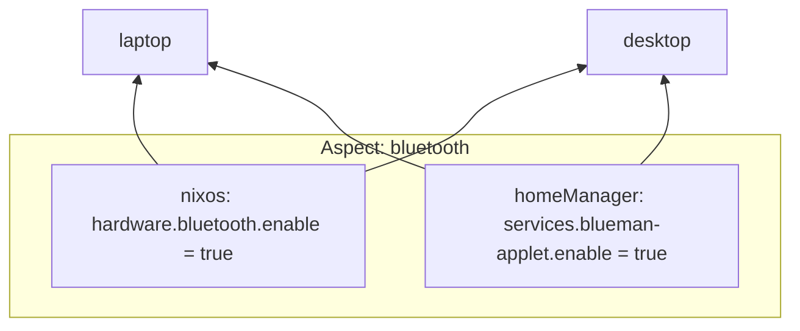

import { Aside } from '@astrojs/starlight/components';

Den has four core concepts. Each has one job:

| Concept | What it is | Where it lives |
|---------|-----------|----------------|
| **[Entity](/explanation/entities/)** | A typed data record — a host, user, or home | `den.hosts`, `den.homes`, `den.schema` |
| **[Aspect](/explanation/aspects/)** | A composable unit of configuration that spans Nix classes | `den.aspects` |
| **[Policy](/explanation/policies/)** | A function that defines how entities relate and route data | `den.policies` |
| **[Quirk](/explanation/quirks-and-pipes/)** | Structured data emitted by aspects, aggregated via pipes | `den.quirks` |

Entities declare *what exists*. Aspects declare *what it does*. Policies
declare *how things relate*. Quirks let aspects share structured data
without coupling.

These four concepts compose to support NixOS, nix-Darwin, home-manager,
WSL, MicroVM, flake-parts perSystem modules, machine fleets, and anything
else configurable through Nix modules.

<Aside title="Aspect-Oriented">
If you are familiar with Aspect-Oriented-Programming you will recognize how Den uses pointcuts to define where configurations get applied at each point in the pipeline.

> Pointcuts in **Aspect-Oriented-Programming** determine where additional behavior (advice) should be applied in your code, typically at method execution points.
</Aside>

<Aside title="Context-Driven">
Den is, fundamentally, a _data transformation_ pipeline (of your infra entities) to which _functions_ (producing configurations) are applied.


> A context transformation pipeline takes initially `{host}` and traverses its topology
> `host`->`[users]`->`[homes]` aggregating dependencies, optionally branching to support
> feature detection `host`->`wsl-host` or `host`->`[microvm-guest]`.
</Aside>

From our README header example:

```nix
# These three lines is how Den instantiates a configuration.
# Other Nix configuration domains outside NixOS/nix-Darwin
# can use the same pattern. demo: templates/nvf-standalone

# Den resolves entities declared in den.hosts automatically.
# Policies drive topology (host->[users]->[homes]).
# The pipeline collects all aspects and produces per-class modules.

# For manual resolution outside the pipeline:
aspect = den.lib.aspects.resolve "nixos" (den.aspects.my-aspect { host = den.hosts.x86_64-linux.my-laptop; });
nixosConfigurations.my-laptop = lib.nixosSystem { modules = [ aspect ]; };
```

Anything that you can describe via a data structure that can be traversed, can be configured like we do for NixOS. 

### Den is Aspect-oriented

<Aside icon="nix" title="Aspects">

An aspect is an attrset that contains modules of different Nix `class`.

```nix
gaming = { host, user }: { nixos = ...; homeManager = ...; hjem = ...; darwin = ... ; }
```

Such an attrset is an [**aspect**](https://dendrix.denful.dev/Dendritic.html) because it lets you configure a single cross-cutting concern (`gaming`) over different configuration domains.

Nix classes are NOT an artificial concept created by Den. There are [many nix classes in the wild](https://github.com/search?q=language%3ANix+%28%22+class+%3D+%22+AND+%22evalModules%22%29&type=code), the most common are [`nixos`](https://github.com/search?q=repo%3ANixOS%2Fnixpkgs+%22class+%3D+%5C%22nixos%5C%22%22&type=code), [`darwin`](https://github.com/nix-darwin/nix-darwin/blob/da529ac9e46f25ed5616fd634079a5f3c579135f/eval-config.nix#L81), [`homeManager`](https://github.com/nix-community/home-manager/blob/5be5d8245cbc7bc0c09fbb5f38f23f223c543f85/nixos/common.nix#L27).
</Aside>

Most importantly, the context `{host,user}` here are **not** `_module.args` **nor** `specialArgs`, it is an actual function, not a module-looking-as-a-function. This means config can depend on context without Nix infinite loops.

<Aside type="caution" title="Den context ≠ NixOS module args">
When Den docs say "context" they mean the pipeline parameters (`{ host }`, `{ host, user }`,
`{ home }`, or any combination) — a single attrset argument to a real Nix function. Context is
freeform: you can request any subset you need (e.g., `{ user }` alone, or `{ user, class }`), and
the pipeline introspects the argument pattern to decide where the function applies.
This is distinct from NixOS module arguments (`{ config, pkgs, lib, ... }`) which live inside the module system.
Den context is evaluated _before_ module evaluation, which is why it cannot cause infinite recursion.
</Aside>


### Den is Context-driven

Den uses **policies** and **schema includes** as **Aspect Pointcuts** — where
configuration is applied to data at a given point in the pipeline.
Say you have an entity kind `foo` with data shape `{ x }`:

```nix
# inherit (den.lib) policy;  # brings `policy.resolve.to` shorthand into scope
# This policy fans out from entity kind `foo` to entity kind `bar`
den.policies.foo-to-bar = { x, ... }:
  [ (policy.resolve.to "bar" { y = x; }) ];
```

Aspects activated on `bar` entities receive `{ y }` in their context:

```nix
# Aspect that configures using data available when resolving `bar` entities
den.aspects.bar-config = { y }: { nixos.something = y; };

# Activate it for all `bar` entities
den.schema.bar.includes = [ den.aspects.bar-config den.aspects.other ];
```

### Host resolution pipeline

This is how everything works in Den. Policies drive entity topology,
and schema includes activate aspects at each entity kind:

```nix
# inherit (den.lib) policy;  # brings `policy.resolve.to` shorthand into scope
# Activate the host's own aspect for all hosts
den.schema.host.includes = [ ({ host }: den.aspects.${host.aspect}) ];

# host -> users: fan-out policy
den.policies.host-to-users = { host, ... }:
  map (user: policy.resolve.to "user" { inherit host user; })
    (lib.attrValues host.users);

# Activate user aspects
den.schema.user.includes = [ ({ host, user }: den.aspects.${user.aspect}) ];

# conditional: only if HM is enabled for user and host
den.policies.user-to-hm-user = { host, user, ... }:
  lib.optional (host.hm.enable && lib.elem "homeManager" user.classes)
    (policy.resolve.to "hm-user" { inherit host user; });

# host -> wsl-host: same data shape, different entity kind
den.policies.host-to-wsl-host = { host, ... }:
  lib.optional host.wsl.enable
    (policy.resolve.to "wsl-host" { inherit host; });
```

**people can define their own extensions to Den's NixOS pipeline, or define other pipelines entirely**.

<Aside title="Real world examples">
Minimal real-life example: [wsl support](https://github.com/denful/den/blob/main/modules/aspects/batteries/wsl.nix)

[home-env](https://github.com/denful/den/blob/main/nix/lib/home-env.nix#L97) is how Den implements homeManager/hjem/maid support

[flake-parts perSystem classes](https://github.com/denful/den/blob/main/templates/flake-parts-modules/modules/classes/files.nix)

[microvm guests support](https://github.com/denful/den/blob/main/templates/microvm/modules/microvm-integration.nix#L46)
</Aside>

## Feature-First, Not Host-First

<Aside title="Recommended Read">
[Flipping the Configuration Matrix](https://not-a-number.io/2025/refactoring-my-infrastructure-as-code-configurations/#flipping-the-configuration-matrix) by [Pol Dellaiera](https://github.com/drupol) was very influential in Den design and is a very recommended read.

See also my [dendrix article](https://dendrix.denful.dev/Dendritic.html) about the advantages of aspect-oriented Nix.
</Aside>

Traditional Nix configurations start from hosts and push modules downward.
Den follows an aspect-oriented model that inverts this: **aspects** (features) are the primary organizational unit.
Each aspect declares its behavior per Nix class, and hosts simply select which
aspects apply to them.



An aspect consolidates all class-specific configuration for a single concern.
Adding bluetooth to a new host is one line: include the aspect.
Removing it is deleting that line.

## Context-Driven Dispatch

Den uses function **parametric dispatch**:
aspect functions declare which context parameters they need via their
argument pattern.

```nix
# Runs in every context (host, user, home)
{ nixos.networking.firewall.enable = true; }

# Runs only when a {host} context exists
({ host }: { nixos.networking.hostName = host.hostName; })

# Runs only when both {host, user} are present
({ host, user }: {
  nixos.users.users.${user.userName}.extraGroups = [ "wheel" ];
})
```

Den introspects function arguments at evaluation time. A function requiring
`{ host, user }` is silently skipped in contexts that only have `{ host }`.
No conditionals, no `mkIf`, no `enable` -- the context shape **is** the condition.

## Composition via Includes

Aspects form a directed acyclic graph through `includes` and form a tree of related aspects using `provides`.

```nix
den.aspects.workstation = {
  includes = [
    den.aspects.dev-tools
    den.aspects.gaming.emulation
    den.batteries.primary-user
  ];
  nixos.services.xserver.enable = true;
};
```


## Separation of Concerns

Den separates **what exists** from **what it does**:

| Layer | Purpose | Example |
|-------|---------|---------|
| Schema | Declare entities | `den.hosts.x86_64-linux.laptop.users.alice = {}` |
| Aspects | Configure behavior | `den.aspects.laptop.nixos.networking.hostName = "laptop"` |
| Policies | Entity topology and routing | `den.policies.host-to-users` fans out from hosts to users |
| Quirks | Structured data flow | `den.quirks.firewall` + `pipe.collect` aggregates across hosts |
| Batteries | Reusable patterns | `den.batteries.primary-user`, `den.batteries.user-shell` |

This separation means you can reorganize files, rename aspects, or add platforms
without restructuring your configuration logic.
