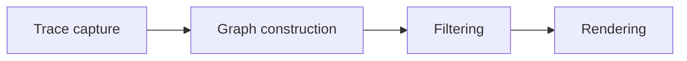

import { Aside } from '@astrojs/starlight/components';

<Aside title="Source" icon="github">
Capture: [`nix/lib/diag/capture.nix`](https://github.com/denful/den/blob/main/nix/lib/diag/capture.nix)
Rendering: [`denful/den-diagram`](https://github.com/denful/den-diagram)
</Aside>

## What it does

The `diag` library lets you visualize how Den resolves aspects -- which aspects include which, how policies fan out, which classes each aspect contributes to. It transforms structured trace data from the effects pipeline into a format-agnostic graph Intermediate Representation (Graph IR), applies filters and reshapes, then renders into Mermaid, GraphViz DOT, PlantUML, C4, and other formats.

## The pipeline

Every diagram passes through four stages:



1. **Trace capture** -- collect `structuredTrace` entries from aspect resolution.
2. **Graph construction** -- build format-agnostic IR (nodes, edges, stages, stage transitions).
3. **Filtering** -- prune, fold, and reshape the IR (user-declared-only, class slices, adapters-only, etc.).
4. **Rendering** -- emit diagram strings in the target format.

## Quick start

The simplest usage renders a host's full aspect graph as Mermaid:

```nix
diag.toMermaid (diag.hostContext { inherit host; })
```

Add a filter for a coarser overview:

```nix
diag.toMermaid (diag.graph.simplified (diag.hostContext { inherit host; }))
```

Or slice to a single class:

```nix
diag.toMermaid (diag.graph.classSlice "nixos" (diag.hostContext { inherit host; }))
```

## Convenience wrappers

Three wrappers build graph IR from common entity kinds without manually calling `den.lib.resolveEntity`:

- **`hostContext { host; classes?; direction?; }`** -- resolves from the host root. Defaults to `["nixos" "homeManager" "user"]` plus any user-declared classes.
- **`userContext { host; user; classes?; direction?; }`** -- resolves from the user root. Defaults to `["homeManager" "user"]`.
- **`homeContext { home; classes?; direction?; }`** -- resolves from a standalone home. Defaults to `["homeManager"]`.

For fully custom entities, use the generic `context` directly:

```nix
root = den.lib.resolveEntity "user" { inherit host user; };
g = diag.context { inherit root; name = user.name; classes = [ "homeManager" ]; };
```

## Filters and views

The graph IR is purely structural -- all visual decisions happen at filter and render time. This separation is why filters exist: the same captured graph can answer many different questions depending on which nodes you keep. Filters compose, so you pipe one into another to narrow the view.

A few representative filters under `diag.graph` give the flavour:

- **`simplified`** -- coarse overview that folds providers and entity-kind subgraphs away, leaving aspect edges only.
- **`classSlice "nixos"`** -- the ancestor closure of aspects active in a single class, for answering "what contributes to my NixOS config?".
- **`flattenEntityKinds`** -- a fold that removes entity-kind subgraph grouping when the boxes get noisy.

These are illustrative, not the full set. See the [`den.lib.diag` reference](/reference/diag/) for the complete catalogue of predicate, closure, reshape, fold, and composite filters.

## Renderers

A renderer turns the filtered IR into a diagram string in some target format. Because the IR is format-agnostic, the same graph drives every renderer -- the choice of renderer is purely a presentation decision. A few representative ones:

- **`toMermaid`** -- Mermaid flowchart, for embedding in docs and GitHub.
- **`toDot`** -- GraphViz DOT, better suited to large graphs and PDF export.
- **`toScopeEdgesMermaid`** -- a sequence-family renderer that draws scope topology edges.

Den ships many more (C4, sankey, treemap, mindmap, state, JSON, and fleet-wide variants). See the [`den.lib.diag` reference](/reference/diag/) for the full list grouped by family.

Every renderer has a `*With` variant (e.g. `toMermaidWith`) that accepts theme and config overrides. The `renderers` constructor builds a complete set with shared settings:

```nix
render = diag.renderers { inherit theme; mermaidConfig = { layout = "elk"; }; };
render.toMermaid graph
```

## Themes

Diagrams support base16 color schemes via `themeFromBase16`:

```nix
theme = diag.themeFromBase16 { inherit pkgs; scheme = "catppuccin-mocha"; };
```

Pass the theme to `renderers` or individual `*With` functions. The library provides `defaultTheme` as a fallback.

## Fleet diagrams

`diag.fleet.of` builds a fleet-wide graph across all hosts in a flake:

```nix
fleetData = diag.fleet.of { flakeName = "my-fleet"; };
```

Fleet graphs feed into fleet-specific renderers like `toFleetSankeyMermaid`, `toFleetTreemapMermaid`, and `toFleetProviderMatrix`.

## Export pipeline

For generating SVG derivations (e.g. for a docs site), use `renderContext` together with the `export` helpers:

```nix
rc = diag.renderContext { inherit pkgs theme; mermaidConfig = elkCfg; };
entries = diag.export.entityEntries { inherit pkgs rc diag; } {
  entity = diag.hostContext { inherit host; };
  name = host.name;
  dir = "hosts/${host.name}";
  viewDefs = rc.views.host;
};
```

The `renderContext` bundles pre-configured renderers (`rc.render`, `rc.renderDense`), SVG builder functions, and standard view definitions (`rc.views.host`, `rc.views.fleet`, etc.) into a single record. `export.entityEntries` turns those view definitions into per-view derivation entries for one entity; `export.fleetEntries` does the same for fleet-wide views. Entries then flow through `entriesToPackages` / `entriesToFiles` / `mkWriteScript`.

## See also

- [`den.lib.diag` reference](/reference/diag) -- complete list of wrappers, filters, renderers, themes, and export helpers
- [Aspects](/explanation/aspects) -- how aspects compose
- [Entities](/explanation/entities) -- the entity kinds that diagrams trace
- [Policies](/explanation/policies) -- policy fan-out visible in diagram views
