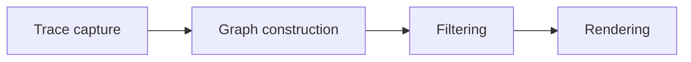

import { Aside } from '@astrojs/starlight/components';

<Aside title="Source" icon="github">
[`nix/lib/diag/`](https://github.com/denful/den/tree/main/nix/lib/diag)
</Aside>

## What it does

The `diag` library lets you visualize how Den resolves aspects -- which aspects include which, how policies fan out, which classes each aspect contributes to. It transforms structured trace data from the effects pipeline into a format-agnostic graph IR, applies filters and reshapes, then renders into Mermaid, GraphViz DOT, PlantUML, C4, and other formats.

## The pipeline

Every diagram passes through four stages:



1. **Trace capture** -- collect `structuredTrace` entries from aspect resolution.
2. **Graph construction** -- build format-agnostic IR (nodes, edges, stages, stage transitions).
3. **Filtering** -- prune, fold, and reshape the IR (user-declared-only, class slices, adapters-only, etc.).
4. **Rendering** -- emit diagram strings in the target format.

## Quick start

The simplest usage renders a host's full aspect graph as Mermaid:

```nix
diag.toMermaid (diag.hostContext { inherit host; })
```

Add a filter for a coarser overview:

```nix
diag.toMermaid (diag.graph.simplified (diag.hostContext { inherit host; }))
```

Or slice to a single class:

```nix
diag.toMermaid (diag.graph.classSlice "nixos" (diag.hostContext { inherit host; }))
```

## Convenience wrappers

Three wrappers build graph IR from common entity kinds without manually calling `den.lib.resolveStage`:

- **`hostContext { host; classes?; direction?; }`** -- resolves from the host root. Defaults to `["nixos" "homeManager" "user"]` plus any user-declared classes.
- **`userContext { host; user; classes?; direction?; }`** -- resolves from the user root. Defaults to `["homeManager" "user"]`.
- **`homeContext { home; classes?; direction?; }`** -- resolves from a standalone home. Defaults to `["homeManager"]`.

For fully custom entities, use the generic `context` directly:

```nix
root = den.lib.resolveStage "user" { inherit host user; };
g = diag.context { inherit root; name = user.name; classes = [ "homeManager" ]; };
```

## Filters and views

The graph IR is purely structural -- all visual decisions happen at filter and render time. Filters compose: pipe one into another to narrow the view.

Key filters under `diag.graph`:

| Filter | Effect |
|---|---|
| `simplified` | Coarse overview: folds providers and flattens stages |
| `userDeclaredOnly` | Only aspects with a class assignment |
| `filterUserAspects` | Removes wrapper/internal nodes |
| `classSlice "nixos"` | Ancestor closure of aspects in one class |
| `adaptersOnly` | Adapter nodes and their neighbors |
| `aspectsOnly` | Aspect-include edges only (no context/provider nodes) |
| `providersOnly` | Provider tree |
| `contextOnly` | Context hierarchy |

## Renderers

| Renderer | Format | Use case |
|---|---|---|
| `toMermaid` | Mermaid flowchart | Embed in docs, GitHub |
| `toDot` | GraphViz DOT | Large graphs, PDF export |
| `toPlantUML` | PlantUML | UML-style diagrams |
| `toSequenceMermaid` | Mermaid sequence | Stage resolution order |
| `toC4Context` | C4 model (PlantUML) | Architecture overviews |
| `toC4ComponentMermaid` | C4 model (Mermaid) | Architecture overviews in Mermaid |
| `toSankeyMermaid` | Mermaid sankey | Inclusion depth flow |
| `toTreemapMermaid` | Mermaid treemap | Aspect tree structure |
| `toMindmapMermaid` | Mermaid mindmap | Inclusion hierarchy |
| `toStateMermaid` | Mermaid state diagram | Stage state transitions |
| `toJSON` | JSON | Machine consumption |

Every renderer has a `*With` variant (e.g. `toMermaidWith`) that accepts theme and config overrides. The `renderers` constructor builds a complete set with shared settings:

```nix
render = diag.renderers { inherit theme; mermaidConfig = { layout = "elk"; }; };
render.toMermaid graph
```

## Themes

Diagrams support base16 color schemes via `themeFromBase16`:

```nix
theme = diag.themeFromBase16 { inherit pkgs; scheme = "catppuccin-mocha"; };
```

Pass the theme to `renderers` or individual `*With` functions. The library provides `defaultTheme` as a fallback.

## Fleet diagrams

`diag.fleet.of` builds a fleet-wide graph across all hosts in a flake:

```nix
fleetData = diag.fleet.of { flakeName = "my-fleet"; };
```

Fleet graphs feed into fleet-specific renderers like `toFleetSankeyMermaid`, `toFleetTreemapMermaid`, and `toFleetProviderMatrix`.

## Export pipeline

For generating SVG derivations (e.g. for a docs site), use `renderContext` and `export`:

```nix
rc = diag.renderContext { inherit pkgs theme; mermaidConfig = elkCfg; };
entries = diag.export.ofViews { inherit pkgs rc; } allHosts hostViewDefs fleetData fleetViewDefs;
```

The `renderContext` bundles pre-configured renderers, SVG builder functions, and standard view definitions (`rc.views.host`, `rc.views.fleet`, etc.) into a single record that templates consume.

## See also

- [Aspects](/explanation/aspects) -- how aspects compose
- [Stages](/explanation/stages) -- the resolution stages that diagrams trace
- [Policies](/explanation/policies) -- policy fan-out visible in diagram views
