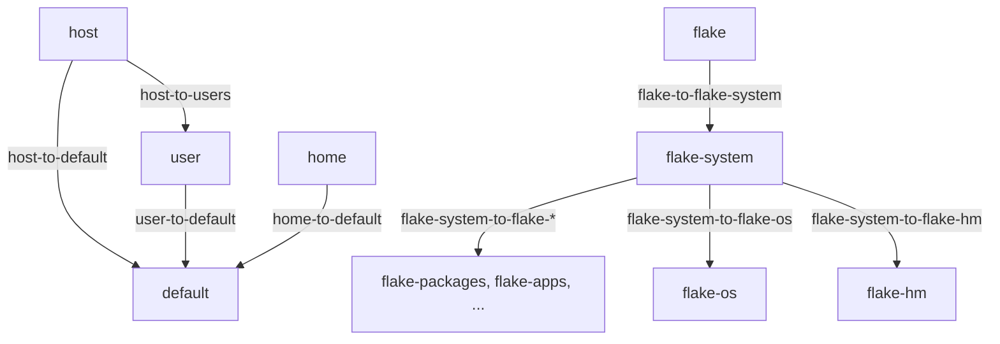

import { Aside } from '@astrojs/starlight/components';

<Aside title="Source" icon="github">
[`nix/lib/policy-types.nix`](https://github.com/vic/den/blob/main/nix/lib/policy-types.nix) --
[`modules/policies/core.nix`](https://github.com/vic/den/blob/main/modules/policies/core.nix) --
[`nix/lib/policy-inspect.nix`](https://github.com/vic/den/blob/main/nix/lib/policy-inspect.nix)
</Aside>

Policies are the second of Den's four concerns.
Where [entities](/explanation/entities/) declare *what things are* and [stages](/explanation/stages/) declare
*where behavior binds*, **policies** declare *how entities relate* -- the directed edges
that connect one entity kind to another.

## Why "policy"?

The word was chosen deliberately. A policy is an authority's rule for reaching a destination.
In the simple case that rule is trivial: "the policy for reaching users is: enumerate `host.users`."
In a complex case it might query an external registry, compute group membership, or apply
access-control logic. The term captures active computation, external authority, and
discrimination in a way that "edge" or "transition" do not.

## The policy graph



Each arrow is a policy. The pipeline walks this graph at evaluation time: starting from
a root entity kind, it fires every active policy whose `from` matches, calls its `resolve`
function, and recurses into the targets.

## Policy anatomy

A policy is declared under `den.policies.<name>` as a submodule with five fields:

| Field | Type | Purpose |
|-------|------|---------|
| `from` | string | Source entity kind (e.g. `"host"`) |
| `to` | string | Target entity kind or stage name |
| `as` | string | Context key for the output (defaults to `to`). Useful for sibling routing where `from == to`. |
| `resolve` | function | Takes pipeline context, returns a list of target context attrsets |
| `handlers` | attrs | Named effect handlers installed when this policy fires |

The core policy `host-to-users` in `modules/policies/core.nix` illustrates the pattern:

```nix
host-to-users = {
  _core = true;
  from = "host";
  to = "user";
  resolve = { host, ... }:
    map (user: { inherit host user; })
        (lib.attrValues host.users);
};
```

The `resolve` function destructures its context argument directly -- `{ host, ... }:` rather
than a monolithic `ctx:` argument. This works because the synthesis layer validates that
the required entity keys are present before calling `resolve`.

## Activation model

Not every policy fires for every entity. Den uses a three-tier activation model:

**Core policies** (`_core = true`) are always active. These are the fundamental
traversals defined in `modules/policies/core.nix` -- `host-to-users`, `host-to-default`,
and so on. You never need to opt into them.

**Entity-kind activation** uses `den.schema.<kind>.policies` to enable a policy for
every entity of that kind:

```nix
den.schema.host.policies = [ "host-to-peers" ];
```

**Entity-instance activation** uses `den.hosts.<system>.<name>.policies` (or the
equivalent for other entity kinds) to enable a policy for a single entity:

```nix
den.hosts.x86_64-linux.igloo.policies = [ "host-to-peers" ];
```

The pipeline merges all three tiers: core policies are always included, then kind-level
and instance-level lists are unioned. A policy only fires when its `from` matches the
current entity kind *and* the policy appears in the merged active set.

## Writing a custom policy

Suppose you want hosts to discover their peers for mesh networking:

```nix
den.policies.host-to-peers = {
  from = "host";
  to = "host";
  as = "peer";  # avoids collision since from == to
  resolve = { host, ... }:
    lib.filter (h: h.hostName != host.hostName)
      (lib.attrValues den.hosts.${host.system});
};

# Activate for all hosts
den.schema.host.policies = [ "host-to-peers" ];
```

The `as = "peer"` field is critical here: without it the target context key would
collide with the source `host` key. With it, downstream stages receive `{ host, peer }`.

## Inspecting policies

The `den.lib.policyInspect.inspect` function lets you probe the policy graph without
running the full pipeline:

```nix
den.lib.policyInspect.inspect {
  kind = "host";
  context = { host = den.hosts.x86_64-linux.myhost; };
}
# => { host-to-users = { from = "host"; to = "user"; targets = [ ... ]; ... }; }
```

Each entry in the result tells you the `from`, `to`, `as`, resolved `targets` list,
and whether the routing is `"sibling"` or `"child"`. This is invaluable for debugging
"why did host X get module Y?" questions.

<Aside type="tip">
  The inspect utility calls resolve functions directly. It is cheap and does not
  trigger a full pipeline evaluation.
</Aside>

## Relation to other concerns

Policies sit between data and behavior in the four-concern model:

1. **Data** ([Entities](/explanation/entities/)) defines what an entity *is*.
2. **Policies** (this page) define how entities *relate* -- the graph edges.
3. **Stages** ([Stages](/explanation/stages/)) define *where* behavior binds in the pipeline.
4. **Behavior** ([Aspects](/explanation/aspects/)) defines *how* entities resolve into configuration.

For the full option reference, see [den.policies](/reference/policies/).
