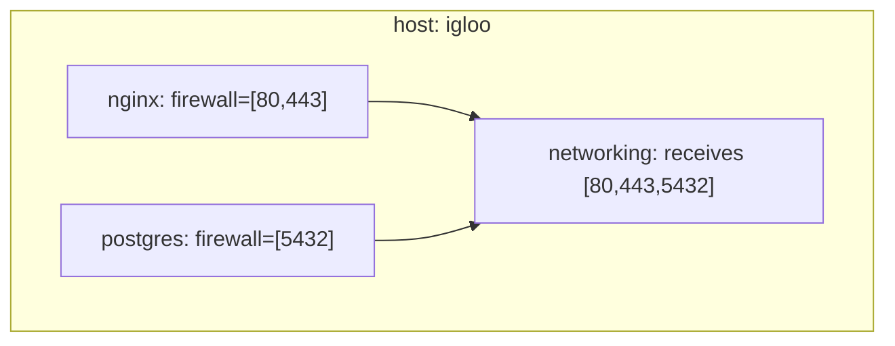

import { Aside } from '@astrojs/starlight/components';

<Aside title="Source" icon="github">
[`modules/options.nix`](https://github.com/denful/den/blob/main/modules/options.nix) --
[`nix/lib/aspects/fx/assemble-pipes.nix`](https://github.com/denful/den/blob/main/nix/lib/aspects/fx/assemble-pipes.nix) --
[`nix/lib/policy-effects.nix`](https://github.com/denful/den/blob/main/nix/lib/policy-effects.nix)
</Aside>

## What is a quirk?

A **quirk** is structured data emitted by an aspect on a named key
registered in `den.quirks`. A **pipe** is a policy effect that routes,
filters, transforms, or aggregates quirk data — within a scope or
across hosts. Producers emit quirks without knowing who consumes them;
policies wire producers to consumers.

## The problem

Quirks and pipes solve a fundamental problem: how do multiple aspects
contribute structured data that a single consumer assembles? Firewall
ports, backup paths, persistence directories, monitoring endpoints —
these are all cases where many producers feed one consumer.

Without quirks, the only way to share data between aspects is through NixOS
module options. This works but creates coupling: every producer must know the
consumer's option path, and cross-entity aggregation (e.g., collecting ports
from all users on a host) requires manual wiring.

```nix
# Without quirks — tight coupling
den.aspects.nginx = {
  nixos.networking.firewall.allowedTCPPorts = [ 80 443 ];
};
den.aspects.postgres = {
  nixos.networking.firewall.allowedTCPPorts = [ 5432 ];
};
```

With quirks, producers don't know or care about consumers:

```nix
# With quirks — decoupled
den.aspects.nginx = {
  firewall = { ports = [ 80 443 ]; };
};
den.aspects.postgres = {
  firewall = { ports = [ 5432 ]; };
};
```

## Three roles

The quirks system separates three concerns:

| Role | Who | What they do |
|---|---|---|
| **Producer** | Any aspect | Emits data on a named quirk key |
| **Architect** | Policy author | Declares pipes and routing via `pipe.from` |
| **Consumer** | Class module | Receives assembled data via function args |

Producers and consumers don't know about each other. The architect wires
them together via policy pipe effects.

## How it works

### 1. Declare a quirk

Register the quirk name in `den.quirks`. This tells the pipeline to classify
matching aspect keys as pipe data rather than class modules:

```nix
den.quirks.firewall = {
  description = "Firewall port declarations";
};
```

<Aside type="caution">
Quirk names must not collide with class names (`den.classes`). The pipeline
asserts this at evaluation time.
</Aside>

### 2. Produce data

Any aspect can emit data on a quirk key. The pipeline collects these values
scope-locally (per entity):

```nix
den.aspects.nginx = {
  nixos.services.nginx.enable = true;
  firewall = { ports = [ 80 443 ]; };
};

den.aspects.postgres = {
  nixos.services.postgresql.enable = true;
  firewall = { ports = [ 5432 ]; };
};
```

Quirk values can be attrsets, lists, or any Nix value. List values are
auto-flattened — `[ [a b] [c] ]` becomes `[a b c]`.

### 3. Consume data

A class module receives quirk data by naming the quirk in its function
arguments:

```nix
den.aspects.networking = {
  nixos = { firewall, lib, ... }: {
    networking.firewall.allowedTCPPorts =
      lib.concatMap (f: f.ports or []) firewall;
  };
};
```

The `firewall` argument receives a list of all quirk values collected in
the current scope. If no producers emitted data, it's `[]`.

<Aside>
Quirk args are delivered via the same `wrapClassModule` mechanism that
delivers entity context (`host`, `user`). They're pre-applied before
the module system sees the function.
</Aside>

### 4. Route with pipes (optional)

For simple same-scope aggregation, steps 1-3 are sufficient — no pipe
policies needed. When you need filtering, transformation, or cross-scope
flow, declare a pipe policy:

```nix
den.policies.filter-tcp = { host, ... }:
  let inherit (den.lib.policy) pipe; in
  [ (pipe.from "firewall" [
      (pipe.filter (e: e.proto == "tcp"))
    ])
  ];
```

See [Pipes guide](/guides/quirks/) for hands-on examples of all pipe stages.

## Scope model

Quirk data is **scope-local** by default. Each entity (host, user, home)
has its own scope, and producers within that scope contribute to that
scope's pool.



### Upward flow with `pipe.expose`

Child-scope data can flow upward. A user's quirk data reaches the host
scope via `pipe.expose`:

```nix
den.policies.expose-prefs = { host, user, ... }:
  let inherit (den.lib.policy) pipe; in
  [ (pipe.from "prefs" [ pipe.expose ]) ];
```

### Renaming with `pipe.as`

`pipe.as` delivers data under a different quirk name. This creates
**derived quirks** — quirks with no native emitters, populated entirely
from other pipes via collect + transform + rename:

```nix
den.policies.derive-targets = { host, ... }:
  let inherit (den.lib.policy) pipe; in
  [ (pipe.from "backends" [
      (pipe.transform (b: "${b.addr}:${toString b.port}"))
      (pipe.as "monitoring-targets")
    ])
  ];
```

Consumers of `monitoring-targets` receive the transformed data. Consumers
of `backends` are unaffected. Composes with `pipe.to` and `pipe.collect`.

### Cross-scope with `pipe.collect`

`pipe.collect` harvests data from sibling scopes matching a predicate.
This enables cross-host aggregation — e.g., collecting all hosts' ports
for a load balancer:

```nix
den.policies.collect-ports = { host, ... }:
  let inherit (den.lib.policy) pipe; in
  [ (pipe.from "firewall" [
      (pipe.collect ({ host, ... }: true))
    ])
  ];
```

Siblings are scopes sharing the same parent in the scope tree.

## Pipeline-time discriminators

When an aspect requires a quirk argument (`{ firewall, ... }:`), the
pipeline defers its inclusion during the tree walk. After all producers
have emitted their data and pipes are assembled, deferred aspects are
resolved with the assembled pipe data.

**Include ordering does not matter.** Whether the consumer appears before
or after producers in `includes`, the result is identical. This eliminates walk-order
sensitivity — consumers always see all available data regardless of
include order.

## Config-dependent thunks

Quirk values can depend on a host's `config` (e.g., reading a port from
NixOS options). These are collected as bare functions and resolved lazily:

- **Local thunks**: Resolved inside `evalModules` using the entity's own
  config fixpoint.
- **Cross-host thunks** (via `pipe.collect`): Resolved eagerly against
  the source host's instantiated config.

```nix
den.aspects.my-service = {
  firewall = { config, ... }: {
    ports = [ config.services.my-service.port ];
  };
};
```

## Relationship to other systems

| What | When to use |
|---|---|
| **Quirks** | Structured data aggregation within or across scopes |
| **Policies** | Entity topology (fan-out, routing) |
| **`provides`** | Cross-entity aspect delivery (host↔user) |
| **Class modules** | NixOS/Darwin/HM configuration |

## See also

- [Quirks guide](/guides/quirks/) — hands-on examples
- [den.quirks reference](/reference/quirks/) — option types and pipe builder API
- [Policies](/explanation/policies/) — how pipe effects compose with other policy effects
