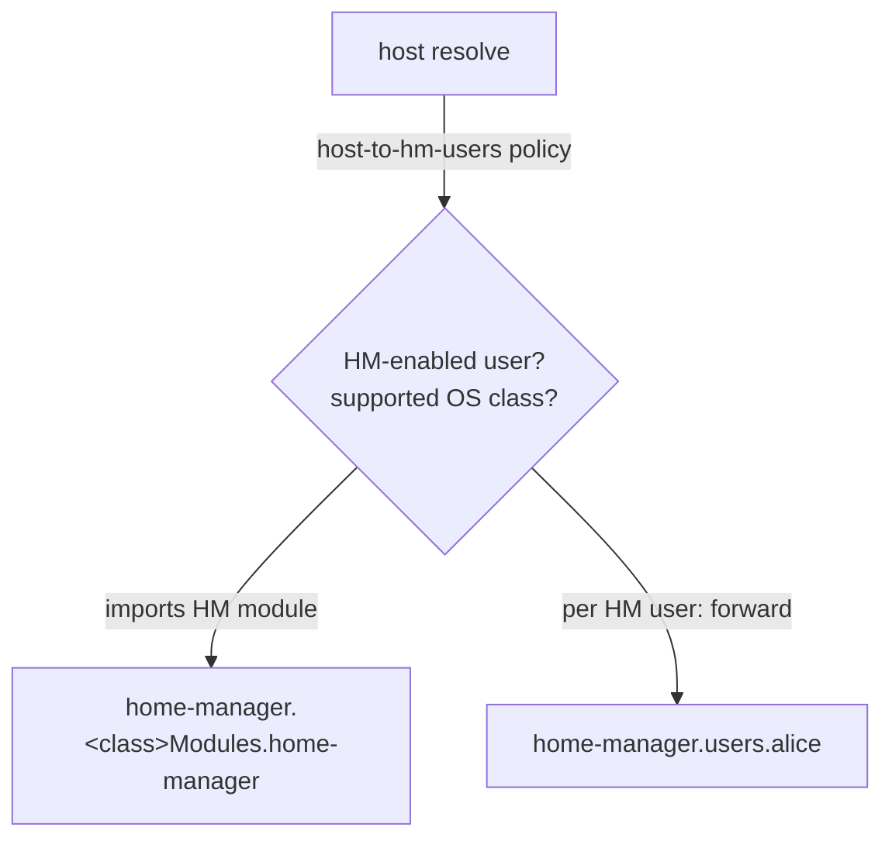

import { Aside } from '@astrojs/starlight/components';


<Aside title="Source" icon="github">
[`home-manager.nix`](https://github.com/denful/den/blob/main/modules/aspects/batteries/home-manager.nix) ·
[`hjem.nix`](https://github.com/denful/den/blob/main/modules/aspects/batteries/hjem.nix) ·
[`maid.nix`](https://github.com/denful/den/blob/main/modules/aspects/batteries/maid.nix) ·
[`home-env.nix`](https://github.com/denful/den/blob/main/nix/lib/home-env.nix)
</Aside>

## Enabling Homes

Den supports several Home Nix classes:

- `homeManager`
- `hjem`
- `maid`
- `user`

All Home integrations are opt-in and must be enabled explicitly, except for `user` which is the built-in user environment on NixOS and nix-Darwin.

```nix
# Per user
den.hosts.x86_64-linux.igloo.users.tux.classes = [ "homeManager" "hjem" ];

# As default for all users, unless they specify other classes.
den.schema.user.classes = lib.mkDefault [ "homeManager" ];
```

Home integration only activates when at least one host user has `homeManager`
in their `classes`. When it does, the integration imports the Home Manager OS
module and forwards each user's `homeManager` class into
`home-manager.users.<userName>`.

The same details apply to other home types like `hjem` and `maid`.

### Requirements

- `inputs.home-manager` must exist in your flake inputs or have custom `host.home-manager.module`.
- At least one user must have `homeManager` in their `classes`.

### How it Works



The `home-manager` battery is built by `makeHomeEnv` in
[`nix/lib/home-env.nix`](https://github.com/denful/den/blob/main/nix/lib/home-env.nix)
and included via `den.schema.host.includes`. It contributes:

1. A `host-to-hm-users` policy that fires during host resolution. When the host
   has at least one user with `homeManager` in their `classes` and a supported
   OS class (`nixos` or `darwin`), it imports the Home Manager OS module and, for
   each HM user, forwards that user's `homeManager` class into
   `home-manager.users.<userName>`.
2. An `hm-user-detect` policy on the user scope, which covers users resolved via
   the registry or other policies rather than declared directly on `host.users`.

### Configuring Home Manager

```nix
den.aspects.alice = {
  homeManager = { pkgs, ... }: {
    home.packages = [ pkgs.htop ];
    programs.git.enable = true;
  };
};
```

The `homeManager` class contents are forwarded to the OS-level
`home-manager.users.alice` automatically.

### Custom HM Module

Override the HM module per host if needed:

```nix
den.hosts.x86_64-linux.laptop = {
  users.vic.classes = [ "homeManager" ];
  home-manager.module = inputs.home-manager-unstable.nixosModules.home-manager;
};
```

## Standalone Homes (homeManager)

For machines without root access:

```nix
den.homes.x86_64-linux.tux = { };
```

This produces a `homeConfigurations.tux` that can be built with the `home-manager` CLI.

### Standalone Homes bound to Host OS

To associate a home with a specific host, name the home using the following
format:

```nix
den.homes.x86_64-linux."tux@igloo" = { };
```

This will output `homeConfigurations."tux@igloo"`. Given a system where the
following is true:

```bash
$ whoami
tux

$ hostname
igloo
```

The `home-manager` CLI will automatically select `homeConfigurations."tux@igloo"`
as the output.

You can configure the home using the aspect named after the user:

```nix
den.aspects.tux = { }; # user configuration for tux that should apply on any hosts
```

Den will correctly set `<home>.userName` so that batteries like `define-user` work.

Note: `igloo` here does *not* need to be a host managed by den (e.g.
`den.hosts.<system>.igloo`), it can also represent the hostname of an externally
managed machine outside of your control.

#### Host-specific standalone home configuration

Cross-entity routing is built in, so a host-bound standalone home can receive
configuration aimed at a specific host through the aspect's `provides`. Name the
provide after the host:

```nix
den.homes.x86_64-linux."tux@igloo" = { };

# user configuration for tux that should only apply on igloo
den.aspects.tux.provides.igloo = { };
```

See [Mutual provision](/guides/mutual/) for the full cross-entity routing
patterns.

#### Separate host and user configuration

This pattern allows you to manage your host and user separately:

```
den.hosts.x86_64-linux.igloo.users.tux = { };
den.homes.x86_64-linux."tux@igloo" = { };
```

Unlike host-managed user configurations, the host and user configuration can be
activated independently from each other.

This can speed up the rebuild process since you no longer need to rebuild both
environments every time.

Tip: The host configuration can still be read by the user via the `osConfig`
module argument

## hjem

[hjem](https://github.com/feel-co/hjem) is an alternative, lightweight home environment manager.

### Enabling

```nix
# Per host
den.hosts.x86_64-linux.laptop = {
  users.alice.classes = [ "hjem" ];
};

# On all hosts
den.schema.host.hjem.enable = true;
```

### Requirements

- `inputs.hjem` must exist.
- Users must have `hjem` in their `classes`.

### Using

```nix
den.aspects.alice.hjem = { };
```

## nix-maid

[nix-maid](https://github.com/nix-maid) is another user-environment manager for NixOS.

### Enabling

```nix
den.hosts.x86_64-linux.laptop = {
  users.alice.classes = [ "maid" ];
};
```

### Requirements

- `inputs.nix-maid` must exist.
- Host class must be `"nixos"`.
- Users must have `maid` in their `classes`.

### Using

```nix
den.aspects.alice.maid = {
  # nix-maid configuration
};
```

## Multiple User Environments

A user can participate in multiple environments:

```nix
den.hosts.x86_64-linux.laptop = {
  users.alice.classes = [ "homeManager" "hjem" ];
  home-manager.enable = true;
  hjem.enable = true;
};
```

Both `homeManager` and `hjem` configurations from `den.aspects.alice` will
be forwarded to their respective targets.

## Host-scope parametric aspects no longer deliver homeManager content to users

Earlier releases let a `{ user, ... }` aspect at host scope leak its
`homeManager` content to each of the host's users. A host-scope parametric
aspect now fans out over the users but emits class-locally **on the host**,
where `homeManager` is inert -- so that content never reaches the users'
Home Manager evaluation. This matches the resolver's emission rule: the bound
user is the arg source, not the output target.

If you were relying on that leak to push home content from a host-scope aspect,
route it through an explicit `to-users` policy, `provides`, or the host-aspects
battery instead.
