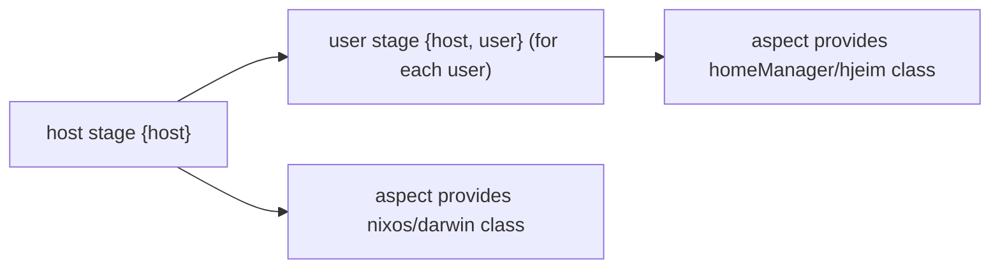
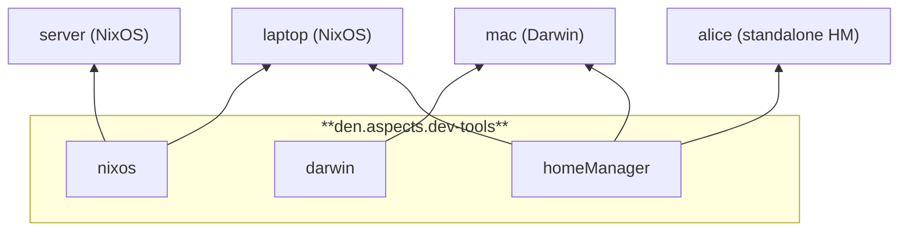
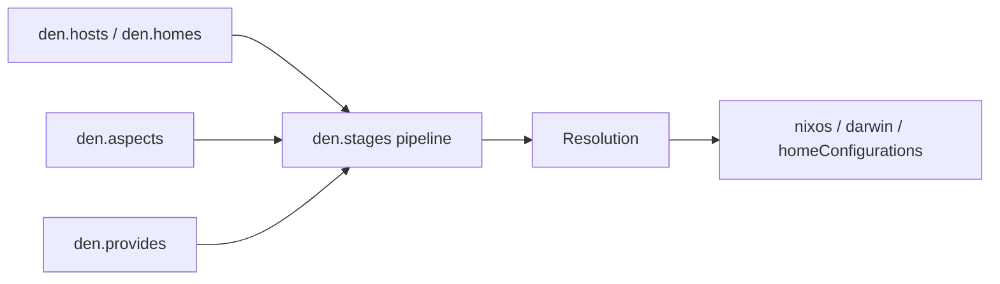

import { Steps, LinkButton, Card, CardGrid } from '@astrojs/starlight/components';

## Testimonials

<div class="testimonials">

> Den takes the Dendritic pattern to a whole new level, and I cannot imagine going back.\
> — `@adda` - Very early Den adopter after using Dendritic flake-parts and Unify. [\[repo\]](https://codeberg.org/Adda/nixos-config)

> I’m super impressed with den so far, I’m excited to try out some new patterns that Unify couldn’t easily do.\
> — `@quasigod` - Author of [_Unify_](https://codeberg.org/quasigod/unify) dendritic-framework, on adopting Den. [\[repo\]](https://tangled.org/quasigod.xyz/nixconfig)

> Massive work you did here!\
> — `@drupol` - Author of [_“Flipping the Configuration Matrix”_](https://not-a-number.io/2025/refactoring-my-infrastructure-as-code-configurations/#flipping-the-configuration-matrix) Dendritic blog post.

> Thanks for the awesome library and the support for non-flakes… it’s positively brilliant!. I really hope this gets wider adoption.\
> — `@vczf` - At [`#den-lib:matrix.org`](https://matrix.to/#/#den-lib:matrix.org) channel.

> Den is a playground for some very advanced concepts. I’m convinced that some of its ideas will play a role in future Nix areas. In my opinion there are some raw diamonds in Den.\
> — `@Doc-Steve` - Author of [_Dendritic Design Guide_](https://github.com/Doc-Steve/dendritic-design-with-flake-parts)

</div>


## The Problem

Traditional Nix configurations are host-first. Bluetooth on three machines means three files with duplicated config — one per host, split again across NixOS and home-manager.

```nix
# Without Den — duplicated across hosts and module systems
hosts/laptop/configuration.nix   # hardware.bluetooth.enable = true
hosts/laptop/home.nix            # services.blueman-applet.enable = true
hosts/desktop/configuration.nix  # hardware.bluetooth.enable = true (again)
hosts/mac/darwin.nix             # homebrew.casks = [ "blueutil" ] (different syntax)
```

## The Den Way

Den inverts this: **aspects** are the primary unit. One aspect, all platforms.

```nix
# With Den — one aspect configures everything
den.aspects.bluetooth = {
  nixos.hardware.bluetooth.enable = true;
  homeManager.services.blueman-applet.enable = true;
  darwin.homebrew.casks = [ "blueutil" ];
};

# Every host that includes it gets bluetooth — across all classes
den.aspects.laptop.includes = [ den.aspects.bluetooth ];
den.aspects.desktop.includes = [ den.aspects.bluetooth ];
```

Den context args flow automatically — no wrappers, no `specialArgs`, no infinite recursion:

```nix
# Den args and NixOS module args coexist in a single function
den.aspects.laptop.nixos = { host, config, pkgs, ... }: {
  networking.hostName = host.name;
};
```

## How It Works

Den is a **library** for composing Nix configurations via [aspect-oriented programming](/explanation/core-principles/) and a **framework** for NixOS/Darwin/home-manager built on top.

Under the hood, Den uses a pure [algebraic effects](/explanation/effects/) pipeline — aspects compile to computations, handlers decide what to do, and a trampoline interprets the result. This gives you extensible [policies](/explanation/policies/) for entity topology, [diagrams](/explanation/diagrams/) of your resolution graph, and [custom classes](/guides/custom-classes/) for any Nix module system.

<div style="display: grid; grid-template-columns: 1fr 1fr; grid-gap: 20px;">
<div>

</div>
<div>

</div>
</div>


## Den as a *library*

<CardGrid>
  <Card title="Aspect-Oriented" icon="puzzle">
    [Aspects](/explanation/aspects/) bundle NixOS, Darwin, home-manager, or [custom class](/guides/custom-classes/) config in one composable unit.
    Includes form a DAG. Provides create sub-aspects. One concern, all platforms.
  </Card>
  <Card title="Pure Effects Pipeline" icon="right-arrow">
    Built on [algebraic effects](/explanation/effects/) via `nix-effects`. Aspects compile to computations, handlers own resolution strategy. [Policies](/explanation/policies/) drive entity topology. [Stages](/explanation/stages/) bind behavior. Everything is extensible.
  </Card>
  <Card title="No Lock-in" icon="open-book">
    Works with flake-parts, without flake-parts, or [without flakes at all](/tutorials/noflake/).
    Den works with anything configurable through Nix modules — NixOS, Terraform, NixVim, or your own domain.
  </Card>
  <Card title="Sharable Aspects" icon="star">
    [Namespaces](/guides/namespaces/) let you publish and consume aspect libraries across flakes or non-flakes.
    [Diagrams](/explanation/diagrams/) visualize your resolution graph for debugging and documentation.
  </Card>
</CardGrid>

## Den as a _framework_.

Built on top of `den.lib`, Den provides a framework with ready-made facilities for 
NixOS/nix-Darwin/homes configurations.



<Steps>
1. **Schema** -- `den.hosts` and `den.homes` declare machines, users, and their properties with `den.schema` modules and extensible freeform types.
2. **Aspects** -- `den.aspects.*` bundles per-class configs (`nixos`, `darwin`, `homeManager`, or any custom class) with `.includes` and `.provides` forming a DAG.
3. **Resolution pipeline** -- `den.policies` fan out from entity kinds (`{host}` → `{host, user}`, `{home}`), while `den.stages` bind behavior at each pipeline step. Batteries register derived entity kinds like `hm-host`, `hm-user`, `wsl-host`.
4. **Resolution** -- Context-aware dispatch: functions receive entity data automatically based on their argument shape. [Class modules](/explanation/class-modules/) can access both Den context and NixOS module args in a single function.
5. **Output** -- Each host/home is instantiated via `nixpkgs.lib.nixosSystem`, `darwin.lib.darwinSystem`, or `home-manager.lib.homeManagerConfiguration`.
</Steps>

<LinkButton icon="right-arrow" variant="primary" href="/explanation/core-principles">Learn More</LinkButton>

<LinkButton variant="minimal" href="/tutorials/microvm">Extensibility Example: MicroVM</LinkButton>


## Den is made possible by amazing people

<a href="https://github.com/vic/den/graphs/contributors">
  
</a>

## Star History

[](https://github.com/vic/den)
