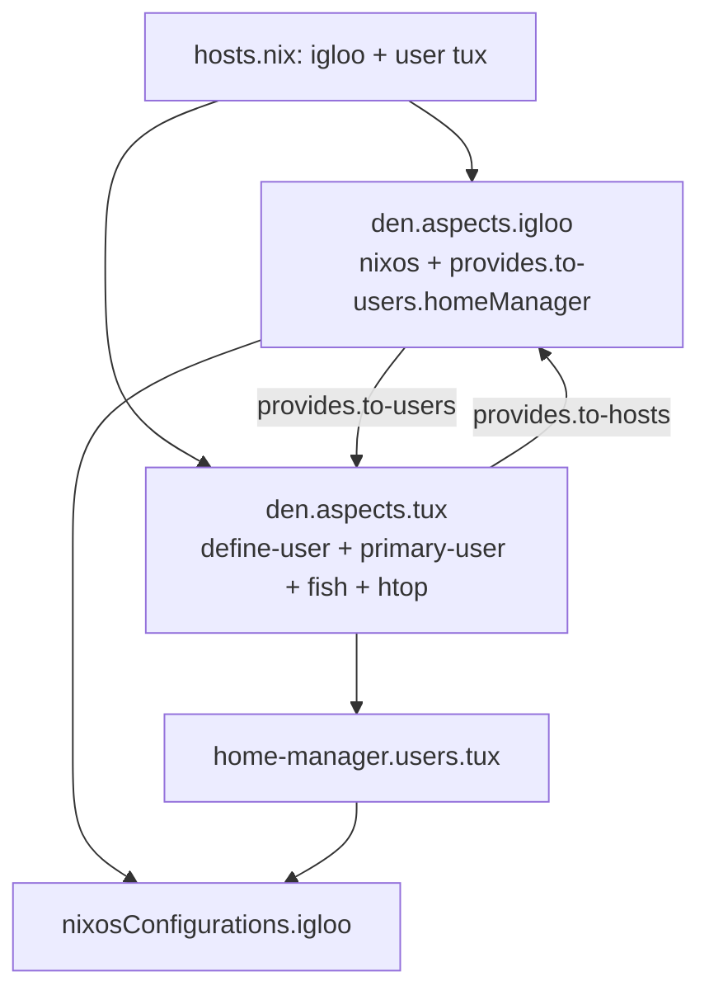

import { Aside } from '@astrojs/starlight/components';

<Aside title="Source" icon="github">
[`templates/default`](https://github.com/denful/den/tree/main/templates/default)
</Aside>

The default template is the recommended way to start a new Den project. It includes flake-parts, Home-Manager, dendritic flake-file, and a VM for testing.

## Initialize

```console
mkdir my-nix && cd my-nix
nix flake init -t github:denful/den#default
nix flake update den
```

## Project Structure

```
flake.nix              # auto-generated by flake-file (do not edit)
modules/
  dendritic.nix        # flake-file inputs + dendritic flake modules
  hosts.nix            # host and user declarations
  defaults.nix         # global settings (stateVersion, default class, etc.)
  igloo.nix            # host aspect
  tux.nix              # user aspect
  vm.nix               # VM runner
  nh.nix               # per-host/home build apps via nh
```

The tree is loaded with [import-tree](https://github.com/denful/import-tree): every
`.nix` file under `modules/` is imported automatically, so you add configuration
by dropping in new files.

## File by File

### hosts.nix — Declare Your Infrastructure

```nix
{
  den.hosts.x86_64-linux.igloo.users.tux = { };
}
```

This single line declares:
- A host `igloo` on `x86_64-linux` (class: `nixos`)
- A user `tux` on that host (class: `homeManager`)

The host and user each get an aspect (`den.aspects.igloo` and `den.aspects.tux`) that you configure in separate files.

### igloo.nix — Host Aspect

```nix
{
  den.aspects.igloo = {
    # host NixOS configuration
    nixos = { pkgs, ... }: {
      environment.systemPackages = [ pkgs.hello ];
    };

    # host provides default home environment for its users
    provides.to-users.homeManager = { pkgs, ... }: {
      home.packages = [ pkgs.vim ];
    };
  };
}
```

The host aspect:
- Emits **NixOS config** directly — system packages available to all users
- Uses `provides.to-users.homeManager` to deliver a default Home-Manager
  environment to every user on this host. `provides.to-users` is a cross-entity
  delivery target — the host hands this content down to each of its users.

### tux.nix — User Aspect

```nix
{ den, ... }:
{
  den.aspects.tux = {
    includes = [
      den.batteries.define-user
      den.batteries.primary-user
      (den.batteries.user-shell "fish")
    ];

    homeManager = { pkgs, ... }: {
      home.packages = [ pkgs.htop ];
    };

    # user can provide NixOS configurations
    # to any host it is included on
    provides.to-hosts.nixos = { pkgs, ... }: { };
  };
}
```

The user aspect:
- Includes [`define-user`](/reference/batteries/#den-batteries-define-user) — defines the user at the OS and Home levels
- Includes [`primary-user`](/reference/batteries/#den-batteries-primary-user) — adds wheel + networkmanager groups
- Includes [`user-shell`](/reference/batteries/#den-batteries-user-shell) — sets fish as default shell at OS and HM level
- Provides personal Home-Manager packages
- Uses `provides.to-hosts.nixos` to push NixOS config up to any host it is included on (empty here, ready to fill in)

### defaults.nix — Global Settings

```nix
{ lib, den, ... }:
{
  den.default.nixos.system.stateVersion = "25.11";
  den.default.homeManager.home.stateVersion = "25.11";

  # enable hm by default
  den.schema.user.classes = lib.mkDefault [ "homeManager" ];

  # User TODO: REMOVE THIS — placeholder boot/filesystem so the
  # example host evaluates. Replace with your real hardware config.
  den.aspects.tux.nixos = {
    boot.loader.grub.enable = false;
    fileSystems."/".device = "/dev/fake";
    fileSystems."/".fsType = "auto";
  };
}
```

`den.default` applies an aspect to **all** hosts, users, and homes — the right
place for `stateVersion` and other global settings. `den.schema.user.classes`
sets the default output class for users (here, `homeManager`), so every user
gets a Home-Manager environment without declaring it per-user. The
`den.aspects.tux.nixos` block is a placeholder so the example evaluates into a
buildable system; delete it once you add real hardware configuration.

### vm.nix — Test in a VM

```nix
{ inputs, den, ... }:
{
  den.aspects.igloo.includes = [ (den.batteries.tty-autologin "tux") ];

  perSystem = { pkgs, ... }: {
    packages.vm = pkgs.writeShellApplication {
      name = "vm";
      text = let
        host = inputs.self.nixosConfigurations.igloo.config;
      in ''
        ${host.system.build.vm}/bin/run-${host.networking.hostName}-vm "$@"
      '';
    };
  };
}
```

Run the VM with:

```console
nix run .#vm
```

### nh.nix — Build Apps

```nix
{ den, lib, ... }:
{
  perSystem = { pkgs, ... }: {
    packages = den.lib.nh.denPackages { fromFlake = true; } pkgs;
  };
}
```

This exposes a flake app named after each host and home, wired through
[nh](https://github.com/viperML/nh). Build (or switch) a host with:

```console
nix run .#igloo
nix run .#igloo -- switch
```

### dendritic.nix — Flake Wiring

```nix
{ inputs, ... }:
{
  imports = [
    (inputs.flake-file.flakeModules.dendritic or { })
    (inputs.den.flakeModules.dendritic or { })
  ];

  # other inputs may be defined at a module using them.
  flake-file.inputs = {
    den.url = "github:denful/den";
    flake-file.url = "github:denful/flake-file";
    home-manager = {
      url = "github:nix-community/home-manager";
      inputs.nixpkgs.follows = "nixpkgs";
    };
  };
}
```

This uses [flake-file](https://github.com/denful/flake-file) so inputs can be defined close to where they are used. Run `nix run .#write-flake` to regenerate `flake.nix` after changing inputs.

## Data Flow



## What It Provides

| Feature | Provided |
|---------|:--------:|
| NixOS host configuration | ✓ |
| Home-Manager integration | ✓ |
| Dendritic flake-file | ✓ |
| VM testing | ✓ |
| flake-parts | ✓ |
| Darwin support | Add input |
| Namespaces | Add manually |

## Next Steps

- Edit `hosts.nix` to add more hosts or users
- Create new aspect files under `modules/`
- Add Darwin support by adding `nix-darwin` input
- Explore the [Example template](/tutorials/example/) for namespaces and advanced features
