# Diag Demo

Aspect-resolution visualization via `den.lib.diag`: Mermaid, Graphviz DOT,
PlantUML, and C4 diagrams rendered from structuredTrace output.

## Hosts

| Host              | Adapter Pattern                            |
| ----------------- | ------------------------------------------ |
| `laptop`          | Baseline, no adapters, full tree           |
| `desktop-gdm`     | Substitute regreet with gdm                |
| `web-server`      | Exclude nginx-exporter provider            |
| `mail-relay`      | Exclude monitoring by aspect reference     |
| `devbox`          | Exclude tailscale across two roles         |
| `provider-filter` | Exclude by meta.provider prefix            |
| `angle-brackets`  | Bracket includes + exclude adapter         |
| `multi-desktop`   | Multi-user: alice (hyprland) + bob (gnome) |

## Per-Host Views (28 per host)

| View                                  | Description                                           |
| ------------------------------------- | ----------------------------------------------------- |
| `ctx`                                 | Context pipeline stages as a flowchart                |
| `aspects`                             | Aspect hierarchy with stage subgraphs                 |
| `simple`                              | Flat, providers folded                                |
| `seq` / `seq-full`                    | Resolution sequence (compact / expanded)              |
| `sankey`                              | Flow weight by leaf count                             |
| `treemap`                             | Provider groups                                       |
| `providers`                           | Provider hierarchy (TD tree)                          |
| `adapters`                            | Nodes touched by adapters + neighbors                 |
| `decisions`                           | Structural decisions (excluded vs surviving siblings) |
| `has-aspect-nixos`                    | hasAspect presence slice (nixos class)                |
| `has-aspect-hm`                       | hasAspect presence slice (homeManager class)          |
| `parametric`                          | Parametric (functor) aspects + neighbors              |
| `declared`                            | User-declared aspects only (hasClass=true)            |
| `class-nixos` / `class-hm`            | Per-class ancestor closure                            |
| `cross-class`                         | Aspects contributing to 2+ classes                    |
| `orphans`                             | Terminal aspects + unreachable roots                  |
| `pipeline`                            | Resolution machinery (wrappers only)                  |
| `mindmap`                             | Provider hierarchy as mindmap                         |
| `state`                               | Context stages as state diagram                       |
| `fan`                                 | Fan-in/fan-out metrics sankey                         |
| `diff-classes`                        | nixos vs homeManager overlay                          |
| `ir`                                  | Graph IR as JSON                                      |
| `c4container` / `c4component`         | PlantUML C4 views                                     |
| `c4container-mmd` / `c4component-mmd` | Mermaid C4 views                                      |
| `dag`                                 | Full DAG in all three formats                         |

## Fleet Views

| View                          | Description                                 |
| ----------------------------- | ------------------------------------------- |
| `namespace`                   | Library declaration graph (static includes) |
| `c4context` / `c4context-mmd` | Fleet-wide C4 context                       |
| `sankey`                      | User-to-host provisioning flow              |
| `treemap`                     | Provider groups across fleet                |
| `provider-matrix`             | Bipartite providers-to-hosts                |

## User Views

Each (host, user) pair gets its own set of views rooted at the user
context (`den.ctx.user`). Named `<host>-<user>-<view>`.

```bash
nix build .#laptop-alice-aspects      # alice's aspect tree on laptop
nix build .#multi-desktop-bob-ctx     # bob's context pipeline
```

## Home Views

Standalone homes (`den.homes.*`) get their own views rooted at the
home context (`den.ctx.home`). Named `home-<name>-<view>`.

```bash
nix build .#home-alice-aspects           # unbound standalone home
nix build .#home-alice@laptop-aspects    # host-bound home
```

## Usage

```bash
nix run .#write-diagrams          # writes all views + this README
nix build .#aspects-laptop        # individual host aspect view
nix build .#dag-laptop            # individual full DAG
nix build .#laptop-alice-aspects  # user-rooted aspect view
nix build .#home-alice-aspects    # home-rooted aspect view
nix build .#fleet-namespace       # library declaration graph
```

## Rendered Traces (Aspect View)

### angle-brackets

```mermaid
%%{init: {"elk":{"mergeEdges":true,"nodePlacementStrategy":"BRANDES_KOEPF"},"layout":"elk","theme":"base","themeVariables":{"activationBkgColor":"#313244","activationBorderColor":"#6c7086","actorBkg":"#313244","actorBorder":"#a6adc8","actorLineColor":"#a6adc8","actorTextColor":"#cdd6f4","background":"#1e1e2e","classText":"#cdd6f4","clusterBkg":"#313244","clusterBorder":"#6c7086","edgeLabelBackground":"#1e1e2e","labelBoxBkgColor":"#313244","labelBoxBorderColor":"#a6adc8","labelTextColor":"#cdd6f4","lineColor":"#a6adc8","loopTextColor":"#cdd6f4","mainBkg":"#313244","nodeBkg":"#313244","nodeBorder":"#a6adc8","nodeTextColor":"#cdd6f4","noteBkgColor":"#313244","noteBorderColor":"#6c7086","noteTextColor":"#cdd6f4","pie1":"#f38ba8","pie2":"#fab387","pie3":"#f9e2af","pie4":"#a6e3a1","pie5":"#94e2d5","pie6":"#89b4fa","pie7":"#cba6f7","pie8":"#f2cdcd","pieLegendTextColor":"#cdd6f4","pieOuterStrokeColor":"#6c7086","pieSectionTextColor":"#cdd6f4","pieStrokeColor":"#6c7086","pieTitleTextColor":"#cdd6f4","primaryBorderColor":"#a6adc8","primaryColor":"#313244","primaryTextColor":"#cdd6f4","secondBkg":"#313244","secondaryBorderColor":"#6c7086","secondaryColor":"#313244","secondaryTextColor":"#cdd6f4","sequenceNumberColor":"#1e1e2e","signalColor":"#a6adc8","signalTextColor":"#cdd6f4","tertiaryBorderColor":"#6c7086","tertiaryColor":"#313244","tertiaryTextColor":"#cdd6f4","textColor":"#cdd6f4","titleColor":"#cdd6f4"}}}%%
graph LR
  angle_brackets([angle-brackets]):::root

  subgraph ctx_host["host { host }"]
  desktop["desktop"]:::desktop_c
  networking["networking"]:::networking_c
  primary_user["primary-user"]:::primary_user_c
  den__provides__primary_user[/"provides/primary-user"\]:::den__provides__primary_user_c
  regreet["regreet"]:::regreet_c
  tailscale["tailscale"]:::tailscale_c
  angle_brackets --> desktop
  angle_brackets --> networking
  angle_brackets --> primary_user
  angle_brackets --> den__provides__primary_user
  angle_brackets -.-x tailscale
  desktop --> regreet
  end
  subgraph ctx_default["default { host }"]
  den__provides__define_user[/"provides/define-user"\]:::den__provides__define_user_c
  den__provides__hostname[/"provides/hostname"\]:::den__provides__hostname_c
  den__provides__mutual_provider[/"provides/mutual-provider"\]:::den__provides__mutual_provider_c
  alice__to_hosts[/"alice/to-hosts"\]:::alice__to_hosts_c
  den__provides__mutual_provider --> alice__to_hosts
  end
  subgraph ctx_user["user { host, user }"]
  alice{{"alice({ aspect-chain, class })"}}:::alice_c
  demo_shell["demo-shell"]:::demo_shell_c
  dev_tools["dev-tools"]:::dev_tools_c
  hyprland["hyprland"]:::hyprland_c
  alice --> demo_shell
  alice --> dev_tools
  alice --> hyprland
  alice --> primary_user
  alice --> den__provides__primary_user
  end
  ctx_hm_host["hm-host { host }"]
  ctx_hm_user["hm-user { host, user }"]

  ctx_host --> ctx_default
  ctx_host --> ctx_hm_host
  ctx_hm_host --> ctx_hm_user
  ctx_host --> ctx_user
  ctx_user --> ctx_default

  classDef root fill:#89b4fa,stroke:#89b4fa,color:#1e1e2e,font-weight:bold
  classDef alice_c fill:#f2cdcd,stroke:#f2cdcd,color:#1e1e2e,stroke-dasharray: 3 3,stroke-width:1px
  classDef angle_brackets_c fill:#89b4fa,stroke:#89b4fa,color:#1e1e2e,stroke-width:3px
  classDef den__provides__define_user_c fill:#a6e3a1,stroke:#a6e3a1,color:#1e1e2e,stroke-dasharray: 3 3,stroke-width:1px
  classDef demo_shell_c fill:#f2cdcd,stroke:#f2cdcd,color:#1e1e2e,stroke-dasharray: 3 3,stroke-width:1px
  classDef desktop_c fill:#f2cdcd,stroke:#f2cdcd,color:#1e1e2e,stroke-width:3px
  classDef dev_tools_c fill:#fab387,stroke:#fab387,color:#1e1e2e,stroke-dasharray: 3 3,stroke-width:1px
  classDef den__provides__hostname_c fill:#fab387,stroke:#fab387,color:#1e1e2e,stroke-dasharray: 3 3,stroke-width:1px
  classDef hyprland_c fill:#f2cdcd,stroke:#f2cdcd,color:#1e1e2e,stroke-dasharray: 3 3,stroke-width:1px
  classDef den__provides__mutual_provider_c fill:#f9e2af,stroke:#f9e2af,color:#1e1e2e,stroke-dasharray: 3 3,stroke-width:1px
  classDef networking_c fill:#89b4fa,stroke:#89b4fa,color:#1e1e2e,stroke-width:3px
  classDef primary_user_c fill:#89b4fa,stroke:#89b4fa,color:#1e1e2e,stroke-width:3px
  classDef den__provides__primary_user_c fill:#89b4fa,stroke:#89b4fa,color:#1e1e2e,stroke-width:3px
  classDef regreet_c fill:#89b4fa,stroke:#89b4fa,color:#1e1e2e,stroke-width:3px
  classDef tailscale_c fill:#f2cdcd,stroke:#f38ba8,color:#1e1e2e,stroke-dasharray: 5 5,stroke-width:2px
  classDef alice__to_hosts_c fill:#a6e3a1,stroke:#a6e3a1,color:#1e1e2e,stroke-dasharray: 3 3,stroke-width:1px
style ctx_host fill:#313244,stroke:#6c7086,stroke-width:2px
style ctx_default fill:#313244,stroke:#6c7086,stroke-width:2px
style ctx_hm_host fill:#313244,stroke:#6c7086,stroke-width:2px
style ctx_hm_user fill:#313244,stroke:#6c7086,stroke-width:2px
style ctx_user fill:#313244,stroke:#6c7086,stroke-width:2px
```



### desktop-gdm

```mermaid
%%{init: {"elk":{"mergeEdges":true,"nodePlacementStrategy":"BRANDES_KOEPF"},"layout":"elk","theme":"base","themeVariables":{"activationBkgColor":"#313244","activationBorderColor":"#6c7086","actorBkg":"#313244","actorBorder":"#a6adc8","actorLineColor":"#a6adc8","actorTextColor":"#cdd6f4","background":"#1e1e2e","classText":"#cdd6f4","clusterBkg":"#313244","clusterBorder":"#6c7086","edgeLabelBackground":"#1e1e2e","labelBoxBkgColor":"#313244","labelBoxBorderColor":"#a6adc8","labelTextColor":"#cdd6f4","lineColor":"#a6adc8","loopTextColor":"#cdd6f4","mainBkg":"#313244","nodeBkg":"#313244","nodeBorder":"#a6adc8","nodeTextColor":"#cdd6f4","noteBkgColor":"#313244","noteBorderColor":"#6c7086","noteTextColor":"#cdd6f4","pie1":"#f38ba8","pie2":"#fab387","pie3":"#f9e2af","pie4":"#a6e3a1","pie5":"#94e2d5","pie6":"#89b4fa","pie7":"#cba6f7","pie8":"#f2cdcd","pieLegendTextColor":"#cdd6f4","pieOuterStrokeColor":"#6c7086","pieSectionTextColor":"#cdd6f4","pieStrokeColor":"#6c7086","pieTitleTextColor":"#cdd6f4","primaryBorderColor":"#a6adc8","primaryColor":"#313244","primaryTextColor":"#cdd6f4","secondBkg":"#313244","secondaryBorderColor":"#6c7086","secondaryColor":"#313244","secondaryTextColor":"#cdd6f4","sequenceNumberColor":"#1e1e2e","signalColor":"#a6adc8","signalTextColor":"#cdd6f4","tertiaryBorderColor":"#6c7086","tertiaryColor":"#313244","tertiaryTextColor":"#cdd6f4","textColor":"#cdd6f4","titleColor":"#cdd6f4"}}}%%
graph LR
  desktop_gdm([desktop-gdm]):::root

  subgraph ctx_host["host { host }"]
  desktop["desktop"]:::desktop_c
  gdm["gdm"]:::gdm_c
  networking["networking"]:::networking_c
  virtualization__podman[/"virtualization/podman"\]:::virtualization__podman_c
  regreet["regreet"]:::regreet_c
  tailscale["tailscale"]:::tailscale_c
  virtualization["virtualization"]:::virtualization_c
  workstation["workstation"]:::workstation_c
  desktop --> gdm
  desktop -.->|replaced| regreet
  desktop_gdm --> workstation
  workstation --> desktop
  workstation --> networking
  workstation --> virtualization__podman
  workstation --> tailscale
  workstation --> virtualization
  end
  subgraph ctx_default["default { host }"]
  den__provides__define_user[/"provides/define-user"\]:::den__provides__define_user_c
  den__provides__hostname[/"provides/hostname"\]:::den__provides__hostname_c
  den__provides__mutual_provider[/"provides/mutual-provider"\]:::den__provides__mutual_provider_c
  alice__to_hosts[/"alice/to-hosts"\]:::alice__to_hosts_c
  den__provides__mutual_provider --> alice__to_hosts
  end
  subgraph ctx_user["user { host, user }"]
  alice{{"alice({ aspect-chain, class })"}}:::alice_c
  demo_shell["demo-shell"]:::demo_shell_c
  dev_tools["dev-tools"]:::dev_tools_c
  hyprland["hyprland"]:::hyprland_c
  primary_user["primary-user"]:::primary_user_c
  den__provides__primary_user[/"provides/primary-user"\]:::den__provides__primary_user_c
  alice --> demo_shell
  alice --> dev_tools
  alice --> hyprland
  alice --> primary_user
  alice --> den__provides__primary_user
  end
  ctx_hm_host["hm-host { host }"]
  ctx_hm_user["hm-user { host, user }"]

  ctx_host --> ctx_default
  ctx_host --> ctx_hm_host
  ctx_hm_host --> ctx_hm_user
  ctx_host --> ctx_user
  ctx_user --> ctx_default

  classDef root fill:#89b4fa,stroke:#89b4fa,color:#1e1e2e,font-weight:bold
  classDef alice_c fill:#f2cdcd,stroke:#f2cdcd,color:#1e1e2e,stroke-dasharray: 3 3,stroke-width:1px
  classDef den__provides__define_user_c fill:#a6e3a1,stroke:#a6e3a1,color:#1e1e2e,stroke-dasharray: 3 3,stroke-width:1px
  classDef demo_shell_c fill:#f2cdcd,stroke:#f2cdcd,color:#1e1e2e,stroke-dasharray: 3 3,stroke-width:1px
  classDef desktop_c fill:#f2cdcd,stroke:#f2cdcd,color:#1e1e2e,stroke-width:3px
  classDef desktop_gdm_c fill:#f2cdcd,stroke:#f2cdcd,color:#1e1e2e,stroke-width:3px
  classDef dev_tools_c fill:#fab387,stroke:#fab387,color:#1e1e2e,stroke-dasharray: 3 3,stroke-width:1px
  classDef gdm_c fill:#f2cdcd,stroke:#f2cdcd,color:#1e1e2e,stroke-width:3px
  classDef den__provides__hostname_c fill:#fab387,stroke:#fab387,color:#1e1e2e,stroke-dasharray: 3 3,stroke-width:1px
  classDef hyprland_c fill:#f2cdcd,stroke:#f2cdcd,color:#1e1e2e,stroke-dasharray: 3 3,stroke-width:1px
  classDef den__provides__mutual_provider_c fill:#f9e2af,stroke:#f9e2af,color:#1e1e2e,stroke-dasharray: 3 3,stroke-width:1px
  classDef networking_c fill:#89b4fa,stroke:#89b4fa,color:#1e1e2e,stroke-width:3px
  classDef virtualization__podman_c fill:#cba6f7,stroke:#cba6f7,color:#1e1e2e,stroke-width:3px
  classDef primary_user_c fill:#f2cdcd,stroke:#f2cdcd,color:#1e1e2e,stroke-dasharray: 3 3,stroke-width:1px
  classDef den__provides__primary_user_c fill:#f2cdcd,stroke:#f2cdcd,color:#1e1e2e,stroke-width:2px
  classDef regreet_c fill:#89b4fa,stroke:#fab387,color:#1e1e2e,stroke-dasharray: 5 5,stroke-width:2px
  classDef tailscale_c fill:#f2cdcd,stroke:#f2cdcd,color:#1e1e2e,stroke-width:3px
  classDef alice__to_hosts_c fill:#a6e3a1,stroke:#a6e3a1,color:#1e1e2e,stroke-dasharray: 3 3,stroke-width:1px
  classDef virtualization_c fill:#89b4fa,stroke:#89b4fa,color:#1e1e2e,stroke-width:3px
  classDef workstation_c fill:#f2cdcd,stroke:#f2cdcd,color:#1e1e2e,stroke-width:3px
style ctx_host fill:#313244,stroke:#6c7086,stroke-width:2px
style ctx_default fill:#313244,stroke:#6c7086,stroke-width:2px
style ctx_hm_host fill:#313244,stroke:#6c7086,stroke-width:2px
style ctx_hm_user fill:#313244,stroke:#6c7086,stroke-width:2px
style ctx_user fill:#313244,stroke:#6c7086,stroke-width:2px
```



### devbox

```mermaid
%%{init: {"elk":{"mergeEdges":true,"nodePlacementStrategy":"BRANDES_KOEPF"},"layout":"elk","theme":"base","themeVariables":{"activationBkgColor":"#313244","activationBorderColor":"#6c7086","actorBkg":"#313244","actorBorder":"#a6adc8","actorLineColor":"#a6adc8","actorTextColor":"#cdd6f4","background":"#1e1e2e","classText":"#cdd6f4","clusterBkg":"#313244","clusterBorder":"#6c7086","edgeLabelBackground":"#1e1e2e","labelBoxBkgColor":"#313244","labelBoxBorderColor":"#a6adc8","labelTextColor":"#cdd6f4","lineColor":"#a6adc8","loopTextColor":"#cdd6f4","mainBkg":"#313244","nodeBkg":"#313244","nodeBorder":"#a6adc8","nodeTextColor":"#cdd6f4","noteBkgColor":"#313244","noteBorderColor":"#6c7086","noteTextColor":"#cdd6f4","pie1":"#f38ba8","pie2":"#fab387","pie3":"#f9e2af","pie4":"#a6e3a1","pie5":"#94e2d5","pie6":"#89b4fa","pie7":"#cba6f7","pie8":"#f2cdcd","pieLegendTextColor":"#cdd6f4","pieOuterStrokeColor":"#6c7086","pieSectionTextColor":"#cdd6f4","pieStrokeColor":"#6c7086","pieTitleTextColor":"#cdd6f4","primaryBorderColor":"#a6adc8","primaryColor":"#313244","primaryTextColor":"#cdd6f4","secondBkg":"#313244","secondaryBorderColor":"#6c7086","secondaryColor":"#313244","secondaryTextColor":"#cdd6f4","sequenceNumberColor":"#1e1e2e","signalColor":"#a6adc8","signalTextColor":"#cdd6f4","tertiaryBorderColor":"#6c7086","tertiaryColor":"#313244","tertiaryTextColor":"#cdd6f4","textColor":"#cdd6f4","titleColor":"#cdd6f4"}}}%%
graph LR
  devbox([devbox]):::root

  subgraph ctx_host["host { host }"]
  monitoring__alerting[/"monitoring/alerting"\]:::monitoring__alerting_c
  backup["backup"]:::backup_c
  desktop["desktop"]:::desktop_c
  virtualization__docker[/"virtualization/docker"\]:::virtualization__docker_c
  monitoring["monitoring"]:::monitoring_c
  networking["networking"]:::networking_c
  monitoring__nginx_exporter[/"monitoring/nginx-exporter"\]:::monitoring__nginx_exporter_c
  monitoring__node_exporter[/"monitoring/node-exporter"\]:::monitoring__node_exporter_c
  virtualization__podman[/"virtualization/podman"\]:::virtualization__podman_c
  regreet["regreet"]:::regreet_c
  server["server"]:::server_c
  tailscale["tailscale"]:::tailscale_c
  virtualization["virtualization"]:::virtualization_c
  workstation["workstation"]:::workstation_c
  desktop --> regreet
  devbox --> server
  devbox --> workstation
  server --> monitoring__alerting
  server --> backup
  server -.-x virtualization__docker
  server --> monitoring
  server --> networking
  server --> monitoring__nginx_exporter
  server --> monitoring__node_exporter
  server -.-x tailscale
  server --> virtualization
  workstation --> desktop
  workstation --> networking
  workstation --> virtualization__podman
  workstation -.-x tailscale
  workstation --> virtualization
  end
  subgraph ctx_default["default { host }"]
  den__provides__define_user[/"provides/define-user"\]:::den__provides__define_user_c
  den__provides__hostname[/"provides/hostname"\]:::den__provides__hostname_c
  den__provides__mutual_provider[/"provides/mutual-provider"\]:::den__provides__mutual_provider_c
  alice__to_hosts[/"alice/to-hosts"\]:::alice__to_hosts_c
  den__provides__mutual_provider --> alice__to_hosts
  end
  subgraph ctx_user["user { host, user }"]
  alice{{"alice({ aspect-chain, class })"}}:::alice_c
  demo_shell["demo-shell"]:::demo_shell_c
  dev_tools["dev-tools"]:::dev_tools_c
  hyprland["hyprland"]:::hyprland_c
  primary_user["primary-user"]:::primary_user_c
  den__provides__primary_user[/"provides/primary-user"\]:::den__provides__primary_user_c
  alice --> demo_shell
  alice --> dev_tools
  alice --> hyprland
  alice --> primary_user
  alice --> den__provides__primary_user
  end
  ctx_hm_host["hm-host { host }"]
  ctx_hm_user["hm-user { host, user }"]

  ctx_host --> ctx_default
  ctx_host --> ctx_hm_host
  ctx_hm_host --> ctx_hm_user
  ctx_host --> ctx_user
  ctx_user --> ctx_default

  classDef root fill:#89b4fa,stroke:#89b4fa,color:#1e1e2e,font-weight:bold
  classDef monitoring__alerting_c fill:#cba6f7,stroke:#cba6f7,color:#1e1e2e,stroke-width:3px
  classDef alice_c fill:#f2cdcd,stroke:#f2cdcd,color:#1e1e2e,stroke-dasharray: 3 3,stroke-width:1px
  classDef backup_c fill:#89b4fa,stroke:#89b4fa,color:#1e1e2e,stroke-width:3px
  classDef den__provides__define_user_c fill:#a6e3a1,stroke:#a6e3a1,color:#1e1e2e,stroke-dasharray: 3 3,stroke-width:1px
  classDef demo_shell_c fill:#f2cdcd,stroke:#f2cdcd,color:#1e1e2e,stroke-dasharray: 3 3,stroke-width:1px
  classDef desktop_c fill:#f2cdcd,stroke:#f2cdcd,color:#1e1e2e,stroke-width:3px
  classDef dev_tools_c fill:#fab387,stroke:#fab387,color:#1e1e2e,stroke-dasharray: 3 3,stroke-width:1px
  classDef devbox_c fill:#f2cdcd,stroke:#f2cdcd,color:#1e1e2e,stroke-width:3px
  classDef virtualization__docker_c fill:#cba6f7,stroke:#f38ba8,color:#1e1e2e,stroke-dasharray: 5 5,stroke-width:2px
  classDef den__provides__hostname_c fill:#fab387,stroke:#fab387,color:#1e1e2e,stroke-dasharray: 3 3,stroke-width:1px
  classDef hyprland_c fill:#f2cdcd,stroke:#f2cdcd,color:#1e1e2e,stroke-dasharray: 3 3,stroke-width:1px
  classDef monitoring_c fill:#89b4fa,stroke:#89b4fa,color:#1e1e2e,stroke-width:3px
  classDef den__provides__mutual_provider_c fill:#f9e2af,stroke:#f9e2af,color:#1e1e2e,stroke-dasharray: 3 3,stroke-width:1px
  classDef networking_c fill:#89b4fa,stroke:#89b4fa,color:#1e1e2e,stroke-width:3px
  classDef monitoring__nginx_exporter_c fill:#89b4fa,stroke:#89b4fa,color:#1e1e2e,stroke-width:3px
  classDef monitoring__node_exporter_c fill:#f2cdcd,stroke:#f2cdcd,color:#1e1e2e,stroke-width:3px
  classDef virtualization__podman_c fill:#cba6f7,stroke:#cba6f7,color:#1e1e2e,stroke-width:3px
  classDef primary_user_c fill:#f2cdcd,stroke:#f2cdcd,color:#1e1e2e,stroke-dasharray: 3 3,stroke-width:1px
  classDef den__provides__primary_user_c fill:#f2cdcd,stroke:#f2cdcd,color:#1e1e2e,stroke-width:2px
  classDef regreet_c fill:#89b4fa,stroke:#89b4fa,color:#1e1e2e,stroke-width:3px
  classDef server_c fill:#89b4fa,stroke:#89b4fa,color:#1e1e2e,stroke-width:3px
  classDef tailscale_c fill:#f2cdcd,stroke:#f38ba8,color:#1e1e2e,stroke-dasharray: 5 5,stroke-width:2px
  classDef alice__to_hosts_c fill:#a6e3a1,stroke:#a6e3a1,color:#1e1e2e,stroke-dasharray: 3 3,stroke-width:1px
  classDef virtualization_c fill:#89b4fa,stroke:#89b4fa,color:#1e1e2e,stroke-width:3px
  classDef workstation_c fill:#f2cdcd,stroke:#f2cdcd,color:#1e1e2e,stroke-width:3px
style ctx_host fill:#313244,stroke:#6c7086,stroke-width:2px
style ctx_default fill:#313244,stroke:#6c7086,stroke-width:2px
style ctx_hm_host fill:#313244,stroke:#6c7086,stroke-width:2px
style ctx_hm_user fill:#313244,stroke:#6c7086,stroke-width:2px
style ctx_user fill:#313244,stroke:#6c7086,stroke-width:2px
```



### laptop

```mermaid
%%{init: {"elk":{"mergeEdges":true,"nodePlacementStrategy":"BRANDES_KOEPF"},"layout":"elk","theme":"base","themeVariables":{"activationBkgColor":"#313244","activationBorderColor":"#6c7086","actorBkg":"#313244","actorBorder":"#a6adc8","actorLineColor":"#a6adc8","actorTextColor":"#cdd6f4","background":"#1e1e2e","classText":"#cdd6f4","clusterBkg":"#313244","clusterBorder":"#6c7086","edgeLabelBackground":"#1e1e2e","labelBoxBkgColor":"#313244","labelBoxBorderColor":"#a6adc8","labelTextColor":"#cdd6f4","lineColor":"#a6adc8","loopTextColor":"#cdd6f4","mainBkg":"#313244","nodeBkg":"#313244","nodeBorder":"#a6adc8","nodeTextColor":"#cdd6f4","noteBkgColor":"#313244","noteBorderColor":"#6c7086","noteTextColor":"#cdd6f4","pie1":"#f38ba8","pie2":"#fab387","pie3":"#f9e2af","pie4":"#a6e3a1","pie5":"#94e2d5","pie6":"#89b4fa","pie7":"#cba6f7","pie8":"#f2cdcd","pieLegendTextColor":"#cdd6f4","pieOuterStrokeColor":"#6c7086","pieSectionTextColor":"#cdd6f4","pieStrokeColor":"#6c7086","pieTitleTextColor":"#cdd6f4","primaryBorderColor":"#a6adc8","primaryColor":"#313244","primaryTextColor":"#cdd6f4","secondBkg":"#313244","secondaryBorderColor":"#6c7086","secondaryColor":"#313244","secondaryTextColor":"#cdd6f4","sequenceNumberColor":"#1e1e2e","signalColor":"#a6adc8","signalTextColor":"#cdd6f4","tertiaryBorderColor":"#6c7086","tertiaryColor":"#313244","tertiaryTextColor":"#cdd6f4","textColor":"#cdd6f4","titleColor":"#cdd6f4"}}}%%
graph LR
  laptop([laptop]):::root

  subgraph ctx_host["host { host }"]
  desktop["desktop"]:::desktop_c
  networking["networking"]:::networking_c
  virtualization__podman[/"virtualization/podman"\]:::virtualization__podman_c
  regreet["regreet"]:::regreet_c
  tailscale["tailscale"]:::tailscale_c
  virtualization["virtualization"]:::virtualization_c
  workstation["workstation"]:::workstation_c
  desktop --> regreet
  laptop --> workstation
  workstation --> desktop
  workstation --> networking
  workstation --> virtualization__podman
  workstation --> tailscale
  workstation --> virtualization
  end
  subgraph ctx_default["default { host }"]
  den__provides__define_user[/"provides/define-user"\]:::den__provides__define_user_c
  den__provides__hostname[/"provides/hostname"\]:::den__provides__hostname_c
  den__provides__mutual_provider[/"provides/mutual-provider"\]:::den__provides__mutual_provider_c
  alice__to_hosts[/"alice/to-hosts"\]:::alice__to_hosts_c
  den__provides__mutual_provider --> alice__to_hosts
  end
  subgraph ctx_user["user { host, user }"]
  alice{{"alice({ aspect-chain, class })"}}:::alice_c
  demo_shell["demo-shell"]:::demo_shell_c
  dev_tools["dev-tools"]:::dev_tools_c
  hyprland["hyprland"]:::hyprland_c
  primary_user["primary-user"]:::primary_user_c
  den__provides__primary_user[/"provides/primary-user"\]:::den__provides__primary_user_c
  alice --> demo_shell
  alice --> dev_tools
  alice --> hyprland
  alice --> primary_user
  alice --> den__provides__primary_user
  end
  ctx_hm_host["hm-host { host }"]
  ctx_hm_user["hm-user { host, user }"]

  ctx_host --> ctx_default
  ctx_host --> ctx_hm_host
  ctx_hm_host --> ctx_hm_user
  ctx_host --> ctx_user
  ctx_user --> ctx_default

  classDef root fill:#89b4fa,stroke:#89b4fa,color:#1e1e2e,font-weight:bold
  classDef alice_c fill:#f2cdcd,stroke:#f2cdcd,color:#1e1e2e,stroke-dasharray: 3 3,stroke-width:1px
  classDef den__provides__define_user_c fill:#a6e3a1,stroke:#a6e3a1,color:#1e1e2e,stroke-dasharray: 3 3,stroke-width:1px
  classDef demo_shell_c fill:#f2cdcd,stroke:#f2cdcd,color:#1e1e2e,stroke-dasharray: 3 3,stroke-width:1px
  classDef desktop_c fill:#f2cdcd,stroke:#f2cdcd,color:#1e1e2e,stroke-dasharray: 3 3,stroke-width:1px
  classDef dev_tools_c fill:#fab387,stroke:#fab387,color:#1e1e2e,stroke-dasharray: 3 3,stroke-width:1px
  classDef den__provides__hostname_c fill:#fab387,stroke:#fab387,color:#1e1e2e,stroke-dasharray: 3 3,stroke-width:1px
  classDef hyprland_c fill:#f2cdcd,stroke:#f2cdcd,color:#1e1e2e,stroke-dasharray: 3 3,stroke-width:1px
  classDef laptop_c fill:#89b4fa,stroke:#89b4fa,color:#1e1e2e,stroke-dasharray: 3 3,stroke-width:1px
  classDef den__provides__mutual_provider_c fill:#f9e2af,stroke:#f9e2af,color:#1e1e2e,stroke-dasharray: 3 3,stroke-width:1px
  classDef networking_c fill:#89b4fa,stroke:#89b4fa,color:#1e1e2e,stroke-dasharray: 3 3,stroke-width:1px
  classDef virtualization__podman_c fill:#cba6f7,stroke:#cba6f7,color:#1e1e2e,stroke-dasharray: 3 3,stroke-width:1px
  classDef primary_user_c fill:#f2cdcd,stroke:#f2cdcd,color:#1e1e2e,stroke-dasharray: 3 3,stroke-width:1px
  classDef den__provides__primary_user_c fill:#f2cdcd,stroke:#f2cdcd,color:#1e1e2e,stroke-width:2px
  classDef regreet_c fill:#89b4fa,stroke:#89b4fa,color:#1e1e2e,stroke-dasharray: 3 3,stroke-width:1px
  classDef tailscale_c fill:#f2cdcd,stroke:#f2cdcd,color:#1e1e2e,stroke-dasharray: 3 3,stroke-width:1px
  classDef alice__to_hosts_c fill:#a6e3a1,stroke:#a6e3a1,color:#1e1e2e,stroke-dasharray: 3 3,stroke-width:1px
  classDef virtualization_c fill:#89b4fa,stroke:#89b4fa,color:#1e1e2e,stroke-dasharray: 3 3,stroke-width:1px
  classDef workstation_c fill:#f2cdcd,stroke:#f2cdcd,color:#1e1e2e,stroke-dasharray: 3 3,stroke-width:1px
style ctx_host fill:#313244,stroke:#6c7086,stroke-width:2px
style ctx_default fill:#313244,stroke:#6c7086,stroke-width:2px
style ctx_hm_host fill:#313244,stroke:#6c7086,stroke-width:2px
style ctx_hm_user fill:#313244,stroke:#6c7086,stroke-width:2px
style ctx_user fill:#313244,stroke:#6c7086,stroke-width:2px
```



### mail-relay

```mermaid
%%{init: {"elk":{"mergeEdges":true,"nodePlacementStrategy":"BRANDES_KOEPF"},"layout":"elk","theme":"base","themeVariables":{"activationBkgColor":"#313244","activationBorderColor":"#6c7086","actorBkg":"#313244","actorBorder":"#a6adc8","actorLineColor":"#a6adc8","actorTextColor":"#cdd6f4","background":"#1e1e2e","classText":"#cdd6f4","clusterBkg":"#313244","clusterBorder":"#6c7086","edgeLabelBackground":"#1e1e2e","labelBoxBkgColor":"#313244","labelBoxBorderColor":"#a6adc8","labelTextColor":"#cdd6f4","lineColor":"#a6adc8","loopTextColor":"#cdd6f4","mainBkg":"#313244","nodeBkg":"#313244","nodeBorder":"#a6adc8","nodeTextColor":"#cdd6f4","noteBkgColor":"#313244","noteBorderColor":"#6c7086","noteTextColor":"#cdd6f4","pie1":"#f38ba8","pie2":"#fab387","pie3":"#f9e2af","pie4":"#a6e3a1","pie5":"#94e2d5","pie6":"#89b4fa","pie7":"#cba6f7","pie8":"#f2cdcd","pieLegendTextColor":"#cdd6f4","pieOuterStrokeColor":"#6c7086","pieSectionTextColor":"#cdd6f4","pieStrokeColor":"#6c7086","pieTitleTextColor":"#cdd6f4","primaryBorderColor":"#a6adc8","primaryColor":"#313244","primaryTextColor":"#cdd6f4","secondBkg":"#313244","secondaryBorderColor":"#6c7086","secondaryColor":"#313244","secondaryTextColor":"#cdd6f4","sequenceNumberColor":"#1e1e2e","signalColor":"#a6adc8","signalTextColor":"#cdd6f4","tertiaryBorderColor":"#6c7086","tertiaryColor":"#313244","tertiaryTextColor":"#cdd6f4","textColor":"#cdd6f4","titleColor":"#cdd6f4"}}}%%
graph LR
  mail_relay([mail-relay]):::root

  subgraph ctx_host["host { host }"]
  monitoring__alerting[/"monitoring/alerting"\]:::monitoring__alerting_c
  backup["backup"]:::backup_c
  virtualization__docker[/"virtualization/docker"\]:::virtualization__docker_c
  mail["mail"]:::mail_c
  monitoring["monitoring"]:::monitoring_c
  networking["networking"]:::networking_c
  monitoring__nginx_exporter[/"monitoring/nginx-exporter"\]:::monitoring__nginx_exporter_c
  monitoring__node_exporter[/"monitoring/node-exporter"\]:::monitoring__node_exporter_c
  relay["relay"]:::relay_c
  server["server"]:::server_c
  tailscale["tailscale"]:::tailscale_c
  virtualization["virtualization"]:::virtualization_c
  mail_relay --> relay
  relay --> mail
  relay --> server
  server -.-x monitoring__alerting
  server --> backup
  server --> virtualization__docker
  server -.-x monitoring
  server --> networking
  server -.-x monitoring__nginx_exporter
  server -.-x monitoring__node_exporter
  server --> tailscale
  server --> virtualization
  end
  subgraph ctx_default["default { host }"]
  den__provides__define_user[/"provides/define-user"\]:::den__provides__define_user_c
  den__provides__hostname[/"provides/hostname"\]:::den__provides__hostname_c
  den__provides__mutual_provider[/"provides/mutual-provider"\]:::den__provides__mutual_provider_c

  end
  subgraph ctx_user["user { host, user }"]
  deploy{{"deploy({ aspect-chain, class })"}}:::deploy_c

  end
  ctx_hm_host["hm-host { host }"]
  ctx_hm_user["hm-user { host, user }"]

  ctx_host --> ctx_default
  ctx_host --> ctx_hm_host
  ctx_hm_host --> ctx_hm_user
  ctx_host --> ctx_user
  ctx_user --> ctx_default

  classDef root fill:#89b4fa,stroke:#89b4fa,color:#1e1e2e,font-weight:bold
  classDef monitoring__alerting_c fill:#cba6f7,stroke:#f38ba8,color:#1e1e2e,stroke-dasharray: 5 5,stroke-width:2px
  classDef backup_c fill:#89b4fa,stroke:#89b4fa,color:#1e1e2e,stroke-width:3px
  classDef den__provides__define_user_c fill:#a6e3a1,stroke:#a6e3a1,color:#1e1e2e,stroke-dasharray: 3 3,stroke-width:1px
  classDef deploy_c fill:#f2cdcd,stroke:#f2cdcd,color:#1e1e2e,stroke-dasharray: 3 3,stroke-width:1px
  classDef virtualization__docker_c fill:#cba6f7,stroke:#cba6f7,color:#1e1e2e,stroke-width:3px
  classDef den__provides__hostname_c fill:#fab387,stroke:#fab387,color:#1e1e2e,stroke-dasharray: 3 3,stroke-width:1px
  classDef mail_c fill:#f2cdcd,stroke:#f2cdcd,color:#1e1e2e,stroke-width:3px
  classDef mail_relay_c fill:#cba6f7,stroke:#cba6f7,color:#1e1e2e,stroke-width:3px
  classDef monitoring_c fill:#89b4fa,stroke:#f38ba8,color:#1e1e2e,stroke-dasharray: 5 5,stroke-width:2px
  classDef den__provides__mutual_provider_c fill:#f9e2af,stroke:#f9e2af,color:#1e1e2e,stroke-dasharray: 3 3,stroke-width:1px
  classDef networking_c fill:#89b4fa,stroke:#89b4fa,color:#1e1e2e,stroke-width:3px
  classDef monitoring__nginx_exporter_c fill:#89b4fa,stroke:#f38ba8,color:#1e1e2e,stroke-dasharray: 5 5,stroke-width:2px
  classDef monitoring__node_exporter_c fill:#f2cdcd,stroke:#f38ba8,color:#1e1e2e,stroke-dasharray: 5 5,stroke-width:2px
  classDef relay_c fill:#89b4fa,stroke:#89b4fa,color:#1e1e2e,stroke-width:3px
  classDef server_c fill:#89b4fa,stroke:#89b4fa,color:#1e1e2e,stroke-width:3px
  classDef tailscale_c fill:#f2cdcd,stroke:#f2cdcd,color:#1e1e2e,stroke-width:3px
  classDef virtualization_c fill:#89b4fa,stroke:#89b4fa,color:#1e1e2e,stroke-width:3px
style ctx_host fill:#313244,stroke:#6c7086,stroke-width:2px
style ctx_default fill:#313244,stroke:#6c7086,stroke-width:2px
style ctx_hm_host fill:#313244,stroke:#6c7086,stroke-width:2px
style ctx_hm_user fill:#313244,stroke:#6c7086,stroke-width:2px
style ctx_user fill:#313244,stroke:#6c7086,stroke-width:2px
```



### multi-desktop

```mermaid
%%{init: {"elk":{"mergeEdges":true,"nodePlacementStrategy":"BRANDES_KOEPF"},"layout":"elk","theme":"base","themeVariables":{"activationBkgColor":"#313244","activationBorderColor":"#6c7086","actorBkg":"#313244","actorBorder":"#a6adc8","actorLineColor":"#a6adc8","actorTextColor":"#cdd6f4","background":"#1e1e2e","classText":"#cdd6f4","clusterBkg":"#313244","clusterBorder":"#6c7086","edgeLabelBackground":"#1e1e2e","labelBoxBkgColor":"#313244","labelBoxBorderColor":"#a6adc8","labelTextColor":"#cdd6f4","lineColor":"#a6adc8","loopTextColor":"#cdd6f4","mainBkg":"#313244","nodeBkg":"#313244","nodeBorder":"#a6adc8","nodeTextColor":"#cdd6f4","noteBkgColor":"#313244","noteBorderColor":"#6c7086","noteTextColor":"#cdd6f4","pie1":"#f38ba8","pie2":"#fab387","pie3":"#f9e2af","pie4":"#a6e3a1","pie5":"#94e2d5","pie6":"#89b4fa","pie7":"#cba6f7","pie8":"#f2cdcd","pieLegendTextColor":"#cdd6f4","pieOuterStrokeColor":"#6c7086","pieSectionTextColor":"#cdd6f4","pieStrokeColor":"#6c7086","pieTitleTextColor":"#cdd6f4","primaryBorderColor":"#a6adc8","primaryColor":"#313244","primaryTextColor":"#cdd6f4","secondBkg":"#313244","secondaryBorderColor":"#6c7086","secondaryColor":"#313244","secondaryTextColor":"#cdd6f4","sequenceNumberColor":"#1e1e2e","signalColor":"#a6adc8","signalTextColor":"#cdd6f4","tertiaryBorderColor":"#6c7086","tertiaryColor":"#313244","tertiaryTextColor":"#cdd6f4","textColor":"#cdd6f4","titleColor":"#cdd6f4"}}}%%
graph LR
  multi_desktop([multi-desktop]):::root

  subgraph ctx_host["host { host }"]
  desktop["desktop"]:::desktop_c
  networking["networking"]:::networking_c
  virtualization__podman[/"virtualization/podman"\]:::virtualization__podman_c
  regreet["regreet"]:::regreet_c
  tailscale["tailscale"]:::tailscale_c
  virtualization["virtualization"]:::virtualization_c
  workstation["workstation"]:::workstation_c
  desktop --> regreet
  multi_desktop --> workstation
  workstation --> desktop
  workstation --> networking
  workstation --> virtualization__podman
  workstation --> tailscale
  workstation --> virtualization
  end
  subgraph ctx_default["default { host }"]
  den__provides__define_user[/"provides/define-user"\]:::den__provides__define_user_c
  den__provides__hostname[/"provides/hostname"\]:::den__provides__hostname_c
  den__provides__mutual_provider[/"provides/mutual-provider"\]:::den__provides__mutual_provider_c
  alice__to_hosts[/"alice/to-hosts"\]:::alice__to_hosts_c
  den__provides__mutual_provider --> alice__to_hosts
  end
  subgraph ctx_user["user { host, user }"]
  alice{{"alice({ aspect-chain, class })"}}:::alice_c
  bob{{"bob({ aspect-chain, class })"}}:::bob_c
  demo_shell["demo-shell"]:::demo_shell_c
  dev_tools["dev-tools"]:::dev_tools_c
  gnome["gnome"]:::gnome_c
  hyprland["hyprland"]:::hyprland_c
  primary_user["primary-user"]:::primary_user_c
  den__provides__primary_user[/"provides/primary-user"\]:::den__provides__primary_user_c
  alice --> demo_shell
  alice --> dev_tools
  alice --> hyprland
  alice --> primary_user
  alice --> den__provides__primary_user
  bob --> dev_tools
  bob --> gnome
  bob --> primary_user
  bob --> den__provides__primary_user
  end
  ctx_hm_host["hm-host { host }"]
  ctx_hm_user["hm-user { host, user }"]

  ctx_host --> ctx_default
  ctx_host --> ctx_hm_host
  ctx_hm_host --> ctx_hm_user
  ctx_host --> ctx_user
  ctx_user --> ctx_default

  classDef root fill:#89b4fa,stroke:#89b4fa,color:#1e1e2e,font-weight:bold
  classDef alice_c fill:#f2cdcd,stroke:#f2cdcd,color:#1e1e2e,stroke-dasharray: 3 3,stroke-width:1px
  classDef bob_c fill:#f38ba8,stroke:#f38ba8,color:#1e1e2e,stroke-dasharray: 3 3,stroke-width:1px
  classDef den__provides__define_user_c fill:#a6e3a1,stroke:#a6e3a1,color:#1e1e2e,stroke-dasharray: 3 3,stroke-width:1px
  classDef demo_shell_c fill:#f2cdcd,stroke:#f2cdcd,color:#1e1e2e,stroke-dasharray: 3 3,stroke-width:1px
  classDef desktop_c fill:#f2cdcd,stroke:#f2cdcd,color:#1e1e2e,stroke-dasharray: 3 3,stroke-width:1px
  classDef dev_tools_c fill:#fab387,stroke:#fab387,color:#1e1e2e,stroke-dasharray: 3 3,stroke-width:1px
  classDef gnome_c fill:#f2cdcd,stroke:#f2cdcd,color:#1e1e2e,stroke-dasharray: 3 3,stroke-width:1px
  classDef den__provides__hostname_c fill:#fab387,stroke:#fab387,color:#1e1e2e,stroke-dasharray: 3 3,stroke-width:1px
  classDef hyprland_c fill:#f2cdcd,stroke:#f2cdcd,color:#1e1e2e,stroke-dasharray: 3 3,stroke-width:1px
  classDef multi_desktop_c fill:#f2cdcd,stroke:#f2cdcd,color:#1e1e2e,stroke-dasharray: 3 3,stroke-width:1px
  classDef den__provides__mutual_provider_c fill:#f9e2af,stroke:#f9e2af,color:#1e1e2e,stroke-dasharray: 3 3,stroke-width:1px
  classDef networking_c fill:#89b4fa,stroke:#89b4fa,color:#1e1e2e,stroke-dasharray: 3 3,stroke-width:1px
  classDef virtualization__podman_c fill:#cba6f7,stroke:#cba6f7,color:#1e1e2e,stroke-dasharray: 3 3,stroke-width:1px
  classDef primary_user_c fill:#f2cdcd,stroke:#f2cdcd,color:#1e1e2e,stroke-dasharray: 3 3,stroke-width:1px
  classDef den__provides__primary_user_c fill:#f2cdcd,stroke:#f2cdcd,color:#1e1e2e,stroke-width:2px
  classDef regreet_c fill:#89b4fa,stroke:#89b4fa,color:#1e1e2e,stroke-dasharray: 3 3,stroke-width:1px
  classDef tailscale_c fill:#f2cdcd,stroke:#f2cdcd,color:#1e1e2e,stroke-dasharray: 3 3,stroke-width:1px
  classDef alice__to_hosts_c fill:#a6e3a1,stroke:#a6e3a1,color:#1e1e2e,stroke-dasharray: 3 3,stroke-width:1px
  classDef virtualization_c fill:#89b4fa,stroke:#89b4fa,color:#1e1e2e,stroke-dasharray: 3 3,stroke-width:1px
  classDef workstation_c fill:#f2cdcd,stroke:#f2cdcd,color:#1e1e2e,stroke-dasharray: 3 3,stroke-width:1px
style ctx_host fill:#313244,stroke:#6c7086,stroke-width:2px
style ctx_default fill:#313244,stroke:#6c7086,stroke-width:2px
style ctx_hm_host fill:#313244,stroke:#6c7086,stroke-width:2px
style ctx_hm_user fill:#313244,stroke:#6c7086,stroke-width:2px
style ctx_user fill:#313244,stroke:#6c7086,stroke-width:2px
```



### provider-filter

```mermaid
%%{init: {"elk":{"mergeEdges":true,"nodePlacementStrategy":"BRANDES_KOEPF"},"layout":"elk","theme":"base","themeVariables":{"activationBkgColor":"#313244","activationBorderColor":"#6c7086","actorBkg":"#313244","actorBorder":"#a6adc8","actorLineColor":"#a6adc8","actorTextColor":"#cdd6f4","background":"#1e1e2e","classText":"#cdd6f4","clusterBkg":"#313244","clusterBorder":"#6c7086","edgeLabelBackground":"#1e1e2e","labelBoxBkgColor":"#313244","labelBoxBorderColor":"#a6adc8","labelTextColor":"#cdd6f4","lineColor":"#a6adc8","loopTextColor":"#cdd6f4","mainBkg":"#313244","nodeBkg":"#313244","nodeBorder":"#a6adc8","nodeTextColor":"#cdd6f4","noteBkgColor":"#313244","noteBorderColor":"#6c7086","noteTextColor":"#cdd6f4","pie1":"#f38ba8","pie2":"#fab387","pie3":"#f9e2af","pie4":"#a6e3a1","pie5":"#94e2d5","pie6":"#89b4fa","pie7":"#cba6f7","pie8":"#f2cdcd","pieLegendTextColor":"#cdd6f4","pieOuterStrokeColor":"#6c7086","pieSectionTextColor":"#cdd6f4","pieStrokeColor":"#6c7086","pieTitleTextColor":"#cdd6f4","primaryBorderColor":"#a6adc8","primaryColor":"#313244","primaryTextColor":"#cdd6f4","secondBkg":"#313244","secondaryBorderColor":"#6c7086","secondaryColor":"#313244","secondaryTextColor":"#cdd6f4","sequenceNumberColor":"#1e1e2e","signalColor":"#a6adc8","signalTextColor":"#cdd6f4","tertiaryBorderColor":"#6c7086","tertiaryColor":"#313244","tertiaryTextColor":"#cdd6f4","textColor":"#cdd6f4","titleColor":"#cdd6f4"}}}%%
graph LR
  provider_filter([provider-filter]):::root

  subgraph ctx_host["host { host }"]
  monitoring__alerting[/"monitoring/alerting"\]:::monitoring__alerting_c
  backup["backup"]:::backup_c
  virtualization__docker[/"virtualization/docker"\]:::virtualization__docker_c
  monitoring["monitoring"]:::monitoring_c
  networking["networking"]:::networking_c
  monitoring__nginx_exporter[/"monitoring/nginx-exporter"\]:::monitoring__nginx_exporter_c
  monitoring__node_exporter[/"monitoring/node-exporter"\]:::monitoring__node_exporter_c
  server["server"]:::server_c
  tailscale["tailscale"]:::tailscale_c
  virtualization["virtualization"]:::virtualization_c
  provider_filter --> server
  server -.-x monitoring__alerting
  server --> backup
  server --> virtualization__docker
  server --> monitoring
  server --> networking
  server -.-x monitoring__nginx_exporter
  server -.-x monitoring__node_exporter
  server --> tailscale
  server --> virtualization
  end
  subgraph ctx_default["default { host }"]
  den__provides__define_user[/"provides/define-user"\]:::den__provides__define_user_c
  den__provides__hostname[/"provides/hostname"\]:::den__provides__hostname_c
  den__provides__mutual_provider[/"provides/mutual-provider"\]:::den__provides__mutual_provider_c

  end
  subgraph ctx_user["user { host, user }"]
  deploy{{"deploy({ aspect-chain, class })"}}:::deploy_c

  end
  ctx_hm_host["hm-host { host }"]
  ctx_hm_user["hm-user { host, user }"]

  ctx_host --> ctx_default
  ctx_host --> ctx_hm_host
  ctx_hm_host --> ctx_hm_user
  ctx_host --> ctx_user
  ctx_user --> ctx_default

  classDef root fill:#89b4fa,stroke:#89b4fa,color:#1e1e2e,font-weight:bold
  classDef monitoring__alerting_c fill:#cba6f7,stroke:#f38ba8,color:#1e1e2e,stroke-dasharray: 5 5,stroke-width:2px
  classDef backup_c fill:#89b4fa,stroke:#89b4fa,color:#1e1e2e,stroke-width:3px
  classDef den__provides__define_user_c fill:#a6e3a1,stroke:#a6e3a1,color:#1e1e2e,stroke-dasharray: 3 3,stroke-width:1px
  classDef deploy_c fill:#f2cdcd,stroke:#f2cdcd,color:#1e1e2e,stroke-dasharray: 3 3,stroke-width:1px
  classDef virtualization__docker_c fill:#cba6f7,stroke:#cba6f7,color:#1e1e2e,stroke-width:3px
  classDef den__provides__hostname_c fill:#fab387,stroke:#fab387,color:#1e1e2e,stroke-dasharray: 3 3,stroke-width:1px
  classDef monitoring_c fill:#89b4fa,stroke:#89b4fa,color:#1e1e2e,stroke-width:3px
  classDef den__provides__mutual_provider_c fill:#f9e2af,stroke:#f9e2af,color:#1e1e2e,stroke-dasharray: 3 3,stroke-width:1px
  classDef networking_c fill:#89b4fa,stroke:#89b4fa,color:#1e1e2e,stroke-width:3px
  classDef monitoring__nginx_exporter_c fill:#89b4fa,stroke:#f38ba8,color:#1e1e2e,stroke-dasharray: 5 5,stroke-width:2px
  classDef monitoring__node_exporter_c fill:#f2cdcd,stroke:#f38ba8,color:#1e1e2e,stroke-dasharray: 5 5,stroke-width:2px
  classDef provider_filter_c fill:#89b4fa,stroke:#89b4fa,color:#1e1e2e,stroke-width:3px
  classDef server_c fill:#89b4fa,stroke:#89b4fa,color:#1e1e2e,stroke-width:3px
  classDef tailscale_c fill:#f2cdcd,stroke:#f2cdcd,color:#1e1e2e,stroke-width:3px
  classDef virtualization_c fill:#89b4fa,stroke:#89b4fa,color:#1e1e2e,stroke-width:3px
style ctx_host fill:#313244,stroke:#6c7086,stroke-width:2px
style ctx_default fill:#313244,stroke:#6c7086,stroke-width:2px
style ctx_hm_host fill:#313244,stroke:#6c7086,stroke-width:2px
style ctx_hm_user fill:#313244,stroke:#6c7086,stroke-width:2px
style ctx_user fill:#313244,stroke:#6c7086,stroke-width:2px
```



### web-server

```mermaid
%%{init: {"elk":{"mergeEdges":true,"nodePlacementStrategy":"BRANDES_KOEPF"},"layout":"elk","theme":"base","themeVariables":{"activationBkgColor":"#313244","activationBorderColor":"#6c7086","actorBkg":"#313244","actorBorder":"#a6adc8","actorLineColor":"#a6adc8","actorTextColor":"#cdd6f4","background":"#1e1e2e","classText":"#cdd6f4","clusterBkg":"#313244","clusterBorder":"#6c7086","edgeLabelBackground":"#1e1e2e","labelBoxBkgColor":"#313244","labelBoxBorderColor":"#a6adc8","labelTextColor":"#cdd6f4","lineColor":"#a6adc8","loopTextColor":"#cdd6f4","mainBkg":"#313244","nodeBkg":"#313244","nodeBorder":"#a6adc8","nodeTextColor":"#cdd6f4","noteBkgColor":"#313244","noteBorderColor":"#6c7086","noteTextColor":"#cdd6f4","pie1":"#f38ba8","pie2":"#fab387","pie3":"#f9e2af","pie4":"#a6e3a1","pie5":"#94e2d5","pie6":"#89b4fa","pie7":"#cba6f7","pie8":"#f2cdcd","pieLegendTextColor":"#cdd6f4","pieOuterStrokeColor":"#6c7086","pieSectionTextColor":"#cdd6f4","pieStrokeColor":"#6c7086","pieTitleTextColor":"#cdd6f4","primaryBorderColor":"#a6adc8","primaryColor":"#313244","primaryTextColor":"#cdd6f4","secondBkg":"#313244","secondaryBorderColor":"#6c7086","secondaryColor":"#313244","secondaryTextColor":"#cdd6f4","sequenceNumberColor":"#1e1e2e","signalColor":"#a6adc8","signalTextColor":"#cdd6f4","tertiaryBorderColor":"#6c7086","tertiaryColor":"#313244","tertiaryTextColor":"#cdd6f4","textColor":"#cdd6f4","titleColor":"#cdd6f4"}}}%%
graph LR
  web_server([web-server]):::root

  subgraph ctx_host["host { host }"]
  monitoring__alerting[/"monitoring/alerting"\]:::monitoring__alerting_c
  backup["backup"]:::backup_c
  virtualization__docker[/"virtualization/docker"\]:::virtualization__docker_c
  monitoring["monitoring"]:::monitoring_c
  networking["networking"]:::networking_c
  monitoring__nginx_exporter[/"monitoring/nginx-exporter"\]:::monitoring__nginx_exporter_c
  monitoring__node_exporter[/"monitoring/node-exporter"\]:::monitoring__node_exporter_c
  server["server"]:::server_c
  tailscale["tailscale"]:::tailscale_c
  virtualization["virtualization"]:::virtualization_c
  server --> monitoring__alerting
  server --> backup
  server --> virtualization__docker
  server --> monitoring
  server --> networking
  server -.-x monitoring__nginx_exporter
  server --> monitoring__node_exporter
  server --> tailscale
  server --> virtualization
  web_server --> server
  end
  subgraph ctx_default["default { host }"]
  den__provides__define_user[/"provides/define-user"\]:::den__provides__define_user_c
  den__provides__hostname[/"provides/hostname"\]:::den__provides__hostname_c
  den__provides__mutual_provider[/"provides/mutual-provider"\]:::den__provides__mutual_provider_c

  end
  subgraph ctx_user["user { host, user }"]
  deploy{{"deploy({ aspect-chain, class })"}}:::deploy_c

  end
  ctx_hm_host["hm-host { host }"]
  ctx_hm_user["hm-user { host, user }"]

  ctx_host --> ctx_default
  ctx_host --> ctx_hm_host
  ctx_hm_host --> ctx_hm_user
  ctx_host --> ctx_user
  ctx_user --> ctx_default

  classDef root fill:#89b4fa,stroke:#89b4fa,color:#1e1e2e,font-weight:bold
  classDef monitoring__alerting_c fill:#cba6f7,stroke:#cba6f7,color:#1e1e2e,stroke-width:3px
  classDef backup_c fill:#89b4fa,stroke:#89b4fa,color:#1e1e2e,stroke-width:3px
  classDef den__provides__define_user_c fill:#a6e3a1,stroke:#a6e3a1,color:#1e1e2e,stroke-dasharray: 3 3,stroke-width:1px
  classDef deploy_c fill:#f2cdcd,stroke:#f2cdcd,color:#1e1e2e,stroke-dasharray: 3 3,stroke-width:1px
  classDef virtualization__docker_c fill:#cba6f7,stroke:#cba6f7,color:#1e1e2e,stroke-width:3px
  classDef den__provides__hostname_c fill:#fab387,stroke:#fab387,color:#1e1e2e,stroke-dasharray: 3 3,stroke-width:1px
  classDef monitoring_c fill:#89b4fa,stroke:#89b4fa,color:#1e1e2e,stroke-width:3px
  classDef den__provides__mutual_provider_c fill:#f9e2af,stroke:#f9e2af,color:#1e1e2e,stroke-dasharray: 3 3,stroke-width:1px
  classDef networking_c fill:#89b4fa,stroke:#89b4fa,color:#1e1e2e,stroke-width:3px
  classDef monitoring__nginx_exporter_c fill:#89b4fa,stroke:#f38ba8,color:#1e1e2e,stroke-dasharray: 5 5,stroke-width:2px
  classDef monitoring__node_exporter_c fill:#f2cdcd,stroke:#f2cdcd,color:#1e1e2e,stroke-width:3px
  classDef server_c fill:#89b4fa,stroke:#89b4fa,color:#1e1e2e,stroke-width:3px
  classDef tailscale_c fill:#f2cdcd,stroke:#f2cdcd,color:#1e1e2e,stroke-width:3px
  classDef virtualization_c fill:#89b4fa,stroke:#89b4fa,color:#1e1e2e,stroke-width:3px
  classDef web_server_c fill:#cba6f7,stroke:#cba6f7,color:#1e1e2e,stroke-width:3px
style ctx_host fill:#313244,stroke:#6c7086,stroke-width:2px
style ctx_default fill:#313244,stroke:#6c7086,stroke-width:2px
style ctx_hm_host fill:#313244,stroke:#6c7086,stroke-width:2px
style ctx_hm_user fill:#313244,stroke:#6c7086,stroke-width:2px
style ctx_user fill:#313244,stroke:#6c7086,stroke-width:2px
```


