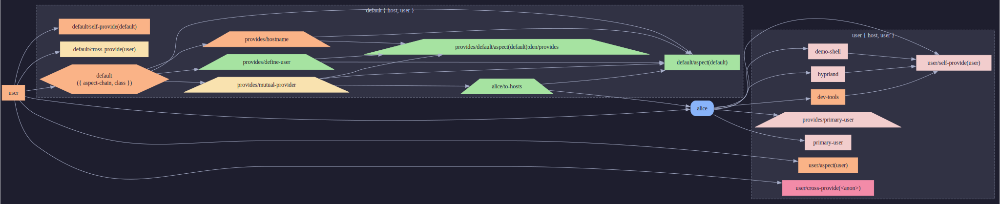
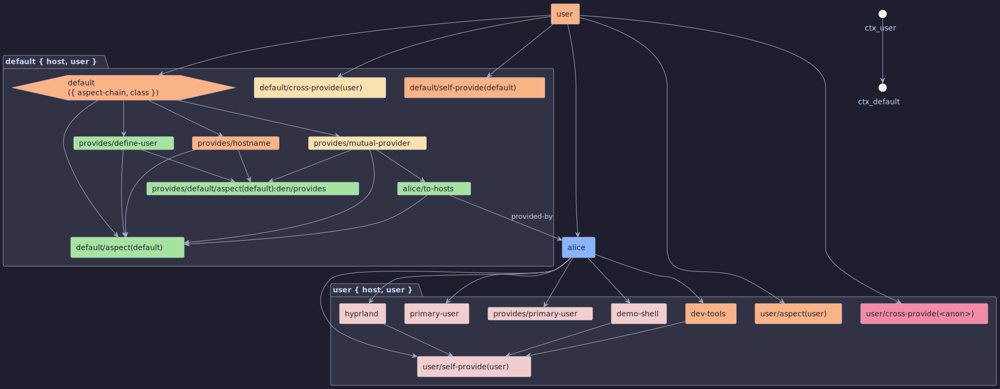
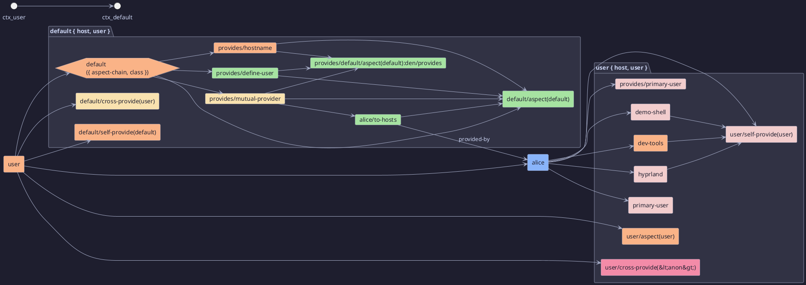

# Full DAG: angle-brackets-alice

## Mermaid

```mermaid
%%{init: {"elk":{"mergeEdges":true,"nodePlacementStrategy":"BRANDES_KOEPF"},"layout":"elk","theme":"base","themeVariables":{"activationBkgColor":"#313244","activationBorderColor":"#6c7086","actorBkg":"#313244","actorBorder":"#a6adc8","actorLineColor":"#a6adc8","actorTextColor":"#cdd6f4","background":"#1e1e2e","classText":"#cdd6f4","clusterBkg":"#313244","clusterBorder":"#6c7086","edgeLabelBackground":"#1e1e2e","labelBoxBkgColor":"#313244","labelBoxBorderColor":"#a6adc8","labelTextColor":"#cdd6f4","lineColor":"#a6adc8","loopTextColor":"#cdd6f4","mainBkg":"#313244","nodeBkg":"#313244","nodeBorder":"#a6adc8","nodeTextColor":"#cdd6f4","noteBkgColor":"#313244","noteBorderColor":"#6c7086","noteTextColor":"#cdd6f4","pie1":"#f38ba8","pie2":"#fab387","pie3":"#f9e2af","pie4":"#a6e3a1","pie5":"#94e2d5","pie6":"#89b4fa","pie7":"#cba6f7","pie8":"#f2cdcd","pieLegendTextColor":"#cdd6f4","pieOuterStrokeColor":"#6c7086","pieSectionTextColor":"#cdd6f4","pieStrokeColor":"#6c7086","pieTitleTextColor":"#cdd6f4","primaryBorderColor":"#a6adc8","primaryColor":"#313244","primaryTextColor":"#cdd6f4","secondBkg":"#313244","secondaryBorderColor":"#6c7086","secondaryColor":"#313244","secondaryTextColor":"#cdd6f4","sequenceNumberColor":"#1e1e2e","signalColor":"#a6adc8","signalTextColor":"#cdd6f4","tertiaryBorderColor":"#6c7086","tertiaryColor":"#313244","tertiaryTextColor":"#cdd6f4","textColor":"#cdd6f4","titleColor":"#cdd6f4"}}}%%
graph LR
  alice([alice]):::root
  user["user"]:::user_c

  subgraph ctx_user["user { host, user }"]
  demo_shell["demo-shell"]:::demo_shell_c
  dev_tools["dev-tools"]:::dev_tools_c
  hyprland["hyprland"]:::hyprland_c
  primary_user["primary-user"]:::primary_user_c
  den__provides__primary_user[/"provides/primary-user"\]:::den__provides__primary_user_c
  user__aspect_user_["user/aspect(user)"]:::user__aspect_user__c
  user__cross_provide__anon__["user/cross-provide(<anon>)"]:::user__cross_provide__anon___c
  user__self_provide_user_["user/self-provide(user)"]:::user__self_provide_user__c
  alice --> demo_shell
  alice --> dev_tools
  alice --> hyprland
  alice --> primary_user
  alice --> den__provides__primary_user
  alice --> user__self_provide_user_
  demo_shell --> user__self_provide_user_
  dev_tools --> user__self_provide_user_
  hyprland --> user__self_provide_user_
  end
  subgraph ctx_default["default { host, user }"]
  n_default{{"default({ aspect-chain, class })"}}:::n_default_c
  default__aspect_default_["default/aspect(default)"]:::default__aspect_default__c
  den__provides__default__aspect_default__den__provides[/"provides/default/aspect(default):den/provides"\]:::den__provides__default__aspect_default__den__provides_c
  default__cross_provide_user_["default/cross-provide(user)"]:::default__cross_provide_user__c
  default__self_provide_default_["default/self-provide(default)"]:::default__self_provide_default__c
  den__provides__define_user[/"provides/define-user"\]:::den__provides__define_user_c
  den__provides__hostname[/"provides/hostname"\]:::den__provides__hostname_c
  den__provides__mutual_provider[/"provides/mutual-provider"\]:::den__provides__mutual_provider_c
  alice__to_hosts[/"alice/to-hosts"\]:::alice__to_hosts_c
  alice__to_hosts --> default__aspect_default_
  n_default --> default__aspect_default_
  n_default --> den__provides__define_user
  n_default --> den__provides__hostname
  n_default --> den__provides__mutual_provider
  den__provides__define_user --> default__aspect_default_
  den__provides__define_user --> den__provides__default__aspect_default__den__provides
  den__provides__hostname --> default__aspect_default_
  den__provides__hostname --> den__provides__default__aspect_default__den__provides
  den__provides__mutual_provider --> default__aspect_default_
  den__provides__mutual_provider --> den__provides__default__aspect_default__den__provides
  den__provides__mutual_provider --> alice__to_hosts
  alice__to_hosts -.->|provided-by| alice
  end

  ctx_user --> ctx_default
  user --> alice
  user --> n_default
  user --> default__cross_provide_user_
  user --> default__self_provide_default_
  user --> user__aspect_user_
  user --> user__cross_provide__anon__

  classDef root fill:#89b4fa,stroke:#89b4fa,color:#1e1e2e,font-weight:bold
  classDef alice_c fill:#f2cdcd,stroke:#f2cdcd,color:#1e1e2e,stroke-dasharray: 3 3,stroke-width:1px
  classDef n_default_c fill:#fab387,stroke:#fab387,color:#1e1e2e,stroke-dasharray: 3 3,stroke-width:1px
  classDef default__aspect_default__c fill:#a6e3a1,stroke:#a6e3a1,color:#1e1e2e,stroke-dasharray: 3 3,stroke-width:1px
  classDef den__provides__default__aspect_default__den__provides_c fill:#a6e3a1,stroke:#a6e3a1,color:#1e1e2e,stroke-dasharray: 3 3,stroke-width:1px
  classDef default__cross_provide_user__c fill:#f9e2af,stroke:#f9e2af,color:#1e1e2e,stroke-dasharray: 3 3,stroke-width:1px
  classDef default__self_provide_default__c fill:#fab387,stroke:#fab387,color:#1e1e2e,stroke-dasharray: 3 3,stroke-width:1px
  classDef den__provides__define_user_c fill:#a6e3a1,stroke:#a6e3a1,color:#1e1e2e,stroke-dasharray: 3 3,stroke-width:1px
  classDef demo_shell_c fill:#f2cdcd,stroke:#f2cdcd,color:#1e1e2e,stroke-dasharray: 3 3,stroke-width:1px
  classDef dev_tools_c fill:#fab387,stroke:#fab387,color:#1e1e2e,stroke-dasharray: 3 3,stroke-width:1px
  classDef den__provides__hostname_c fill:#fab387,stroke:#fab387,color:#1e1e2e,stroke-dasharray: 3 3,stroke-width:1px
  classDef hyprland_c fill:#f2cdcd,stroke:#f2cdcd,color:#1e1e2e,stroke-dasharray: 3 3,stroke-width:1px
  classDef den__provides__mutual_provider_c fill:#f9e2af,stroke:#f9e2af,color:#1e1e2e,stroke-dasharray: 3 3,stroke-width:1px
  classDef primary_user_c fill:#f2cdcd,stroke:#f2cdcd,color:#1e1e2e,stroke-dasharray: 3 3,stroke-width:1px
  classDef den__provides__primary_user_c fill:#f2cdcd,stroke:#f2cdcd,color:#1e1e2e,stroke-dasharray: 3 3,stroke-width:1px
  classDef alice__to_hosts_c fill:#a6e3a1,stroke:#a6e3a1,color:#1e1e2e,stroke-dasharray: 3 3,stroke-width:1px
  classDef user_c fill:#fab387,stroke:#fab387,color:#1e1e2e,stroke-dasharray: 3 3,stroke-width:1px
  classDef user__aspect_user__c fill:#fab387,stroke:#fab387,color:#1e1e2e,stroke-dasharray: 3 3,stroke-width:1px
  classDef user__cross_provide__anon___c fill:#f38ba8,stroke:#f38ba8,color:#1e1e2e,stroke-dasharray: 3 3,stroke-width:1px
  classDef user__self_provide_user__c fill:#f2cdcd,stroke:#f2cdcd,color:#1e1e2e,stroke-dasharray: 3 3,stroke-width:1px
style ctx_user fill:#313244,stroke:#6c7086,stroke-width:2px
style ctx_default fill:#313244,stroke:#6c7086,stroke-width:2px
```

## Graphviz DOT

```dot
digraph {
  rankdir=LR;
  bgcolor="#1e1e2e";
  color="#cdd6f4";
  fontcolor="#cdd6f4";
  node [style=filled, fillcolor="#313244", fontcolor="#cdd6f4", color="#a6adc8"];
  edge [color="#a6adc8", fontcolor="#cdd6f4"];
  alice [label="alice",shape=box,style="rounded,filled",fillcolor="#89b4fa",color="#89b4fa",fontcolor="#1e1e2e"];
  subgraph cluster_ctx_user {
    label="user { host, user }";
    style=dashed;
    color="#6c7086";
    fontcolor="#cdd6f4";
    bgcolor="#313244";
  demo_shell [label="demo-shell",shape=box,style=filled,fillcolor="#f2cdcd",color="#f2cdcd",fontcolor="#1e1e2e"];
  dev_tools [label="dev-tools",shape=box,style=filled,fillcolor="#fab387",color="#fab387",fontcolor="#1e1e2e"];
  hyprland [label="hyprland",shape=box,style=filled,fillcolor="#f2cdcd",color="#f2cdcd",fontcolor="#1e1e2e"];
  primary_user [label="primary-user",shape=box,style=filled,fillcolor="#f2cdcd",color="#f2cdcd",fontcolor="#1e1e2e"];
  den__provides__primary_user [label="provides/primary-user",shape=trapezium,style=filled,fillcolor="#f2cdcd",color="#f2cdcd",fontcolor="#1e1e2e"];
  user__aspect_user_ [label="user/aspect(user)",shape=box,style=filled,fillcolor="#fab387",color="#fab387",fontcolor="#1e1e2e"];
  user__cross_provide__anon__ [label="user/cross-provide(<anon>)",shape=box,style=filled,fillcolor="#f38ba8",color="#f38ba8",fontcolor="#1e1e2e"];
  user__self_provide_user_ [label="user/self-provide(user)",shape=box,style=filled,fillcolor="#f2cdcd",color="#f2cdcd",fontcolor="#1e1e2e"];
  }
  subgraph cluster_ctx_default {
    label="default { host, user }";
    style=dashed;
    color="#6c7086";
    fontcolor="#cdd6f4";
    bgcolor="#313244";
  n_default [label="default\n({ aspect-chain, class })",shape=hexagon,style=filled,fillcolor="#fab387",color="#fab387",fontcolor="#1e1e2e"];
  default__aspect_default_ [label="default/aspect(default)",shape=box,style=filled,fillcolor="#a6e3a1",color="#a6e3a1",fontcolor="#1e1e2e"];
  den__provides__default__aspect_default__den__provides [label="provides/default/aspect(default):den/provides",shape=trapezium,style=filled,fillcolor="#a6e3a1",color="#a6e3a1",fontcolor="#1e1e2e"];
  default__cross_provide_user_ [label="default/cross-provide(user)",shape=box,style=filled,fillcolor="#f9e2af",color="#f9e2af",fontcolor="#1e1e2e"];
  default__self_provide_default_ [label="default/self-provide(default)",shape=box,style=filled,fillcolor="#fab387",color="#fab387",fontcolor="#1e1e2e"];
  den__provides__define_user [label="provides/define-user",shape=trapezium,style=filled,fillcolor="#a6e3a1",color="#a6e3a1",fontcolor="#1e1e2e"];
  den__provides__hostname [label="provides/hostname",shape=trapezium,style=filled,fillcolor="#fab387",color="#fab387",fontcolor="#1e1e2e"];
  den__provides__mutual_provider [label="provides/mutual-provider",shape=trapezium,style=filled,fillcolor="#f9e2af",color="#f9e2af",fontcolor="#1e1e2e"];
  alice__to_hosts [label="alice/to-hosts",shape=trapezium,style=filled,fillcolor="#a6e3a1",color="#a6e3a1",fontcolor="#1e1e2e"];
  }
  user [label="user",shape=box,style=filled,fillcolor="#fab387",color="#fab387",fontcolor="#1e1e2e"];

  alice -> demo_shell;
  alice -> dev_tools;
  alice -> hyprland;
  alice -> primary_user;
  alice -> den__provides__primary_user;
  alice -> user__self_provide_user_;
  alice__to_hosts -> default__aspect_default_;
  n_default -> default__aspect_default_;
  n_default -> den__provides__define_user;
  n_default -> den__provides__hostname;
  n_default -> den__provides__mutual_provider;
  demo_shell -> user__self_provide_user_;
  den__provides__define_user -> default__aspect_default_;
  den__provides__define_user -> den__provides__default__aspect_default__den__provides;
  den__provides__hostname -> default__aspect_default_;
  den__provides__hostname -> den__provides__default__aspect_default__den__provides;
  den__provides__mutual_provider -> default__aspect_default_;
  den__provides__mutual_provider -> den__provides__default__aspect_default__den__provides;
  den__provides__mutual_provider -> alice__to_hosts;
  dev_tools -> user__self_provide_user_;
  hyprland -> user__self_provide_user_;
  user -> alice;
  user -> n_default;
  user -> default__cross_provide_user_;
  user -> default__self_provide_default_;
  user -> user__aspect_user_;
  user -> user__cross_provide__anon__;
  alice__to_hosts -> alice;
}
```

## PlantUML

```plantuml
@startuml
left to right direction
skinparam backgroundColor #1e1e2e
skinparam defaultFontColor #cdd6f4
skinparam defaultFontName "JetBrains Mono,monospace"
skinparam arrowColor #a6adc8
skinparam arrowFontColor #cdd6f4
skinparam RectangleBackgroundColor #313244
skinparam RectangleBorderColor #a6adc8
skinparam RectangleFontColor #1e1e2e
skinparam HexagonBackgroundColor #313244
skinparam HexagonBorderColor #a6adc8
skinparam HexagonFontColor #1e1e2e
skinparam CardBackgroundColor #313244
skinparam CardBorderColor #a6adc8
skinparam CardFontColor #1e1e2e
skinparam PackageBackgroundColor #313244
skinparam PackageBorderColor #6c7086
skinparam PackageFontColor #cdd6f4
skinparam NoteBackgroundColor #313244
skinparam NoteBorderColor #6c7086
skinparam NoteFontColor #cdd6f4

rectangle "alice" as alice #89b4fa
package "user { host, user }" as stage_user {
  rectangle "demo-shell" as demo_shell #f2cdcd
  rectangle "dev-tools" as dev_tools #fab387
  rectangle "hyprland" as hyprland #f2cdcd
  rectangle "primary-user" as primary_user #f2cdcd
  card "provides/primary-user" as den__provides__primary_user #f2cdcd
  rectangle "user/aspect(user)" as user__aspect_user_ #fab387
  rectangle "user/cross-provide(&lt;anon&gt;)" as user__cross_provide__anon__ #f38ba8
  rectangle "user/self-provide(user)" as user__self_provide_user_ #f2cdcd
}
package "default { host, user }" as stage_default {
  hexagon "default\n({ aspect-chain, class })" as n_default #fab387
  rectangle "default/aspect(default)" as default__aspect_default_ #a6e3a1
  card "provides/default/aspect(default):den/provides" as den__provides__default__aspect_default__den__provides #a6e3a1
  rectangle "default/cross-provide(user)" as default__cross_provide_user_ #f9e2af
  rectangle "default/self-provide(default)" as default__self_provide_default_ #fab387
  card "provides/define-user" as den__provides__define_user #a6e3a1
  card "provides/hostname" as den__provides__hostname #fab387
  card "provides/mutual-provider" as den__provides__mutual_provider #f9e2af
  card "alice/to-hosts" as alice__to_hosts #a6e3a1
}
rectangle "user" as user #fab387

alice --> demo_shell
alice --> dev_tools
alice --> hyprland
alice --> primary_user
alice --> den__provides__primary_user
alice --> user__self_provide_user_
alice__to_hosts --> default__aspect_default_
n_default --> default__aspect_default_
n_default --> den__provides__define_user
n_default --> den__provides__hostname
n_default --> den__provides__mutual_provider
demo_shell --> user__self_provide_user_
den__provides__define_user --> default__aspect_default_
den__provides__define_user --> den__provides__default__aspect_default__den__provides
den__provides__hostname --> default__aspect_default_
den__provides__hostname --> den__provides__default__aspect_default__den__provides
den__provides__mutual_provider --> default__aspect_default_
den__provides__mutual_provider --> den__provides__default__aspect_default__den__provides
den__provides__mutual_provider --> alice__to_hosts
dev_tools --> user__self_provide_user_
hyprland --> user__self_provide_user_
user --> alice
user --> n_default
user --> default__cross_provide_user_
user --> default__self_provide_default_
user --> user__aspect_user_
user --> user__cross_provide__anon__
alice__to_hosts --> alice : provided-by
ctx_user --> ctx_default
@enduml
```
