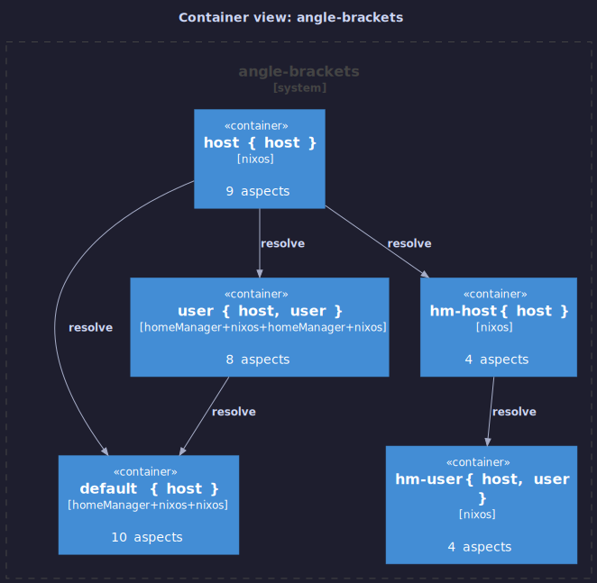
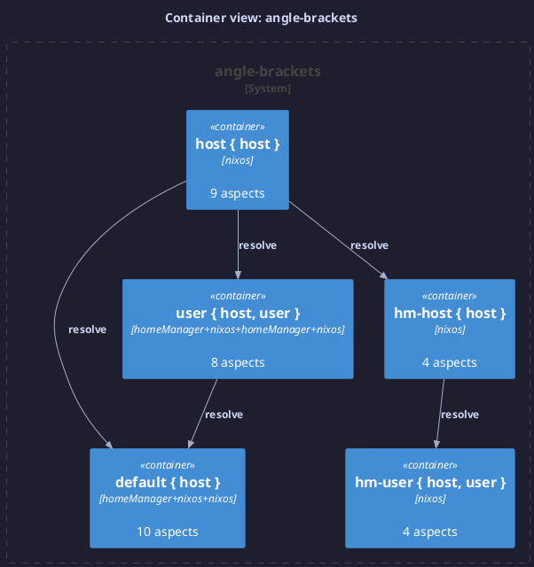

# C4 Container View: angle-brackets

```plantuml
@startuml
!include <C4/C4_Container>
skinparam backgroundColor #1e1e2e
skinparam defaultFontColor #cdd6f4
skinparam defaultFontName "JetBrains Mono,monospace"
skinparam arrowColor #a6adc8
skinparam arrowFontColor #cdd6f4
skinparam PersonBackgroundColor #313244
skinparam PersonBorderColor #a6adc8
skinparam PersonFontColor #cdd6f4
skinparam SystemBackgroundColor #313244
skinparam SystemBorderColor #a6adc8
skinparam SystemFontColor #cdd6f4
skinparam ContainerBackgroundColor #313244
skinparam ContainerBorderColor #a6adc8
skinparam ContainerFontColor #cdd6f4
skinparam ComponentBackgroundColor #313244
skinparam ComponentBorderColor #a6adc8
skinparam ComponentFontColor #cdd6f4
skinparam BoundaryBackgroundColor #313244
skinparam BoundaryBorderColor #6c7086
skinparam BoundaryFontColor #cdd6f4
skinparam RectangleBackgroundColor #313244
skinparam RectangleBorderColor #a6adc8
skinparam RectangleFontColor #cdd6f4


title Container view: angle-brackets

System_Boundary(angle_brackets, "angle-brackets") {
  Container(ctx_host, "host { host }", "nixos", "9 aspects")
  Container(ctx_default, "default { host }", "homeManager+nixos+nixos", "10 aspects")
  Container(ctx_hm_host, "hm-host { host }", "nixos", "4 aspects")
  Container(ctx_hm_user, "hm-user { host, user }", "nixos", "4 aspects")
  Container(ctx_user, "user { host, user }", "homeManager+nixos+homeManager+nixos", "8 aspects")
}

Rel(ctx_host, ctx_default, "resolve")
Rel(ctx_host, ctx_hm_host, "resolve")
Rel(ctx_hm_host, ctx_hm_user, "resolve")
Rel(ctx_host, ctx_user, "resolve")
Rel(ctx_user, ctx_default, "resolve")
@enduml
```
