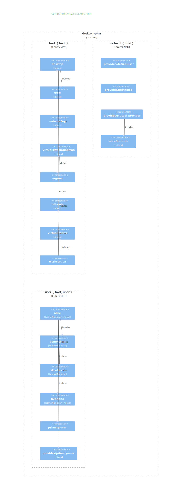
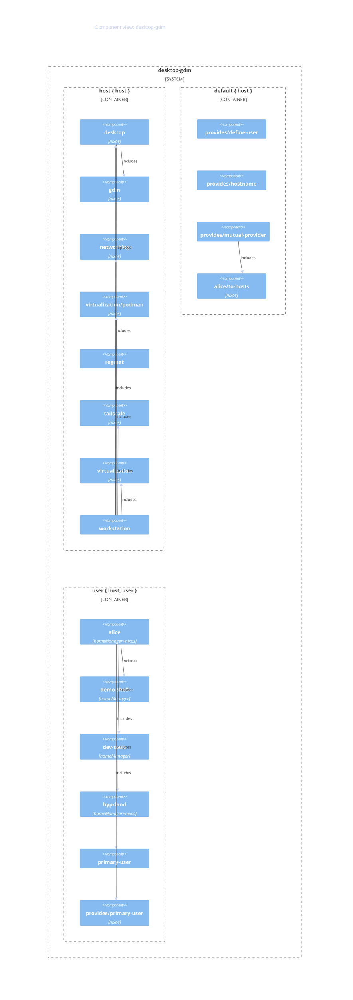

# C4 Component (Mermaid): desktop-gdm

```mermaid
%%{init: {"theme":"base","themeVariables":{"activationBkgColor":"#313244","activationBorderColor":"#6c7086","actorBkg":"#313244","actorBorder":"#a6adc8","actorLineColor":"#a6adc8","actorTextColor":"#cdd6f4","background":"#1e1e2e","classText":"#cdd6f4","clusterBkg":"#313244","clusterBorder":"#6c7086","edgeLabelBackground":"#1e1e2e","labelBoxBkgColor":"#313244","labelBoxBorderColor":"#a6adc8","labelTextColor":"#cdd6f4","lineColor":"#a6adc8","loopTextColor":"#cdd6f4","mainBkg":"#313244","nodeBkg":"#313244","nodeBorder":"#a6adc8","nodeTextColor":"#cdd6f4","noteBkgColor":"#313244","noteBorderColor":"#6c7086","noteTextColor":"#cdd6f4","pie1":"#f38ba8","pie2":"#fab387","pie3":"#f9e2af","pie4":"#a6e3a1","pie5":"#94e2d5","pie6":"#89b4fa","pie7":"#cba6f7","pie8":"#f2cdcd","pieLegendTextColor":"#cdd6f4","pieOuterStrokeColor":"#6c7086","pieSectionTextColor":"#cdd6f4","pieStrokeColor":"#6c7086","pieTitleTextColor":"#cdd6f4","primaryBorderColor":"#a6adc8","primaryColor":"#313244","primaryTextColor":"#cdd6f4","secondBkg":"#313244","secondaryBorderColor":"#6c7086","secondaryColor":"#313244","secondaryTextColor":"#cdd6f4","sequenceNumberColor":"#1e1e2e","signalColor":"#a6adc8","signalTextColor":"#cdd6f4","tertiaryBorderColor":"#6c7086","tertiaryColor":"#313244","tertiaryTextColor":"#cdd6f4","textColor":"#cdd6f4","titleColor":"#cdd6f4"}}}%%
C4Component
title Component view: desktop-gdm

System_Boundary(desktop_gdm, "desktop-gdm") {
  Container_Boundary(host, "host { host }") {
    Component(desktop, "desktop", "nixos")
    Component(gdm, "gdm", "nixos")
    Component(networking, "networking", "nixos")
    Component(virtualization__podman, "virtualization/podman", "nixos")
    Component(regreet, "regreet", "")
    Component(tailscale, "tailscale", "nixos")
    Component(virtualization, "virtualization", "nixos")
    Component(workstation, "workstation", "")
}
  Container_Boundary(c4_default, "default { host }") {
    Component(den__provides__define_user, "provides/define-user", "")
    Component(den__provides__hostname, "provides/hostname", "")
    Component(den__provides__mutual_provider, "provides/mutual-provider", "")
    Component(alice__to_hosts, "alice/to-hosts", "nixos")
}
  Container_Boundary(user, "user { host, user }") {
    Component(alice, "alice", "homeManager+nixos")
    Component(demo_shell, "demo-shell", "homeManager")
    Component(dev_tools, "dev-tools", "homeManager")
    Component(hyprland, "hyprland", "homeManager+nixos")
    Component(primary_user, "primary-user", "")
    Component(den__provides__primary_user, "provides/primary-user", "nixos")
}
}

Rel(alice, demo_shell, "includes")
Rel(alice, dev_tools, "includes")
Rel(alice, hyprland, "includes")
Rel(alice, primary_user, "includes")
Rel(alice, den__provides__primary_user, "includes")
Rel(den__provides__mutual_provider, alice__to_hosts, "includes")
Rel(desktop, gdm, "includes")
Rel(desktop, regreet, "replaced")
Rel(workstation, desktop, "includes")
Rel(workstation, networking, "includes")
Rel(workstation, virtualization__podman, "includes")
Rel(workstation, tailscale, "includes")
Rel(workstation, virtualization, "includes")
```
