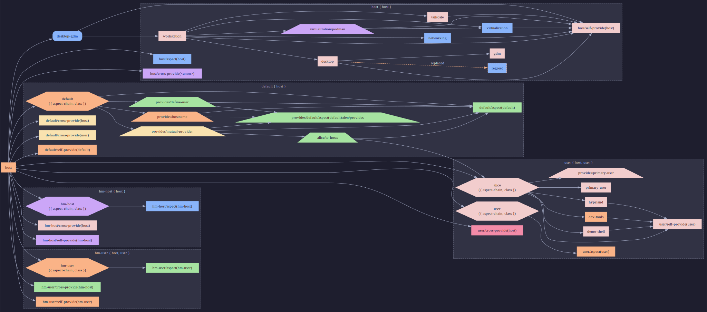
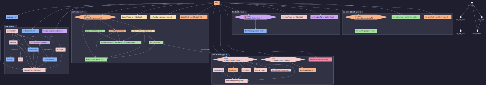
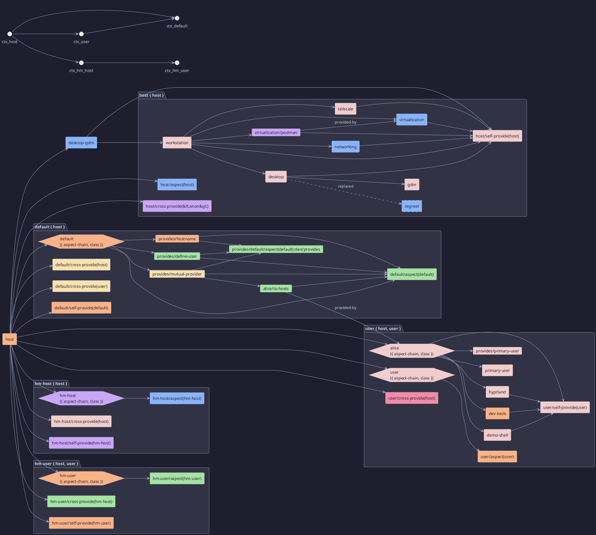

# Full DAG: desktop-gdm

## Mermaid

```mermaid
%%{init: {"elk":{"mergeEdges":true,"nodePlacementStrategy":"BRANDES_KOEPF"},"layout":"elk","theme":"base","themeVariables":{"activationBkgColor":"#313244","activationBorderColor":"#6c7086","actorBkg":"#313244","actorBorder":"#a6adc8","actorLineColor":"#a6adc8","actorTextColor":"#cdd6f4","background":"#1e1e2e","classText":"#cdd6f4","clusterBkg":"#313244","clusterBorder":"#6c7086","edgeLabelBackground":"#1e1e2e","labelBoxBkgColor":"#313244","labelBoxBorderColor":"#a6adc8","labelTextColor":"#cdd6f4","lineColor":"#a6adc8","loopTextColor":"#cdd6f4","mainBkg":"#313244","nodeBkg":"#313244","nodeBorder":"#a6adc8","nodeTextColor":"#cdd6f4","noteBkgColor":"#313244","noteBorderColor":"#6c7086","noteTextColor":"#cdd6f4","pie1":"#f38ba8","pie2":"#fab387","pie3":"#f9e2af","pie4":"#a6e3a1","pie5":"#94e2d5","pie6":"#89b4fa","pie7":"#cba6f7","pie8":"#f2cdcd","pieLegendTextColor":"#cdd6f4","pieOuterStrokeColor":"#6c7086","pieSectionTextColor":"#cdd6f4","pieStrokeColor":"#6c7086","pieTitleTextColor":"#cdd6f4","primaryBorderColor":"#a6adc8","primaryColor":"#313244","primaryTextColor":"#cdd6f4","secondBkg":"#313244","secondaryBorderColor":"#6c7086","secondaryColor":"#313244","secondaryTextColor":"#cdd6f4","sequenceNumberColor":"#1e1e2e","signalColor":"#a6adc8","signalTextColor":"#cdd6f4","tertiaryBorderColor":"#6c7086","tertiaryColor":"#313244","tertiaryTextColor":"#cdd6f4","textColor":"#cdd6f4","titleColor":"#cdd6f4"}}}%%
graph LR
  desktop_gdm([desktop-gdm]):::root
  host["host"]:::host_c

  subgraph ctx_host["host { host }"]
  desktop["desktop"]:::desktop_c
  gdm["gdm"]:::gdm_c
  host__aspect_host_["host/aspect(host)"]:::host__aspect_host__c
  host__cross_provide__anon__["host/cross-provide(<anon>)"]:::host__cross_provide__anon___c
  host__self_provide_host_["host/self-provide(host)"]:::host__self_provide_host__c
  networking["networking"]:::networking_c
  virtualization__podman[/"virtualization/podman"\]:::virtualization__podman_c
  regreet["regreet"]:::regreet_c
  tailscale["tailscale"]:::tailscale_c
  virtualization["virtualization"]:::virtualization_c
  workstation["workstation"]:::workstation_c
  desktop --> gdm
  desktop --> host__self_provide_host_
  desktop -.->|replaced| regreet
  desktop_gdm --> host__self_provide_host_
  desktop_gdm --> workstation
  networking --> host__self_provide_host_
  tailscale --> host__self_provide_host_
  virtualization --> host__self_provide_host_
  virtualization__podman --> host__self_provide_host_
  workstation --> desktop
  workstation --> host__self_provide_host_
  workstation --> networking
  workstation --> virtualization__podman
  workstation --> tailscale
  workstation --> virtualization
  virtualization__podman -.->|provided-by| virtualization
  end
  subgraph ctx_default["default { host }"]
  n_default{{"default({ aspect-chain, class })"}}:::n_default_c
  default__aspect_default_["default/aspect(default)"]:::default__aspect_default__c
  den__provides__default__aspect_default__den__provides[/"provides/default/aspect(default):den/provides"\]:::den__provides__default__aspect_default__den__provides_c
  default__cross_provide_host_["default/cross-provide(host)"]:::default__cross_provide_host__c
  default__cross_provide_user_["default/cross-provide(user)"]:::default__cross_provide_user__c
  default__self_provide_default_["default/self-provide(default)"]:::default__self_provide_default__c
  den__provides__define_user[/"provides/define-user"\]:::den__provides__define_user_c
  den__provides__hostname[/"provides/hostname"\]:::den__provides__hostname_c
  den__provides__mutual_provider[/"provides/mutual-provider"\]:::den__provides__mutual_provider_c
  alice__to_hosts[/"alice/to-hosts"\]:::alice__to_hosts_c
  alice__to_hosts --> default__aspect_default_
  n_default --> default__aspect_default_
  n_default --> den__provides__define_user
  n_default --> den__provides__hostname
  n_default --> den__provides__mutual_provider
  den__provides__define_user --> default__aspect_default_
  den__provides__define_user --> den__provides__default__aspect_default__den__provides
  den__provides__hostname --> default__aspect_default_
  den__provides__hostname --> den__provides__default__aspect_default__den__provides
  den__provides__mutual_provider --> default__aspect_default_
  den__provides__mutual_provider --> den__provides__default__aspect_default__den__provides
  den__provides__mutual_provider --> alice__to_hosts
  alice__to_hosts -.->|provided-by| alice
  end
  subgraph ctx_hm_host["hm-host { host }"]
  hm_host{{"hm-host({ aspect-chain, class })"}}:::hm_host_c
  hm_host__aspect_hm_host_["hm-host/aspect(hm-host)"]:::hm_host__aspect_hm_host__c
  hm_host__cross_provide_host_["hm-host/cross-provide(host)"]:::hm_host__cross_provide_host__c
  hm_host__self_provide_hm_host_["hm-host/self-provide(hm-host)"]:::hm_host__self_provide_hm_host__c
  hm_host --> hm_host__aspect_hm_host_
  end
  subgraph ctx_hm_user["hm-user { host, user }"]
  hm_user{{"hm-user({ aspect-chain, class })"}}:::hm_user_c
  hm_user__aspect_hm_user_["hm-user/aspect(hm-user)"]:::hm_user__aspect_hm_user__c
  hm_user__cross_provide_hm_host_["hm-user/cross-provide(hm-host)"]:::hm_user__cross_provide_hm_host__c
  hm_user__self_provide_hm_user_["hm-user/self-provide(hm-user)"]:::hm_user__self_provide_hm_user__c
  hm_user --> hm_user__aspect_hm_user_
  end
  subgraph ctx_user["user { host, user }"]
  alice{{"alice({ aspect-chain, class })"}}:::alice_c
  demo_shell["demo-shell"]:::demo_shell_c
  dev_tools["dev-tools"]:::dev_tools_c
  hyprland["hyprland"]:::hyprland_c
  primary_user["primary-user"]:::primary_user_c
  den__provides__primary_user[/"provides/primary-user"\]:::den__provides__primary_user_c
  user{{"user({ aspect-chain, class })"}}:::user_c
  user__aspect_user_["user/aspect(user)"]:::user__aspect_user__c
  user__cross_provide_host_["user/cross-provide(host)"]:::user__cross_provide_host__c
  user__self_provide_user_["user/self-provide(user)"]:::user__self_provide_user__c
  alice --> demo_shell
  alice --> dev_tools
  alice --> hyprland
  alice --> primary_user
  alice --> den__provides__primary_user
  alice --> user__self_provide_user_
  demo_shell --> user__self_provide_user_
  dev_tools --> user__self_provide_user_
  hyprland --> user__self_provide_user_
  user --> user__aspect_user_
  end

  ctx_host --> ctx_default
  ctx_host --> ctx_hm_host
  ctx_hm_host --> ctx_hm_user
  ctx_host --> ctx_user
  ctx_user --> ctx_default
  host --> alice
  host --> n_default
  host --> default__cross_provide_host_
  host --> default__cross_provide_user_
  host --> default__self_provide_default_
  host --> desktop_gdm
  host --> hm_host
  host --> hm_host__cross_provide_host_
  host --> hm_host__self_provide_hm_host_
  host --> hm_user
  host --> hm_user__cross_provide_hm_host_
  host --> hm_user__self_provide_hm_user_
  host --> host__aspect_host_
  host --> host__cross_provide__anon__
  host --> user
  host --> user__cross_provide_host_

  classDef root fill:#89b4fa,stroke:#89b4fa,color:#1e1e2e,font-weight:bold
  classDef alice_c fill:#f2cdcd,stroke:#f2cdcd,color:#1e1e2e,stroke-dasharray: 3 3,stroke-width:1px
  classDef n_default_c fill:#fab387,stroke:#fab387,color:#1e1e2e,stroke-dasharray: 3 3,stroke-width:1px
  classDef default__aspect_default__c fill:#a6e3a1,stroke:#a6e3a1,color:#1e1e2e,stroke-dasharray: 3 3,stroke-width:1px
  classDef den__provides__default__aspect_default__den__provides_c fill:#a6e3a1,stroke:#a6e3a1,color:#1e1e2e,stroke-width:2px
  classDef default__cross_provide_host__c fill:#f9e2af,stroke:#f9e2af,color:#1e1e2e,stroke-dasharray: 3 3,stroke-width:1px
  classDef default__cross_provide_user__c fill:#f9e2af,stroke:#f9e2af,color:#1e1e2e,stroke-dasharray: 3 3,stroke-width:1px
  classDef default__self_provide_default__c fill:#fab387,stroke:#fab387,color:#1e1e2e,stroke-dasharray: 3 3,stroke-width:1px
  classDef den__provides__define_user_c fill:#a6e3a1,stroke:#a6e3a1,color:#1e1e2e,stroke-dasharray: 3 3,stroke-width:1px
  classDef demo_shell_c fill:#f2cdcd,stroke:#f2cdcd,color:#1e1e2e,stroke-dasharray: 3 3,stroke-width:1px
  classDef desktop_c fill:#f2cdcd,stroke:#f2cdcd,color:#1e1e2e,stroke-width:3px
  classDef desktop_gdm_c fill:#f2cdcd,stroke:#f2cdcd,color:#1e1e2e,stroke-width:3px
  classDef dev_tools_c fill:#fab387,stroke:#fab387,color:#1e1e2e,stroke-dasharray: 3 3,stroke-width:1px
  classDef gdm_c fill:#f2cdcd,stroke:#f2cdcd,color:#1e1e2e,stroke-width:3px
  classDef hm_host_c fill:#cba6f7,stroke:#cba6f7,color:#1e1e2e,stroke-dasharray: 3 3,stroke-width:1px
  classDef hm_host__aspect_hm_host__c fill:#89b4fa,stroke:#89b4fa,color:#1e1e2e,stroke-dasharray: 3 3,stroke-width:1px
  classDef hm_host__cross_provide_host__c fill:#f2cdcd,stroke:#f2cdcd,color:#1e1e2e,stroke-dasharray: 3 3,stroke-width:1px
  classDef hm_host__self_provide_hm_host__c fill:#cba6f7,stroke:#cba6f7,color:#1e1e2e,stroke-width:2px
  classDef hm_user_c fill:#fab387,stroke:#fab387,color:#1e1e2e,stroke-dasharray: 3 3,stroke-width:1px
  classDef hm_user__aspect_hm_user__c fill:#a6e3a1,stroke:#a6e3a1,color:#1e1e2e,stroke-dasharray: 3 3,stroke-width:1px
  classDef hm_user__cross_provide_hm_host__c fill:#a6e3a1,stroke:#a6e3a1,color:#1e1e2e,stroke-dasharray: 3 3,stroke-width:1px
  classDef hm_user__self_provide_hm_user__c fill:#fab387,stroke:#fab387,color:#1e1e2e,stroke-dasharray: 3 3,stroke-width:1px
  classDef host_c fill:#fab387,stroke:#fab387,color:#1e1e2e,stroke-dasharray: 3 3,stroke-width:1px
  classDef host__aspect_host__c fill:#89b4fa,stroke:#89b4fa,color:#1e1e2e,stroke-dasharray: 3 3,stroke-width:1px
  classDef host__cross_provide__anon___c fill:#cba6f7,stroke:#cba6f7,color:#1e1e2e,stroke-dasharray: 3 3,stroke-width:1px
  classDef host__self_provide_host__c fill:#f2cdcd,stroke:#f2cdcd,color:#1e1e2e,stroke-width:3px
  classDef den__provides__hostname_c fill:#fab387,stroke:#fab387,color:#1e1e2e,stroke-dasharray: 3 3,stroke-width:1px
  classDef hyprland_c fill:#f2cdcd,stroke:#f2cdcd,color:#1e1e2e,stroke-dasharray: 3 3,stroke-width:1px
  classDef den__provides__mutual_provider_c fill:#f9e2af,stroke:#f9e2af,color:#1e1e2e,stroke-dasharray: 3 3,stroke-width:1px
  classDef networking_c fill:#89b4fa,stroke:#89b4fa,color:#1e1e2e,stroke-width:3px
  classDef virtualization__podman_c fill:#cba6f7,stroke:#cba6f7,color:#1e1e2e,stroke-width:3px
  classDef primary_user_c fill:#f2cdcd,stroke:#f2cdcd,color:#1e1e2e,stroke-dasharray: 3 3,stroke-width:1px
  classDef den__provides__primary_user_c fill:#f2cdcd,stroke:#f2cdcd,color:#1e1e2e,stroke-width:2px
  classDef regreet_c fill:#89b4fa,stroke:#fab387,color:#1e1e2e,stroke-dasharray: 5 5,stroke-width:2px
  classDef tailscale_c fill:#f2cdcd,stroke:#f2cdcd,color:#1e1e2e,stroke-width:3px
  classDef alice__to_hosts_c fill:#a6e3a1,stroke:#a6e3a1,color:#1e1e2e,stroke-dasharray: 3 3,stroke-width:1px
  classDef user_c fill:#f2cdcd,stroke:#f2cdcd,color:#1e1e2e,stroke-dasharray: 3 3,stroke-width:1px
  classDef user__aspect_user__c fill:#fab387,stroke:#fab387,color:#1e1e2e,stroke-dasharray: 3 3,stroke-width:1px
  classDef user__cross_provide_host__c fill:#f38ba8,stroke:#f38ba8,color:#1e1e2e,stroke-dasharray: 3 3,stroke-width:1px
  classDef user__self_provide_user__c fill:#f2cdcd,stroke:#f2cdcd,color:#1e1e2e,stroke-dasharray: 3 3,stroke-width:1px
  classDef virtualization_c fill:#89b4fa,stroke:#89b4fa,color:#1e1e2e,stroke-width:3px
  classDef workstation_c fill:#f2cdcd,stroke:#f2cdcd,color:#1e1e2e,stroke-width:3px
style ctx_host fill:#313244,stroke:#6c7086,stroke-width:2px
style ctx_default fill:#313244,stroke:#6c7086,stroke-width:2px
style ctx_hm_host fill:#313244,stroke:#6c7086,stroke-width:2px
style ctx_hm_user fill:#313244,stroke:#6c7086,stroke-width:2px
style ctx_user fill:#313244,stroke:#6c7086,stroke-width:2px
```

## Graphviz DOT

```dot
digraph {
  rankdir=LR;
  bgcolor="#1e1e2e";
  color="#cdd6f4";
  fontcolor="#cdd6f4";
  node [style=filled, fillcolor="#313244", fontcolor="#cdd6f4", color="#a6adc8"];
  edge [color="#a6adc8", fontcolor="#cdd6f4"];
  desktop_gdm [label="desktop-gdm",shape=box,style="rounded,filled",fillcolor="#89b4fa",color="#89b4fa",fontcolor="#1e1e2e"];
  subgraph cluster_ctx_host {
    label="host { host }";
    style=dashed;
    color="#6c7086";
    fontcolor="#cdd6f4";
    bgcolor="#313244";
  desktop [label="desktop",shape=box,style=filled,fillcolor="#f2cdcd",color="#f2cdcd",fontcolor="#1e1e2e"];
  gdm [label="gdm",shape=box,style=filled,fillcolor="#f2cdcd",color="#f2cdcd",fontcolor="#1e1e2e"];
  host__aspect_host_ [label="host/aspect(host)",shape=box,style=filled,fillcolor="#89b4fa",color="#89b4fa",fontcolor="#1e1e2e"];
  host__cross_provide__anon__ [label="host/cross-provide(<anon>)",shape=box,style=filled,fillcolor="#cba6f7",color="#cba6f7",fontcolor="#1e1e2e"];
  host__self_provide_host_ [label="host/self-provide(host)",shape=box,style=filled,fillcolor="#f2cdcd",color="#f2cdcd",fontcolor="#1e1e2e"];
  networking [label="networking",shape=box,style=filled,fillcolor="#89b4fa",color="#89b4fa",fontcolor="#1e1e2e"];
  virtualization__podman [label="virtualization/podman",shape=trapezium,style=filled,fillcolor="#cba6f7",color="#cba6f7",fontcolor="#1e1e2e"];
  regreet [label="regreet",shape=box,style="filled,dashed",fillcolor="#89b4fa",color="#fab387",fontcolor="#1e1e2e"];
  tailscale [label="tailscale",shape=box,style=filled,fillcolor="#f2cdcd",color="#f2cdcd",fontcolor="#1e1e2e"];
  virtualization [label="virtualization",shape=box,style=filled,fillcolor="#89b4fa",color="#89b4fa",fontcolor="#1e1e2e"];
  workstation [label="workstation",shape=box,style=filled,fillcolor="#f2cdcd",color="#f2cdcd",fontcolor="#1e1e2e"];
  }
  subgraph cluster_ctx_default {
    label="default { host }";
    style=dashed;
    color="#6c7086";
    fontcolor="#cdd6f4";
    bgcolor="#313244";
  n_default [label="default\n({ aspect-chain, class })",shape=hexagon,style=filled,fillcolor="#fab387",color="#fab387",fontcolor="#1e1e2e"];
  default__aspect_default_ [label="default/aspect(default)",shape=box,style=filled,fillcolor="#a6e3a1",color="#a6e3a1",fontcolor="#1e1e2e"];
  den__provides__default__aspect_default__den__provides [label="provides/default/aspect(default):den/provides",shape=trapezium,style=filled,fillcolor="#a6e3a1",color="#a6e3a1",fontcolor="#1e1e2e"];
  default__cross_provide_host_ [label="default/cross-provide(host)",shape=box,style=filled,fillcolor="#f9e2af",color="#f9e2af",fontcolor="#1e1e2e"];
  default__cross_provide_user_ [label="default/cross-provide(user)",shape=box,style=filled,fillcolor="#f9e2af",color="#f9e2af",fontcolor="#1e1e2e"];
  default__self_provide_default_ [label="default/self-provide(default)",shape=box,style=filled,fillcolor="#fab387",color="#fab387",fontcolor="#1e1e2e"];
  den__provides__define_user [label="provides/define-user",shape=trapezium,style=filled,fillcolor="#a6e3a1",color="#a6e3a1",fontcolor="#1e1e2e"];
  den__provides__hostname [label="provides/hostname",shape=trapezium,style=filled,fillcolor="#fab387",color="#fab387",fontcolor="#1e1e2e"];
  den__provides__mutual_provider [label="provides/mutual-provider",shape=trapezium,style=filled,fillcolor="#f9e2af",color="#f9e2af",fontcolor="#1e1e2e"];
  alice__to_hosts [label="alice/to-hosts",shape=trapezium,style=filled,fillcolor="#a6e3a1",color="#a6e3a1",fontcolor="#1e1e2e"];
  }
  subgraph cluster_ctx_hm_host {
    label="hm-host { host }";
    style=dashed;
    color="#6c7086";
    fontcolor="#cdd6f4";
    bgcolor="#313244";
  hm_host [label="hm-host\n({ aspect-chain, class })",shape=hexagon,style=filled,fillcolor="#cba6f7",color="#cba6f7",fontcolor="#1e1e2e"];
  hm_host__aspect_hm_host_ [label="hm-host/aspect(hm-host)",shape=box,style=filled,fillcolor="#89b4fa",color="#89b4fa",fontcolor="#1e1e2e"];
  hm_host__cross_provide_host_ [label="hm-host/cross-provide(host)",shape=box,style=filled,fillcolor="#f2cdcd",color="#f2cdcd",fontcolor="#1e1e2e"];
  hm_host__self_provide_hm_host_ [label="hm-host/self-provide(hm-host)",shape=box,style=filled,fillcolor="#cba6f7",color="#cba6f7",fontcolor="#1e1e2e"];
  }
  subgraph cluster_ctx_hm_user {
    label="hm-user { host, user }";
    style=dashed;
    color="#6c7086";
    fontcolor="#cdd6f4";
    bgcolor="#313244";
  hm_user [label="hm-user\n({ aspect-chain, class })",shape=hexagon,style=filled,fillcolor="#fab387",color="#fab387",fontcolor="#1e1e2e"];
  hm_user__aspect_hm_user_ [label="hm-user/aspect(hm-user)",shape=box,style=filled,fillcolor="#a6e3a1",color="#a6e3a1",fontcolor="#1e1e2e"];
  hm_user__cross_provide_hm_host_ [label="hm-user/cross-provide(hm-host)",shape=box,style=filled,fillcolor="#a6e3a1",color="#a6e3a1",fontcolor="#1e1e2e"];
  hm_user__self_provide_hm_user_ [label="hm-user/self-provide(hm-user)",shape=box,style=filled,fillcolor="#fab387",color="#fab387",fontcolor="#1e1e2e"];
  }
  subgraph cluster_ctx_user {
    label="user { host, user }";
    style=dashed;
    color="#6c7086";
    fontcolor="#cdd6f4";
    bgcolor="#313244";
  alice [label="alice\n({ aspect-chain, class })",shape=hexagon,style=filled,fillcolor="#f2cdcd",color="#f2cdcd",fontcolor="#1e1e2e"];
  demo_shell [label="demo-shell",shape=box,style=filled,fillcolor="#f2cdcd",color="#f2cdcd",fontcolor="#1e1e2e"];
  dev_tools [label="dev-tools",shape=box,style=filled,fillcolor="#fab387",color="#fab387",fontcolor="#1e1e2e"];
  hyprland [label="hyprland",shape=box,style=filled,fillcolor="#f2cdcd",color="#f2cdcd",fontcolor="#1e1e2e"];
  primary_user [label="primary-user",shape=box,style=filled,fillcolor="#f2cdcd",color="#f2cdcd",fontcolor="#1e1e2e"];
  den__provides__primary_user [label="provides/primary-user",shape=trapezium,style=filled,fillcolor="#f2cdcd",color="#f2cdcd",fontcolor="#1e1e2e"];
  user [label="user\n({ aspect-chain, class })",shape=hexagon,style=filled,fillcolor="#f2cdcd",color="#f2cdcd",fontcolor="#1e1e2e"];
  user__aspect_user_ [label="user/aspect(user)",shape=box,style=filled,fillcolor="#fab387",color="#fab387",fontcolor="#1e1e2e"];
  user__cross_provide_host_ [label="user/cross-provide(host)",shape=box,style=filled,fillcolor="#f38ba8",color="#f38ba8",fontcolor="#1e1e2e"];
  user__self_provide_user_ [label="user/self-provide(user)",shape=box,style=filled,fillcolor="#f2cdcd",color="#f2cdcd",fontcolor="#1e1e2e"];
  }
  host [label="host",shape=box,style=filled,fillcolor="#fab387",color="#fab387",fontcolor="#1e1e2e"];

  alice -> demo_shell;
  alice -> dev_tools;
  alice -> hyprland;
  alice -> primary_user;
  alice -> den__provides__primary_user;
  alice -> user__self_provide_user_;
  alice__to_hosts -> default__aspect_default_;
  n_default -> default__aspect_default_;
  n_default -> den__provides__define_user;
  n_default -> den__provides__hostname;
  n_default -> den__provides__mutual_provider;
  demo_shell -> user__self_provide_user_;
  den__provides__define_user -> default__aspect_default_;
  den__provides__define_user -> den__provides__default__aspect_default__den__provides;
  den__provides__hostname -> default__aspect_default_;
  den__provides__hostname -> den__provides__default__aspect_default__den__provides;
  den__provides__mutual_provider -> default__aspect_default_;
  den__provides__mutual_provider -> den__provides__default__aspect_default__den__provides;
  den__provides__mutual_provider -> alice__to_hosts;
  desktop -> gdm;
  desktop -> host__self_provide_host_;
  desktop -> regreet [style=dashed,color="#fab387",label="replaced"];
  desktop_gdm -> host__self_provide_host_;
  desktop_gdm -> workstation;
  dev_tools -> user__self_provide_user_;
  hm_host -> hm_host__aspect_hm_host_;
  hm_user -> hm_user__aspect_hm_user_;
  host -> alice;
  host -> n_default;
  host -> default__cross_provide_host_;
  host -> default__cross_provide_user_;
  host -> default__self_provide_default_;
  host -> desktop_gdm;
  host -> hm_host;
  host -> hm_host__cross_provide_host_;
  host -> hm_host__self_provide_hm_host_;
  host -> hm_user;
  host -> hm_user__cross_provide_hm_host_;
  host -> hm_user__self_provide_hm_user_;
  host -> host__aspect_host_;
  host -> host__cross_provide__anon__;
  host -> user;
  host -> user__cross_provide_host_;
  hyprland -> user__self_provide_user_;
  networking -> host__self_provide_host_;
  tailscale -> host__self_provide_host_;
  user -> user__aspect_user_;
  virtualization -> host__self_provide_host_;
  virtualization__podman -> host__self_provide_host_;
  workstation -> desktop;
  workstation -> host__self_provide_host_;
  workstation -> networking;
  workstation -> virtualization__podman;
  workstation -> tailscale;
  workstation -> virtualization;
  virtualization__podman -> virtualization;
  alice__to_hosts -> alice;
}
```

## PlantUML

```plantuml
@startuml
left to right direction
skinparam backgroundColor #1e1e2e
skinparam defaultFontColor #cdd6f4
skinparam defaultFontName "JetBrains Mono,monospace"
skinparam arrowColor #a6adc8
skinparam arrowFontColor #cdd6f4
skinparam RectangleBackgroundColor #313244
skinparam RectangleBorderColor #a6adc8
skinparam RectangleFontColor #1e1e2e
skinparam HexagonBackgroundColor #313244
skinparam HexagonBorderColor #a6adc8
skinparam HexagonFontColor #1e1e2e
skinparam CardBackgroundColor #313244
skinparam CardBorderColor #a6adc8
skinparam CardFontColor #1e1e2e
skinparam PackageBackgroundColor #313244
skinparam PackageBorderColor #6c7086
skinparam PackageFontColor #cdd6f4
skinparam NoteBackgroundColor #313244
skinparam NoteBorderColor #6c7086
skinparam NoteFontColor #cdd6f4

rectangle "desktop-gdm" as desktop_gdm #89b4fa
package "host { host }" as stage_host {
  rectangle "desktop" as desktop #f2cdcd
  rectangle "gdm" as gdm #f2cdcd
  rectangle "host/aspect(host)" as host__aspect_host_ #89b4fa
  rectangle "host/cross-provide(&lt;anon&gt;)" as host__cross_provide__anon__ #cba6f7
  rectangle "host/self-provide(host)" as host__self_provide_host_ #f2cdcd
  rectangle "networking" as networking #89b4fa
  card "virtualization/podman" as virtualization__podman #cba6f7
  rectangle "regreet" as regreet #89b4fa;line.dashed
  rectangle "tailscale" as tailscale #f2cdcd
  rectangle "virtualization" as virtualization #89b4fa
  rectangle "workstation" as workstation #f2cdcd
}
package "default { host }" as stage_default {
  hexagon "default\n({ aspect-chain, class })" as n_default #fab387
  rectangle "default/aspect(default)" as default__aspect_default_ #a6e3a1
  card "provides/default/aspect(default):den/provides" as den__provides__default__aspect_default__den__provides #a6e3a1
  rectangle "default/cross-provide(host)" as default__cross_provide_host_ #f9e2af
  rectangle "default/cross-provide(user)" as default__cross_provide_user_ #f9e2af
  rectangle "default/self-provide(default)" as default__self_provide_default_ #fab387
  card "provides/define-user" as den__provides__define_user #a6e3a1
  card "provides/hostname" as den__provides__hostname #fab387
  card "provides/mutual-provider" as den__provides__mutual_provider #f9e2af
  card "alice/to-hosts" as alice__to_hosts #a6e3a1
}
package "hm-host { host }" as stage_hm_host {
  hexagon "hm-host\n({ aspect-chain, class })" as hm_host #cba6f7
  rectangle "hm-host/aspect(hm-host)" as hm_host__aspect_hm_host_ #89b4fa
  rectangle "hm-host/cross-provide(host)" as hm_host__cross_provide_host_ #f2cdcd
  rectangle "hm-host/self-provide(hm-host)" as hm_host__self_provide_hm_host_ #cba6f7
}
package "hm-user { host, user }" as stage_hm_user {
  hexagon "hm-user\n({ aspect-chain, class })" as hm_user #fab387
  rectangle "hm-user/aspect(hm-user)" as hm_user__aspect_hm_user_ #a6e3a1
  rectangle "hm-user/cross-provide(hm-host)" as hm_user__cross_provide_hm_host_ #a6e3a1
  rectangle "hm-user/self-provide(hm-user)" as hm_user__self_provide_hm_user_ #fab387
}
package "user { host, user }" as stage_user {
  hexagon "alice\n({ aspect-chain, class })" as alice #f2cdcd
  rectangle "demo-shell" as demo_shell #f2cdcd
  rectangle "dev-tools" as dev_tools #fab387
  rectangle "hyprland" as hyprland #f2cdcd
  rectangle "primary-user" as primary_user #f2cdcd
  card "provides/primary-user" as den__provides__primary_user #f2cdcd
  hexagon "user\n({ aspect-chain, class })" as user #f2cdcd
  rectangle "user/aspect(user)" as user__aspect_user_ #fab387
  rectangle "user/cross-provide(host)" as user__cross_provide_host_ #f38ba8
  rectangle "user/self-provide(user)" as user__self_provide_user_ #f2cdcd
}
rectangle "host" as host #fab387

alice --> demo_shell
alice --> dev_tools
alice --> hyprland
alice --> primary_user
alice --> den__provides__primary_user
alice --> user__self_provide_user_
alice__to_hosts --> default__aspect_default_
n_default --> default__aspect_default_
n_default --> den__provides__define_user
n_default --> den__provides__hostname
n_default --> den__provides__mutual_provider
demo_shell --> user__self_provide_user_
den__provides__define_user --> default__aspect_default_
den__provides__define_user --> den__provides__default__aspect_default__den__provides
den__provides__hostname --> default__aspect_default_
den__provides__hostname --> den__provides__default__aspect_default__den__provides
den__provides__mutual_provider --> default__aspect_default_
den__provides__mutual_provider --> den__provides__default__aspect_default__den__provides
den__provides__mutual_provider --> alice__to_hosts
desktop --> gdm
desktop --> host__self_provide_host_
desktop ..> regreet : replaced
desktop_gdm --> host__self_provide_host_
desktop_gdm --> workstation
dev_tools --> user__self_provide_user_
hm_host --> hm_host__aspect_hm_host_
hm_user --> hm_user__aspect_hm_user_
host --> alice
host --> n_default
host --> default__cross_provide_host_
host --> default__cross_provide_user_
host --> default__self_provide_default_
host --> desktop_gdm
host --> hm_host
host --> hm_host__cross_provide_host_
host --> hm_host__self_provide_hm_host_
host --> hm_user
host --> hm_user__cross_provide_hm_host_
host --> hm_user__self_provide_hm_user_
host --> host__aspect_host_
host --> host__cross_provide__anon__
host --> user
host --> user__cross_provide_host_
hyprland --> user__self_provide_user_
networking --> host__self_provide_host_
tailscale --> host__self_provide_host_
user --> user__aspect_user_
virtualization --> host__self_provide_host_
virtualization__podman --> host__self_provide_host_
workstation --> desktop
workstation --> host__self_provide_host_
workstation --> networking
workstation --> virtualization__podman
workstation --> tailscale
workstation --> virtualization
virtualization__podman --> virtualization : provided-by
alice__to_hosts --> alice : provided-by
ctx_host --> ctx_default
ctx_host --> ctx_hm_host
ctx_hm_host --> ctx_hm_user
ctx_host --> ctx_user
ctx_user --> ctx_default
@enduml
```
