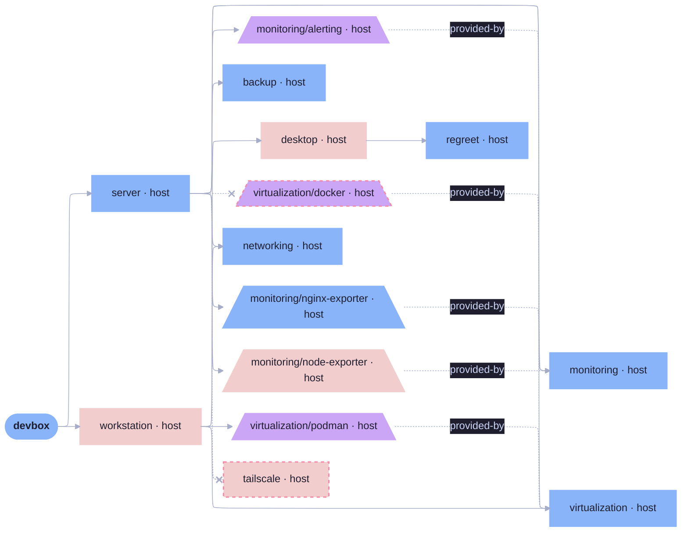

# Adapter Impact: devbox

```mermaid
%%{init: {"elk":{"mergeEdges":true,"nodePlacementStrategy":"BRANDES_KOEPF"},"layout":"elk","theme":"base","themeVariables":{"activationBkgColor":"#313244","activationBorderColor":"#6c7086","actorBkg":"#313244","actorBorder":"#a6adc8","actorLineColor":"#a6adc8","actorTextColor":"#cdd6f4","background":"#1e1e2e","classText":"#cdd6f4","clusterBkg":"#313244","clusterBorder":"#6c7086","edgeLabelBackground":"#1e1e2e","labelBoxBkgColor":"#313244","labelBoxBorderColor":"#a6adc8","labelTextColor":"#cdd6f4","lineColor":"#a6adc8","loopTextColor":"#cdd6f4","mainBkg":"#313244","nodeBkg":"#313244","nodeBorder":"#a6adc8","nodeTextColor":"#cdd6f4","noteBkgColor":"#313244","noteBorderColor":"#6c7086","noteTextColor":"#cdd6f4","pie1":"#f38ba8","pie2":"#fab387","pie3":"#f9e2af","pie4":"#a6e3a1","pie5":"#94e2d5","pie6":"#89b4fa","pie7":"#cba6f7","pie8":"#f2cdcd","pieLegendTextColor":"#cdd6f4","pieOuterStrokeColor":"#6c7086","pieSectionTextColor":"#cdd6f4","pieStrokeColor":"#6c7086","pieTitleTextColor":"#cdd6f4","primaryBorderColor":"#a6adc8","primaryColor":"#313244","primaryTextColor":"#cdd6f4","secondBkg":"#313244","secondaryBorderColor":"#6c7086","secondaryColor":"#313244","secondaryTextColor":"#cdd6f4","sequenceNumberColor":"#1e1e2e","signalColor":"#a6adc8","signalTextColor":"#cdd6f4","tertiaryBorderColor":"#6c7086","tertiaryColor":"#313244","tertiaryTextColor":"#cdd6f4","textColor":"#cdd6f4","titleColor":"#cdd6f4"}}}%%
graph LR
  devbox([devbox]):::root
  monitoring__alerting[/"monitoring/alerting · host"\]:::monitoring__alerting_c
  backup["backup · host"]:::backup_c
  desktop["desktop · host"]:::desktop_c
  virtualization__docker[/"virtualization/docker · host"\]:::virtualization__docker_c
  monitoring["monitoring · host"]:::monitoring_c
  networking["networking · host"]:::networking_c
  monitoring__nginx_exporter[/"monitoring/nginx-exporter · host"\]:::monitoring__nginx_exporter_c
  monitoring__node_exporter[/"monitoring/node-exporter · host"\]:::monitoring__node_exporter_c
  virtualization__podman[/"virtualization/podman · host"\]:::virtualization__podman_c
  regreet["regreet · host"]:::regreet_c
  server["server · host"]:::server_c
  tailscale["tailscale · host"]:::tailscale_c
  virtualization["virtualization · host"]:::virtualization_c
  workstation["workstation · host"]:::workstation_c

  desktop --> regreet
  devbox --> server
  devbox --> workstation
  server --> monitoring__alerting
  server --> backup
  server -.-x virtualization__docker
  server --> monitoring
  server --> networking
  server --> monitoring__nginx_exporter
  server --> monitoring__node_exporter
  server -.-x tailscale
  server --> virtualization
  workstation --> desktop
  workstation --> networking
  workstation --> virtualization__podman
  workstation -.-x tailscale
  workstation --> virtualization
  virtualization__podman -.->|provided-by| virtualization
  monitoring__node_exporter -.->|provided-by| monitoring
  monitoring__nginx_exporter -.->|provided-by| monitoring
  monitoring__alerting -.->|provided-by| monitoring
  virtualization__docker -.->|provided-by| virtualization

  classDef root fill:#89b4fa,stroke:#89b4fa,color:#1e1e2e,font-weight:bold
  classDef monitoring__alerting_c fill:#cba6f7,stroke:#cba6f7,color:#1e1e2e,stroke-width:3px
  classDef backup_c fill:#89b4fa,stroke:#89b4fa,color:#1e1e2e,stroke-width:3px
  classDef desktop_c fill:#f2cdcd,stroke:#f2cdcd,color:#1e1e2e,stroke-width:3px
  classDef devbox_c fill:#f2cdcd,stroke:#f2cdcd,color:#1e1e2e,stroke-width:3px
  classDef virtualization__docker_c fill:#cba6f7,stroke:#f38ba8,color:#1e1e2e,stroke-dasharray: 5 5,stroke-width:2px
  classDef monitoring_c fill:#89b4fa,stroke:#89b4fa,color:#1e1e2e,stroke-width:3px
  classDef networking_c fill:#89b4fa,stroke:#89b4fa,color:#1e1e2e,stroke-width:3px
  classDef monitoring__nginx_exporter_c fill:#89b4fa,stroke:#89b4fa,color:#1e1e2e,stroke-width:3px
  classDef monitoring__node_exporter_c fill:#f2cdcd,stroke:#f2cdcd,color:#1e1e2e,stroke-width:3px
  classDef virtualization__podman_c fill:#cba6f7,stroke:#cba6f7,color:#1e1e2e,stroke-width:3px
  classDef regreet_c fill:#89b4fa,stroke:#89b4fa,color:#1e1e2e,stroke-width:3px
  classDef server_c fill:#89b4fa,stroke:#89b4fa,color:#1e1e2e,stroke-width:3px
  classDef tailscale_c fill:#f2cdcd,stroke:#f38ba8,color:#1e1e2e,stroke-dasharray: 5 5,stroke-width:2px
  classDef virtualization_c fill:#89b4fa,stroke:#89b4fa,color:#1e1e2e,stroke-width:3px
  classDef workstation_c fill:#f2cdcd,stroke:#f2cdcd,color:#1e1e2e,stroke-width:3px
```
