# Diagram Gallery: devbox

Every rendered view for `devbox`. Source for each diagram is in the
corresponding `devbox-<view>.md` file.

## Context Hierarchy

## Aspect Hierarchy

## Simplified View

## Resolution Sequence
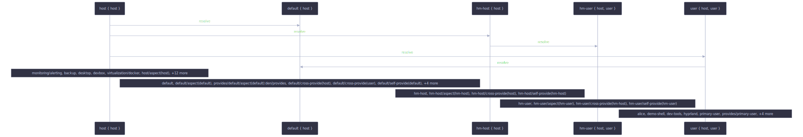

## Resolution Sequence (expanded)
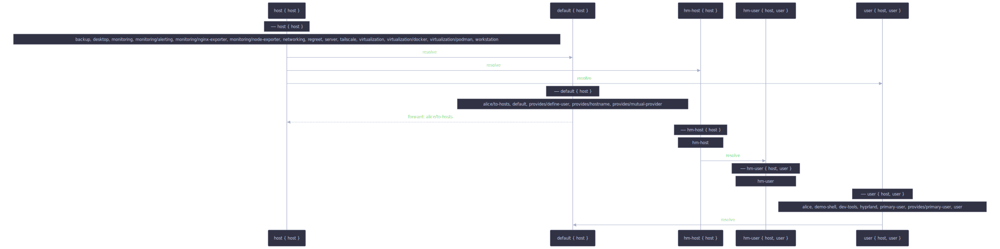

## Sankey Flow
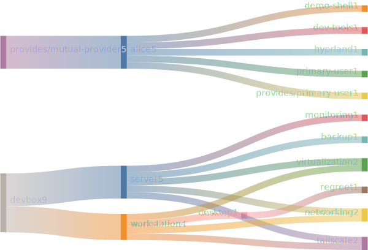

## Treemap
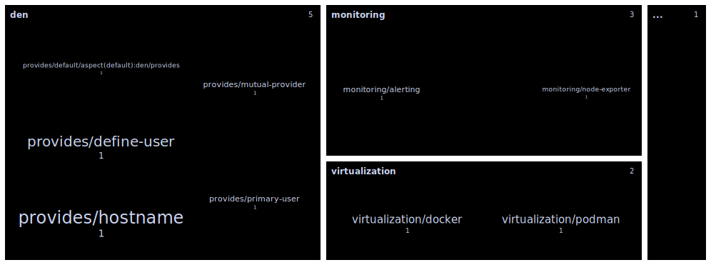

## Provider Tree

## Adapter Impact

## Structural Decisions

## hasAspect Presence: nixos

## hasAspect Presence: homeManager

## Parametric Aspects

## User-Declared Aspects

## Class Slice: nixos

## Class Slice: homeManager

## Cross-Class Aspects

## Orphans and Leaves

## Resolution Pipeline (machinery)

## Provider Mindmap

## Context State Diagram

## Fan-In / Fan-Out
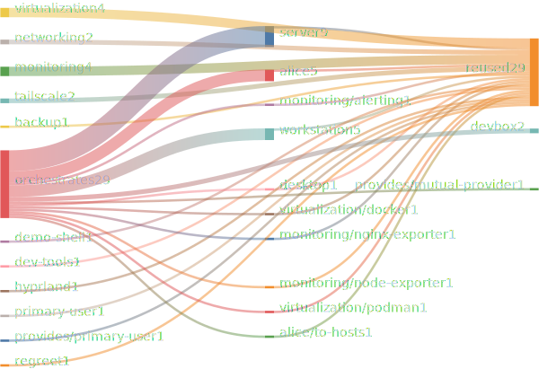

## Class Diff (nixos vs homeManager)

## C4 Container
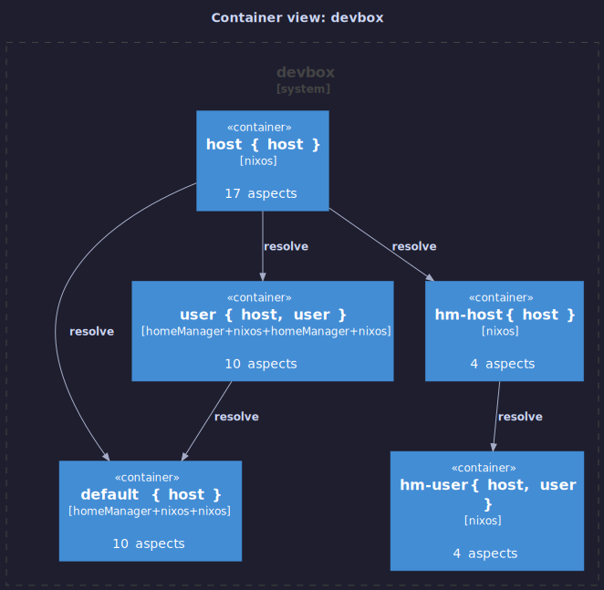

## C4 Component
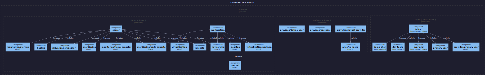

## Full DAG — Mermaid

## Full DAG — Graphviz DOT
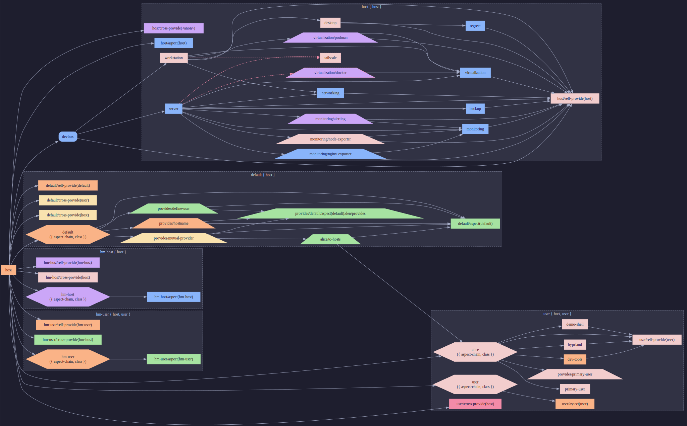

## Full DAG — PlantUML
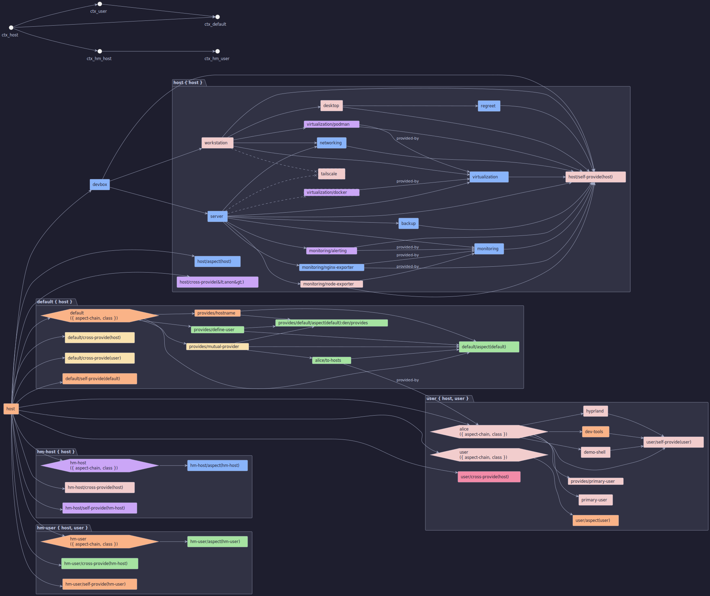
