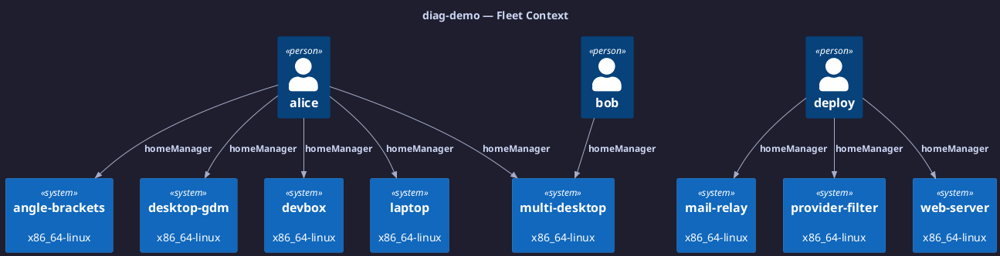

# Fleet C4 Context

```plantuml
@startuml
!include <C4/C4_Context>
skinparam backgroundColor #1e1e2e
skinparam defaultFontColor #cdd6f4
skinparam defaultFontName "JetBrains Mono,monospace"
skinparam arrowColor #a6adc8
skinparam arrowFontColor #cdd6f4
skinparam PersonBackgroundColor #313244
skinparam PersonBorderColor #a6adc8
skinparam PersonFontColor #cdd6f4
skinparam SystemBackgroundColor #313244
skinparam SystemBorderColor #a6adc8
skinparam SystemFontColor #cdd6f4
skinparam ContainerBackgroundColor #313244
skinparam ContainerBorderColor #a6adc8
skinparam ContainerFontColor #cdd6f4
skinparam ComponentBackgroundColor #313244
skinparam ComponentBorderColor #a6adc8
skinparam ComponentFontColor #cdd6f4
skinparam BoundaryBackgroundColor #313244
skinparam BoundaryBorderColor #6c7086
skinparam BoundaryFontColor #cdd6f4
skinparam RectangleBackgroundColor #313244
skinparam RectangleBorderColor #a6adc8
skinparam RectangleFontColor #cdd6f4


title diag-demo — Fleet Context

Person(alice, "alice")
Person(deploy, "deploy")
Person(bob, "bob")

System(angle_brackets, "angle-brackets", "x86_64-linux")
System(desktop_gdm, "desktop-gdm", "x86_64-linux")
System(devbox, "devbox", "x86_64-linux")
System(laptop, "laptop", "x86_64-linux")
System(mail_relay, "mail-relay", "x86_64-linux")
System(multi_desktop, "multi-desktop", "x86_64-linux")
System(provider_filter, "provider-filter", "x86_64-linux")
System(web_server, "web-server", "x86_64-linux")

Rel(alice, angle_brackets, "homeManager")
Rel(alice, desktop_gdm, "homeManager")
Rel(alice, devbox, "homeManager")
Rel(alice, laptop, "homeManager")
Rel(deploy, mail_relay, "homeManager")
Rel(alice, multi_desktop, "homeManager")
Rel(bob, multi_desktop, "homeManager")
Rel(deploy, provider_filter, "homeManager")
Rel(deploy, web_server, "homeManager")

@enduml
```
