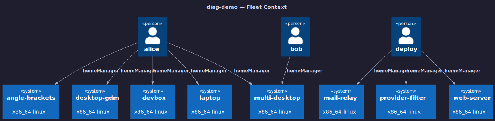
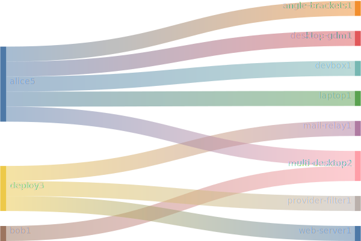
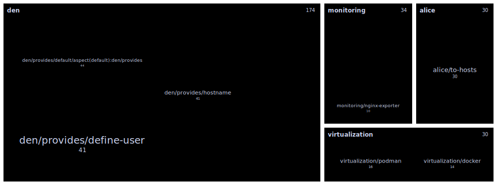

# Fleet Diagram Gallery

Flake-wide views covering every host and user in the fleet. Source for each
diagram is in the corresponding `fleet-<view>.md` file.

## Aspect Namespace (declarations)

## C4 Context

## Sankey

## Treemap

## Provider Matrix

