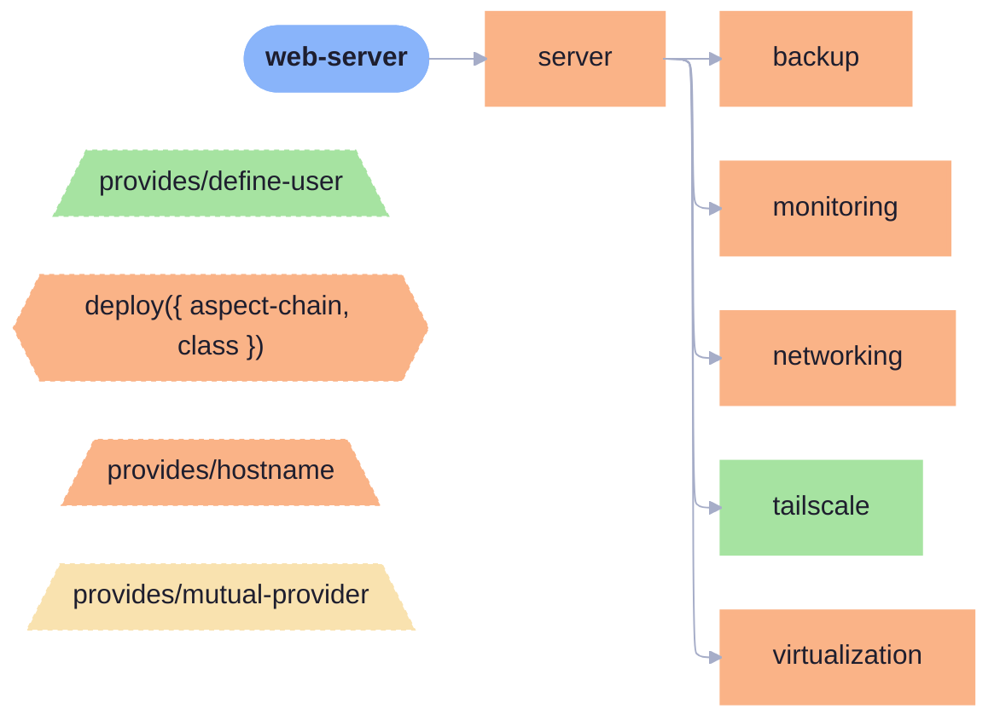

# Simplified View: web-server

```mermaid
%%{init: {"elk":{"mergeEdges":true,"nodePlacementStrategy":"BRANDES_KOEPF"},"layout":"elk","theme":"base","themeVariables":{"activationBkgColor":"#313244","activationBorderColor":"#6c7086","actorBkg":"#313244","actorBorder":"#a6adc8","actorLineColor":"#a6adc8","actorTextColor":"#cdd6f4","background":"#1e1e2e","classText":"#cdd6f4","clusterBkg":"#313244","clusterBorder":"#6c7086","edgeLabelBackground":"#1e1e2e","labelBoxBkgColor":"#313244","labelBoxBorderColor":"#a6adc8","labelTextColor":"#cdd6f4","lineColor":"#a6adc8","loopTextColor":"#cdd6f4","mainBkg":"#313244","nodeBkg":"#313244","nodeBorder":"#a6adc8","nodeTextColor":"#cdd6f4","noteBkgColor":"#313244","noteBorderColor":"#6c7086","noteTextColor":"#cdd6f4","pie1":"#f38ba8","pie2":"#fab387","pie3":"#f9e2af","pie4":"#a6e3a1","pie5":"#94e2d5","pie6":"#89b4fa","pie7":"#cba6f7","pie8":"#f2cdcd","pieLegendTextColor":"#cdd6f4","pieOuterStrokeColor":"#6c7086","pieSectionTextColor":"#cdd6f4","pieStrokeColor":"#6c7086","pieTitleTextColor":"#cdd6f4","primaryBorderColor":"#a6adc8","primaryColor":"#313244","primaryTextColor":"#cdd6f4","secondBkg":"#313244","secondaryBorderColor":"#6c7086","secondaryColor":"#313244","secondaryTextColor":"#cdd6f4","sequenceNumberColor":"#1e1e2e","signalColor":"#a6adc8","signalTextColor":"#cdd6f4","tertiaryBorderColor":"#6c7086","tertiaryColor":"#313244","tertiaryTextColor":"#cdd6f4","textColor":"#cdd6f4","titleColor":"#cdd6f4"}}}%%
graph LR
  web_server([web-server]):::root
  backup["backup"]:::backup_c
  den__provides__define_user[/"provides/define-user"\]:::den__provides__define_user_c
  deploy{{"deploy({ aspect-chain, class })"}}:::deploy_c
  den__provides__hostname[/"provides/hostname"\]:::den__provides__hostname_c
  monitoring["monitoring"]:::monitoring_c
  den__provides__mutual_provider[/"provides/mutual-provider"\]:::den__provides__mutual_provider_c
  networking["networking"]:::networking_c
  server["server"]:::server_c
  tailscale["tailscale"]:::tailscale_c
  virtualization["virtualization"]:::virtualization_c

  server --> monitoring
  server --> backup
  server --> virtualization
  server --> networking
  server --> tailscale
  web_server --> server

  classDef root fill:#89b4fa,stroke:#89b4fa,color:#1e1e2e,font-weight:bold
  classDef backup_c fill:#fab387,stroke:#fab387,color:#1e1e2e,stroke-width:3px
  classDef den__provides__define_user_c fill:#a6e3a1,stroke:#a6e3a1,color:#1e1e2e,stroke-dasharray: 3 3,stroke-width:1px
  classDef deploy_c fill:#fab387,stroke:#fab387,color:#1e1e2e,stroke-dasharray: 3 3,stroke-width:1px
  classDef den__provides__hostname_c fill:#fab387,stroke:#fab387,color:#1e1e2e,stroke-dasharray: 3 3,stroke-width:1px
  classDef monitoring_c fill:#fab387,stroke:#fab387,color:#1e1e2e,stroke-width:3px
  classDef den__provides__mutual_provider_c fill:#f9e2af,stroke:#f9e2af,color:#1e1e2e,stroke-dasharray: 3 3,stroke-width:1px
  classDef networking_c fill:#fab387,stroke:#fab387,color:#1e1e2e,stroke-width:3px
  classDef server_c fill:#fab387,stroke:#fab387,color:#1e1e2e,stroke-width:3px
  classDef tailscale_c fill:#a6e3a1,stroke:#a6e3a1,color:#1e1e2e,stroke-width:3px
  classDef virtualization_c fill:#fab387,stroke:#fab387,color:#1e1e2e,stroke-width:3px
  classDef web_server_c fill:#f9e2af,stroke:#f9e2af,color:#1e1e2e,stroke-width:3px
```
