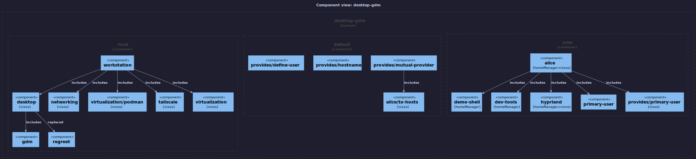

# C4 Component View: desktop-gdm

```plantuml
@startuml
!include <C4/C4_Component>
skinparam backgroundColor #1e1e2e
skinparam defaultFontColor #cdd6f4
skinparam defaultFontName "JetBrains Mono,monospace"
skinparam arrowColor #a6adc8
skinparam arrowFontColor #cdd6f4
skinparam PersonBackgroundColor #313244
skinparam PersonBorderColor #a6adc8
skinparam PersonFontColor #cdd6f4
skinparam SystemBackgroundColor #313244
skinparam SystemBorderColor #a6adc8
skinparam SystemFontColor #cdd6f4
skinparam ContainerBackgroundColor #313244
skinparam ContainerBorderColor #a6adc8
skinparam ContainerFontColor #cdd6f4
skinparam ComponentBackgroundColor #313244
skinparam ComponentBorderColor #a6adc8
skinparam ComponentFontColor #cdd6f4
skinparam BoundaryBackgroundColor #313244
skinparam BoundaryBorderColor #6c7086
skinparam BoundaryFontColor #cdd6f4
skinparam RectangleBackgroundColor #313244
skinparam RectangleBorderColor #a6adc8
skinparam RectangleFontColor #cdd6f4


title Component view: desktop-gdm

System_Boundary(desktop_gdm, "desktop-gdm") {
  Container_Boundary(host, "host") {
    Component(desktop, "desktop", "nixos")
    Component(gdm, "gdm", "")
    Component(networking, "networking", "nixos")
    Component(virtualization__podman, "virtualization/podman", "nixos")
    Component(regreet, "regreet", "")
    Component(tailscale, "tailscale", "nixos")
    Component(virtualization, "virtualization", "nixos")
    Component(workstation, "workstation", "")
}
  Container_Boundary(c4_default, "default") {
    Component(den__provides__define_user, "provides/define-user", "")
    Component(den__provides__hostname, "provides/hostname", "")
    Component(den__provides__mutual_provider, "provides/mutual-provider", "")
    Component(alice__to_hosts, "alice/to-hosts", "nixos")
}
  Container_Boundary(user, "user") {
    Component(alice, "alice", "homeManager+nixos")
    Component(demo_shell, "demo-shell", "homeManager")
    Component(dev_tools, "dev-tools", "homeManager")
    Component(hyprland, "hyprland", "homeManager+nixos")
    Component(primary_user, "primary-user", "")
    Component(den__provides__primary_user, "provides/primary-user", "nixos")
}
}

Rel(alice, demo_shell, "includes")
Rel(alice, dev_tools, "includes")
Rel(alice, hyprland, "includes")
Rel(alice, primary_user, "includes")
Rel(alice, den__provides__primary_user, "includes")
Rel(den__provides__mutual_provider, alice__to_hosts, "includes")
Rel(desktop, gdm, "includes")
Rel(desktop, regreet, "replaced")
Rel(workstation, desktop, "includes")
Rel(workstation, networking, "includes")
Rel(workstation, virtualization__podman, "includes")
Rel(workstation, tailscale, "includes")
Rel(workstation, virtualization, "includes")
@enduml
```
