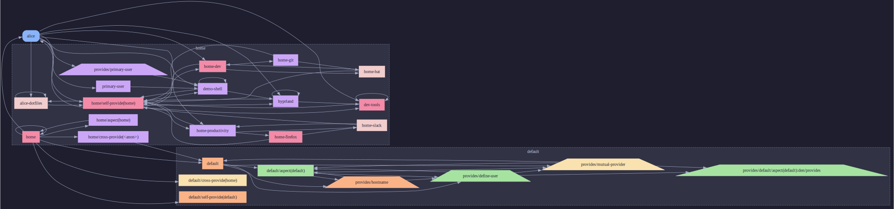
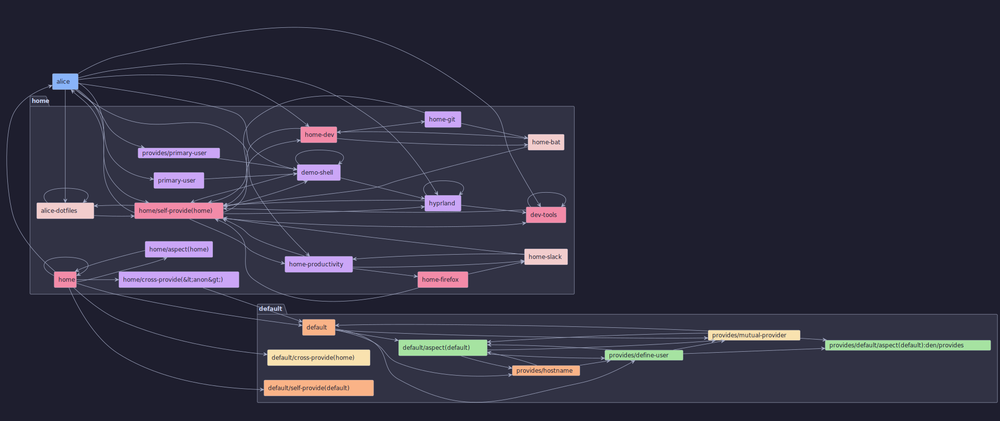

# Full DAG: home-alice-at-laptop

## Mermaid

```mermaid
%%{init: {"elk":{"mergeEdges":true,"nodePlacementStrategy":"BRANDES_KOEPF"},"layout":"elk","theme":"base","themeVariables":{"activationBkgColor":"#313244","activationBorderColor":"#6c7086","actorBkg":"#313244","actorBorder":"#a6adc8","actorLineColor":"#a6adc8","actorTextColor":"#cdd6f4","background":"#1e1e2e","classText":"#cdd6f4","clusterBkg":"#313244","clusterBorder":"#6c7086","edgeLabelBackground":"#1e1e2e","labelBoxBkgColor":"#313244","labelBoxBorderColor":"#a6adc8","labelTextColor":"#cdd6f4","lineColor":"#a6adc8","loopTextColor":"#cdd6f4","mainBkg":"#313244","nodeBkg":"#313244","nodeBorder":"#a6adc8","nodeTextColor":"#cdd6f4","noteBkgColor":"#313244","noteBorderColor":"#6c7086","noteTextColor":"#cdd6f4","pie1":"#f38ba8","pie2":"#fab387","pie3":"#f9e2af","pie4":"#a6e3a1","pie5":"#94e2d5","pie6":"#89b4fa","pie7":"#cba6f7","pie8":"#f2cdcd","pieLegendTextColor":"#cdd6f4","pieOuterStrokeColor":"#6c7086","pieSectionTextColor":"#cdd6f4","pieStrokeColor":"#6c7086","pieTitleTextColor":"#cdd6f4","primaryBorderColor":"#a6adc8","primaryColor":"#313244","primaryTextColor":"#cdd6f4","secondBkg":"#313244","secondaryBorderColor":"#6c7086","secondaryColor":"#313244","secondaryTextColor":"#cdd6f4","sequenceNumberColor":"#1e1e2e","signalColor":"#a6adc8","signalTextColor":"#cdd6f4","tertiaryBorderColor":"#6c7086","tertiaryColor":"#313244","tertiaryTextColor":"#cdd6f4","textColor":"#cdd6f4","titleColor":"#cdd6f4"}}}%%
graph LR
  alice([alice]):::root

  subgraph ctx_home["home"]
  alice_dotfiles["alice-dotfiles"]:::alice_dotfiles_c
  demo_shell["demo-shell"]:::demo_shell_c
  dev_tools["dev-tools"]:::dev_tools_c
  home["home"]:::home_c
  home_bat["home-bat"]:::home_bat_c
  home_dev["home-dev"]:::home_dev_c
  home_firefox["home-firefox"]:::home_firefox_c
  home_git["home-git"]:::home_git_c
  home_productivity["home-productivity"]:::home_productivity_c
  home_slack["home-slack"]:::home_slack_c
  home__aspect_home_["home/aspect(home)"]:::home__aspect_home__c
  home__cross_provide__anon__["home/cross-provide(<anon>)"]:::home__cross_provide__anon___c
  home__self_provide_home_["home/self-provide(home)"]:::home__self_provide_home__c
  hyprland["hyprland"]:::hyprland_c
  primary_user["primary-user"]:::primary_user_c
  den__provides__primary_user[/"provides/primary-user"\]:::den__provides__primary_user_c
  alice --> alice_dotfiles
  alice --> demo_shell
  alice --> dev_tools
  alice --> home_dev
  alice --> home_productivity
  alice --> home__self_provide_home_
  alice --> hyprland
  alice --> primary_user
  alice --> den__provides__primary_user
  alice_dotfiles --> alice_dotfiles
  alice_dotfiles --> home__self_provide_home_
  demo_shell --> demo_shell
  demo_shell --> home__self_provide_home_
  demo_shell --> hyprland
  den__provides__primary_user --> demo_shell
  dev_tools --> dev_tools
  dev_tools --> home__self_provide_home_
  home --> alice
  home --> n_default
  home --> default__cross_provide_home_
  home --> default__self_provide_default_
  home --> home
  home --> home__aspect_home_
  home --> home__cross_provide__anon__
  home_bat --> home_dev
  home_bat --> home__self_provide_home_
  home_dev --> home_bat
  home_dev --> home_git
  home_dev --> home__self_provide_home_
  home_firefox --> home_slack
  home_firefox --> home__self_provide_home_
  home_git --> home_bat
  home_git --> home__self_provide_home_
  home_productivity --> home_firefox
  home_productivity --> home_slack
  home_productivity --> home__self_provide_home_
  home_slack --> home_productivity
  home_slack --> home__self_provide_home_
  home__aspect_home_ --> home
  home__cross_provide__anon__ --> n_default
  home__self_provide_home_ --> alice
  home__self_provide_home_ --> alice_dotfiles
  home__self_provide_home_ --> demo_shell
  home__self_provide_home_ --> dev_tools
  home__self_provide_home_ --> home_dev
  home__self_provide_home_ --> home_productivity
  home__self_provide_home_ --> hyprland
  hyprland --> dev_tools
  hyprland --> home__self_provide_home_
  hyprland --> hyprland
  primary_user --> demo_shell
  end
  subgraph ctx_default["default"]
  n_default["default"]:::n_default_c
  default__aspect_default_["default/aspect(default)"]:::default__aspect_default__c
  den__provides__default__aspect_default__den__provides[/"provides/default/aspect(default):den/provides"\]:::den__provides__default__aspect_default__den__provides_c
  default__cross_provide_home_["default/cross-provide(home)"]:::default__cross_provide_home__c
  default__self_provide_default_["default/self-provide(default)"]:::default__self_provide_default__c
  den__provides__define_user[/"provides/define-user"\]:::den__provides__define_user_c
  den__provides__hostname[/"provides/hostname"\]:::den__provides__hostname_c
  den__provides__mutual_provider[/"provides/mutual-provider"\]:::den__provides__mutual_provider_c
  n_default --> default__aspect_default_
  n_default --> den__provides__define_user
  n_default --> den__provides__hostname
  n_default --> den__provides__mutual_provider
  default__aspect_default_ --> den__provides__define_user
  default__aspect_default_ --> den__provides__hostname
  default__aspect_default_ --> den__provides__mutual_provider
  den__provides__define_user --> default__aspect_default_
  den__provides__define_user --> den__provides__default__aspect_default__den__provides
  den__provides__define_user --> den__provides__mutual_provider
  den__provides__hostname --> default__aspect_default_
  den__provides__hostname --> den__provides__define_user
  den__provides__mutual_provider --> n_default
  den__provides__mutual_provider --> default__aspect_default_
  den__provides__mutual_provider --> den__provides__default__aspect_default__den__provides
  end


  classDef root fill:#89b4fa,stroke:#89b4fa,color:#1e1e2e,font-weight:bold
  classDef alice_c fill:#cba6f7,stroke:#cba6f7,color:#1e1e2e,stroke-width:2px
  classDef alice_dotfiles_c fill:#f2cdcd,stroke:#f2cdcd,color:#1e1e2e,stroke-width:2px
  classDef n_default_c fill:#fab387,stroke:#fab387,color:#1e1e2e,stroke-width:2px
  classDef default__aspect_default__c fill:#a6e3a1,stroke:#a6e3a1,color:#1e1e2e,stroke-dasharray: 3 3,stroke-width:1px
  classDef den__provides__default__aspect_default__den__provides_c fill:#a6e3a1,stroke:#a6e3a1,color:#1e1e2e,stroke-width:2px
  classDef default__cross_provide_home__c fill:#f9e2af,stroke:#f9e2af,color:#1e1e2e,stroke-dasharray: 3 3,stroke-width:1px
  classDef default__self_provide_default__c fill:#fab387,stroke:#fab387,color:#1e1e2e,stroke-dasharray: 3 3,stroke-width:1px
  classDef den__provides__define_user_c fill:#a6e3a1,stroke:#a6e3a1,color:#1e1e2e,stroke-dasharray: 3 3,stroke-width:1px
  classDef demo_shell_c fill:#cba6f7,stroke:#cba6f7,color:#1e1e2e,stroke-width:2px
  classDef dev_tools_c fill:#f38ba8,stroke:#f38ba8,color:#1e1e2e,stroke-width:2px
  classDef home_c fill:#f38ba8,stroke:#f38ba8,color:#1e1e2e,stroke-dasharray: 3 3,stroke-width:1px
  classDef home_bat_c fill:#f2cdcd,stroke:#f2cdcd,color:#1e1e2e,stroke-width:2px
  classDef home_dev_c fill:#f38ba8,stroke:#f38ba8,color:#1e1e2e,stroke-dasharray: 3 3,stroke-width:1px
  classDef home_firefox_c fill:#f38ba8,stroke:#f38ba8,color:#1e1e2e,stroke-width:2px
  classDef home_git_c fill:#cba6f7,stroke:#cba6f7,color:#1e1e2e,stroke-width:2px
  classDef home_productivity_c fill:#cba6f7,stroke:#cba6f7,color:#1e1e2e,stroke-dasharray: 3 3,stroke-width:1px
  classDef home_slack_c fill:#f2cdcd,stroke:#f2cdcd,color:#1e1e2e,stroke-width:2px
  classDef home__aspect_home__c fill:#cba6f7,stroke:#cba6f7,color:#1e1e2e,stroke-dasharray: 3 3,stroke-width:1px
  classDef home__cross_provide__anon___c fill:#cba6f7,stroke:#cba6f7,color:#1e1e2e,stroke-dasharray: 3 3,stroke-width:1px
  classDef home__self_provide_home__c fill:#f38ba8,stroke:#f38ba8,color:#1e1e2e,stroke-dasharray: 3 3,stroke-width:1px
  classDef den__provides__hostname_c fill:#fab387,stroke:#fab387,color:#1e1e2e,stroke-dasharray: 3 3,stroke-width:1px
  classDef hyprland_c fill:#cba6f7,stroke:#cba6f7,color:#1e1e2e,stroke-width:2px
  classDef den__provides__mutual_provider_c fill:#f9e2af,stroke:#f9e2af,color:#1e1e2e,stroke-dasharray: 3 3,stroke-width:1px
  classDef primary_user_c fill:#cba6f7,stroke:#cba6f7,color:#1e1e2e,stroke-dasharray: 3 3,stroke-width:1px
  classDef den__provides__primary_user_c fill:#cba6f7,stroke:#cba6f7,color:#1e1e2e,stroke-dasharray: 3 3,stroke-width:1px
style ctx_home fill:#313244,stroke:#6c7086,stroke-width:2px
style ctx_default fill:#313244,stroke:#6c7086,stroke-width:2px
```

## Graphviz DOT

```dot
digraph {
  rankdir=LR;
  bgcolor="#1e1e2e";
  color="#cdd6f4";
  fontcolor="#cdd6f4";
  node [style=filled, fillcolor="#313244", fontcolor="#cdd6f4", color="#a6adc8"];
  edge [color="#a6adc8", fontcolor="#cdd6f4"];
  alice [label="alice",shape=box,style="rounded,filled",fillcolor="#89b4fa",color="#89b4fa",fontcolor="#1e1e2e"];
  subgraph cluster_ctx_home {
    label="home";
    style=dashed;
    color="#6c7086";
    fontcolor="#cdd6f4";
    bgcolor="#313244";
  alice_dotfiles [label="alice-dotfiles",shape=box,style=filled,fillcolor="#f2cdcd",color="#f2cdcd",fontcolor="#1e1e2e"];
  demo_shell [label="demo-shell",shape=box,style=filled,fillcolor="#cba6f7",color="#cba6f7",fontcolor="#1e1e2e"];
  dev_tools [label="dev-tools",shape=box,style=filled,fillcolor="#f38ba8",color="#f38ba8",fontcolor="#1e1e2e"];
  home [label="home",shape=box,style=filled,fillcolor="#f38ba8",color="#f38ba8",fontcolor="#1e1e2e"];
  home_bat [label="home-bat",shape=box,style=filled,fillcolor="#f2cdcd",color="#f2cdcd",fontcolor="#1e1e2e"];
  home_dev [label="home-dev",shape=box,style=filled,fillcolor="#f38ba8",color="#f38ba8",fontcolor="#1e1e2e"];
  home_firefox [label="home-firefox",shape=box,style=filled,fillcolor="#f38ba8",color="#f38ba8",fontcolor="#1e1e2e"];
  home_git [label="home-git",shape=box,style=filled,fillcolor="#cba6f7",color="#cba6f7",fontcolor="#1e1e2e"];
  home_productivity [label="home-productivity",shape=box,style=filled,fillcolor="#cba6f7",color="#cba6f7",fontcolor="#1e1e2e"];
  home_slack [label="home-slack",shape=box,style=filled,fillcolor="#f2cdcd",color="#f2cdcd",fontcolor="#1e1e2e"];
  home__aspect_home_ [label="home/aspect(home)",shape=box,style=filled,fillcolor="#cba6f7",color="#cba6f7",fontcolor="#1e1e2e"];
  home__cross_provide__anon__ [label="home/cross-provide(<anon>)",shape=box,style=filled,fillcolor="#cba6f7",color="#cba6f7",fontcolor="#1e1e2e"];
  home__self_provide_home_ [label="home/self-provide(home)",shape=box,style=filled,fillcolor="#f38ba8",color="#f38ba8",fontcolor="#1e1e2e"];
  hyprland [label="hyprland",shape=box,style=filled,fillcolor="#cba6f7",color="#cba6f7",fontcolor="#1e1e2e"];
  primary_user [label="primary-user",shape=box,style=filled,fillcolor="#cba6f7",color="#cba6f7",fontcolor="#1e1e2e"];
  den__provides__primary_user [label="provides/primary-user",shape=trapezium,style=filled,fillcolor="#cba6f7",color="#cba6f7",fontcolor="#1e1e2e"];
  }
  subgraph cluster_ctx_default {
    label="default";
    style=dashed;
    color="#6c7086";
    fontcolor="#cdd6f4";
    bgcolor="#313244";
  n_default [label="default",shape=box,style=filled,fillcolor="#fab387",color="#fab387",fontcolor="#1e1e2e"];
  default__aspect_default_ [label="default/aspect(default)",shape=box,style=filled,fillcolor="#a6e3a1",color="#a6e3a1",fontcolor="#1e1e2e"];
  den__provides__default__aspect_default__den__provides [label="provides/default/aspect(default):den/provides",shape=trapezium,style=filled,fillcolor="#a6e3a1",color="#a6e3a1",fontcolor="#1e1e2e"];
  default__cross_provide_home_ [label="default/cross-provide(home)",shape=box,style=filled,fillcolor="#f9e2af",color="#f9e2af",fontcolor="#1e1e2e"];
  default__self_provide_default_ [label="default/self-provide(default)",shape=box,style=filled,fillcolor="#fab387",color="#fab387",fontcolor="#1e1e2e"];
  den__provides__define_user [label="provides/define-user",shape=trapezium,style=filled,fillcolor="#a6e3a1",color="#a6e3a1",fontcolor="#1e1e2e"];
  den__provides__hostname [label="provides/hostname",shape=trapezium,style=filled,fillcolor="#fab387",color="#fab387",fontcolor="#1e1e2e"];
  den__provides__mutual_provider [label="provides/mutual-provider",shape=trapezium,style=filled,fillcolor="#f9e2af",color="#f9e2af",fontcolor="#1e1e2e"];
  }

  alice -> alice_dotfiles;
  alice -> demo_shell;
  alice -> dev_tools;
  alice -> home_dev;
  alice -> home_productivity;
  alice -> home__self_provide_home_;
  alice -> hyprland;
  alice -> primary_user;
  alice -> den__provides__primary_user;
  alice_dotfiles -> alice_dotfiles;
  alice_dotfiles -> home__self_provide_home_;
  n_default -> default__aspect_default_;
  n_default -> den__provides__define_user;
  n_default -> den__provides__hostname;
  n_default -> den__provides__mutual_provider;
  default__aspect_default_ -> den__provides__define_user;
  default__aspect_default_ -> den__provides__hostname;
  default__aspect_default_ -> den__provides__mutual_provider;
  demo_shell -> demo_shell;
  demo_shell -> home__self_provide_home_;
  demo_shell -> hyprland;
  den__provides__define_user -> default__aspect_default_;
  den__provides__define_user -> den__provides__default__aspect_default__den__provides;
  den__provides__define_user -> den__provides__mutual_provider;
  den__provides__hostname -> default__aspect_default_;
  den__provides__hostname -> den__provides__define_user;
  den__provides__mutual_provider -> n_default;
  den__provides__mutual_provider -> default__aspect_default_;
  den__provides__mutual_provider -> den__provides__default__aspect_default__den__provides;
  den__provides__primary_user -> demo_shell;
  dev_tools -> dev_tools;
  dev_tools -> home__self_provide_home_;
  home -> alice;
  home -> n_default;
  home -> default__cross_provide_home_;
  home -> default__self_provide_default_;
  home -> home;
  home -> home__aspect_home_;
  home -> home__cross_provide__anon__;
  home_bat -> home_dev;
  home_bat -> home__self_provide_home_;
  home_dev -> home_bat;
  home_dev -> home_git;
  home_dev -> home__self_provide_home_;
  home_firefox -> home_slack;
  home_firefox -> home__self_provide_home_;
  home_git -> home_bat;
  home_git -> home__self_provide_home_;
  home_productivity -> home_firefox;
  home_productivity -> home_slack;
  home_productivity -> home__self_provide_home_;
  home_slack -> home_productivity;
  home_slack -> home__self_provide_home_;
  home__aspect_home_ -> home;
  home__cross_provide__anon__ -> n_default;
  home__self_provide_home_ -> alice;
  home__self_provide_home_ -> alice_dotfiles;
  home__self_provide_home_ -> demo_shell;
  home__self_provide_home_ -> dev_tools;
  home__self_provide_home_ -> home_dev;
  home__self_provide_home_ -> home_productivity;
  home__self_provide_home_ -> hyprland;
  hyprland -> dev_tools;
  hyprland -> home__self_provide_home_;
  hyprland -> hyprland;
  primary_user -> demo_shell;
}
```

## PlantUML

```plantuml
@startuml
left to right direction
skinparam backgroundColor #1e1e2e
skinparam defaultFontColor #cdd6f4
skinparam defaultFontName "JetBrains Mono,monospace"
skinparam arrowColor #a6adc8
skinparam arrowFontColor #cdd6f4
skinparam RectangleBackgroundColor #313244
skinparam RectangleBorderColor #a6adc8
skinparam RectangleFontColor #1e1e2e
skinparam HexagonBackgroundColor #313244
skinparam HexagonBorderColor #a6adc8
skinparam HexagonFontColor #1e1e2e
skinparam CardBackgroundColor #313244
skinparam CardBorderColor #a6adc8
skinparam CardFontColor #1e1e2e
skinparam PackageBackgroundColor #313244
skinparam PackageBorderColor #6c7086
skinparam PackageFontColor #cdd6f4
skinparam NoteBackgroundColor #313244
skinparam NoteBorderColor #6c7086
skinparam NoteFontColor #cdd6f4

rectangle "alice" as alice #89b4fa
package "home" as stage_home {
  rectangle "alice-dotfiles" as alice_dotfiles #f2cdcd
  rectangle "demo-shell" as demo_shell #cba6f7
  rectangle "dev-tools" as dev_tools #f38ba8
  rectangle "home" as home #f38ba8
  rectangle "home-bat" as home_bat #f2cdcd
  rectangle "home-dev" as home_dev #f38ba8
  rectangle "home-firefox" as home_firefox #f38ba8
  rectangle "home-git" as home_git #cba6f7
  rectangle "home-productivity" as home_productivity #cba6f7
  rectangle "home-slack" as home_slack #f2cdcd
  rectangle "home/aspect(home)" as home__aspect_home_ #cba6f7
  rectangle "home/cross-provide(&lt;anon&gt;)" as home__cross_provide__anon__ #cba6f7
  rectangle "home/self-provide(home)" as home__self_provide_home_ #f38ba8
  rectangle "hyprland" as hyprland #cba6f7
  rectangle "primary-user" as primary_user #cba6f7
  card "provides/primary-user" as den__provides__primary_user #cba6f7
}
package "default" as stage_default {
  rectangle "default" as n_default #fab387
  rectangle "default/aspect(default)" as default__aspect_default_ #a6e3a1
  card "provides/default/aspect(default):den/provides" as den__provides__default__aspect_default__den__provides #a6e3a1
  rectangle "default/cross-provide(home)" as default__cross_provide_home_ #f9e2af
  rectangle "default/self-provide(default)" as default__self_provide_default_ #fab387
  card "provides/define-user" as den__provides__define_user #a6e3a1
  card "provides/hostname" as den__provides__hostname #fab387
  card "provides/mutual-provider" as den__provides__mutual_provider #f9e2af
}

alice --> alice_dotfiles
alice --> demo_shell
alice --> dev_tools
alice --> home_dev
alice --> home_productivity
alice --> home__self_provide_home_
alice --> hyprland
alice --> primary_user
alice --> den__provides__primary_user
alice_dotfiles --> alice_dotfiles
alice_dotfiles --> home__self_provide_home_
n_default --> default__aspect_default_
n_default --> den__provides__define_user
n_default --> den__provides__hostname
n_default --> den__provides__mutual_provider
default__aspect_default_ --> den__provides__define_user
default__aspect_default_ --> den__provides__hostname
default__aspect_default_ --> den__provides__mutual_provider
demo_shell --> demo_shell
demo_shell --> home__self_provide_home_
demo_shell --> hyprland
den__provides__define_user --> default__aspect_default_
den__provides__define_user --> den__provides__default__aspect_default__den__provides
den__provides__define_user --> den__provides__mutual_provider
den__provides__hostname --> default__aspect_default_
den__provides__hostname --> den__provides__define_user
den__provides__mutual_provider --> n_default
den__provides__mutual_provider --> default__aspect_default_
den__provides__mutual_provider --> den__provides__default__aspect_default__den__provides
den__provides__primary_user --> demo_shell
dev_tools --> dev_tools
dev_tools --> home__self_provide_home_
home --> alice
home --> n_default
home --> default__cross_provide_home_
home --> default__self_provide_default_
home --> home
home --> home__aspect_home_
home --> home__cross_provide__anon__
home_bat --> home_dev
home_bat --> home__self_provide_home_
home_dev --> home_bat
home_dev --> home_git
home_dev --> home__self_provide_home_
home_firefox --> home_slack
home_firefox --> home__self_provide_home_
home_git --> home_bat
home_git --> home__self_provide_home_
home_productivity --> home_firefox
home_productivity --> home_slack
home_productivity --> home__self_provide_home_
home_slack --> home_productivity
home_slack --> home__self_provide_home_
home__aspect_home_ --> home
home__cross_provide__anon__ --> n_default
home__self_provide_home_ --> alice
home__self_provide_home_ --> alice_dotfiles
home__self_provide_home_ --> demo_shell
home__self_provide_home_ --> dev_tools
home__self_provide_home_ --> home_dev
home__self_provide_home_ --> home_productivity
home__self_provide_home_ --> hyprland
hyprland --> dev_tools
hyprland --> home__self_provide_home_
hyprland --> hyprland
primary_user --> demo_shell
@enduml
```
