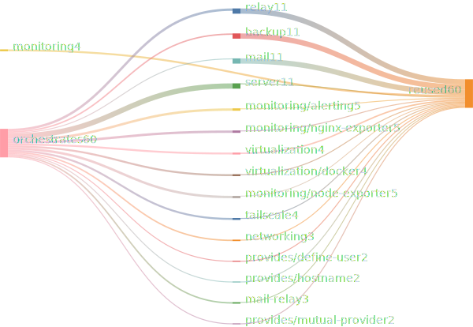
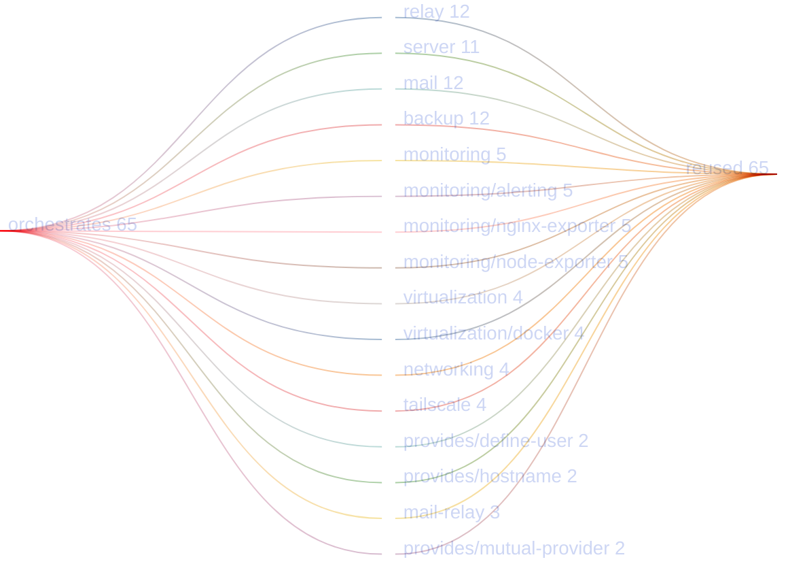

# Fan-In / Fan-Out: mail-relay

```mermaid
%%{init: {"theme":"base","themeVariables":{"activationBkgColor":"#313244","activationBorderColor":"#6c7086","actorBkg":"#313244","actorBorder":"#a6adc8","actorLineColor":"#a6adc8","actorTextColor":"#cdd6f4","background":"#1e1e2e","classText":"#cdd6f4","clusterBkg":"#313244","clusterBorder":"#6c7086","edgeLabelBackground":"#1e1e2e","labelBoxBkgColor":"#313244","labelBoxBorderColor":"#a6adc8","labelTextColor":"#cdd6f4","lineColor":"#a6adc8","loopTextColor":"#cdd6f4","mainBkg":"#313244","nodeBkg":"#313244","nodeBorder":"#a6adc8","nodeTextColor":"#cdd6f4","noteBkgColor":"#313244","noteBorderColor":"#6c7086","noteTextColor":"#cdd6f4","pie1":"#f38ba8","pie2":"#fab387","pie3":"#f9e2af","pie4":"#a6e3a1","pie5":"#94e2d5","pie6":"#89b4fa","pie7":"#cba6f7","pie8":"#f2cdcd","pieLegendTextColor":"#cdd6f4","pieOuterStrokeColor":"#6c7086","pieSectionTextColor":"#cdd6f4","pieStrokeColor":"#6c7086","pieTitleTextColor":"#cdd6f4","primaryBorderColor":"#a6adc8","primaryColor":"#313244","primaryTextColor":"#cdd6f4","secondBkg":"#313244","secondaryBorderColor":"#6c7086","secondaryColor":"#313244","secondaryTextColor":"#cdd6f4","sequenceNumberColor":"#1e1e2e","signalColor":"#a6adc8","signalTextColor":"#cdd6f4","tertiaryBorderColor":"#6c7086","tertiaryColor":"#313244","tertiaryTextColor":"#cdd6f4","textColor":"#cdd6f4","titleColor":"#cdd6f4"}}}%%
sankey-beta

"relay","reused",12
"backup","reused",12
"mail","reused",12
"server","reused",2
"monitoring","reused",5
"monitoring/alerting","reused",2
"monitoring/nginx-exporter","reused",2
"monitoring/node-exporter","reused",2
"virtualization","reused",3
"virtualization/docker","reused",2
"networking","reused",2
"tailscale","reused",2
"provides/define-user","reused",2
"provides/hostname","reused",2
"mail-relay","reused",1
"provides/mutual-provider","reused",2
"orchestrates","relay",5
"orchestrates","backup",3
"orchestrates","mail",2
"orchestrates","server",11
"orchestrates","monitoring",4
"orchestrates","monitoring/alerting",5
"orchestrates","monitoring/nginx-exporter",5
"orchestrates","monitoring/node-exporter",5
"orchestrates","virtualization",4
"orchestrates","virtualization/docker",4
"orchestrates","networking",4
"orchestrates","tailscale",4
"orchestrates","provides/define-user",2
"orchestrates","provides/hostname",2
"orchestrates","mail-relay",3
"orchestrates","provides/mutual-provider",2
```
