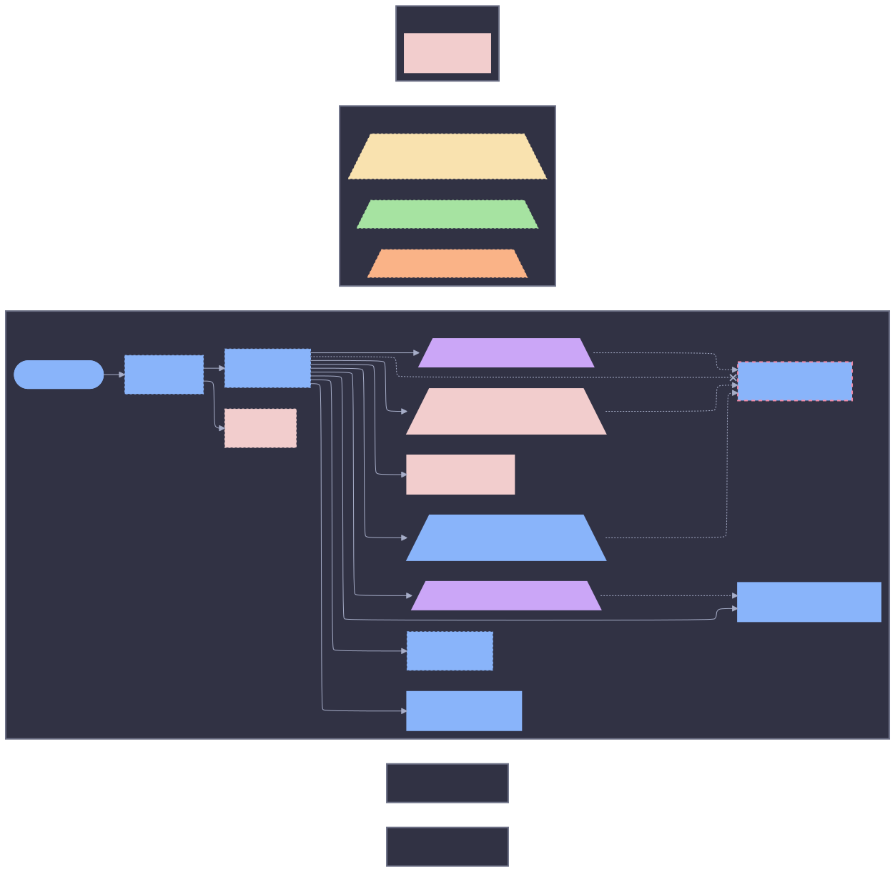

# hasAspect Presence: nixos: mail-relay

```mermaid
%%{init: {"elk":{"mergeEdges":true,"nodePlacementStrategy":"BRANDES_KOEPF"},"layout":"elk","theme":"base","themeVariables":{"activationBkgColor":"#313244","activationBorderColor":"#6c7086","actorBkg":"#313244","actorBorder":"#a6adc8","actorLineColor":"#a6adc8","actorTextColor":"#cdd6f4","background":"#1e1e2e","classText":"#cdd6f4","clusterBkg":"#313244","clusterBorder":"#6c7086","edgeLabelBackground":"#1e1e2e","labelBoxBkgColor":"#313244","labelBoxBorderColor":"#a6adc8","labelTextColor":"#cdd6f4","lineColor":"#a6adc8","loopTextColor":"#cdd6f4","mainBkg":"#313244","nodeBkg":"#313244","nodeBorder":"#a6adc8","nodeTextColor":"#cdd6f4","noteBkgColor":"#313244","noteBorderColor":"#6c7086","noteTextColor":"#cdd6f4","pie1":"#f38ba8","pie2":"#fab387","pie3":"#f9e2af","pie4":"#a6e3a1","pie5":"#94e2d5","pie6":"#89b4fa","pie7":"#cba6f7","pie8":"#f2cdcd","pieLegendTextColor":"#cdd6f4","pieOuterStrokeColor":"#6c7086","pieSectionTextColor":"#cdd6f4","pieStrokeColor":"#6c7086","pieTitleTextColor":"#cdd6f4","primaryBorderColor":"#a6adc8","primaryColor":"#313244","primaryTextColor":"#cdd6f4","secondBkg":"#313244","secondaryBorderColor":"#6c7086","secondaryColor":"#313244","secondaryTextColor":"#cdd6f4","sequenceNumberColor":"#1e1e2e","signalColor":"#a6adc8","signalTextColor":"#cdd6f4","tertiaryBorderColor":"#6c7086","tertiaryColor":"#313244","tertiaryTextColor":"#cdd6f4","textColor":"#cdd6f4","titleColor":"#cdd6f4"}}}%%
graph LR
  mail_relay([mail-relay]):::root

  subgraph ctx_host["host"]
  monitoring__alerting[/"monitoring/alerting"\]:::monitoring__alerting_c
  backup["backup"]:::backup_c
  virtualization__docker[/"virtualization/docker"\]:::virtualization__docker_c
  mail["mail"]:::mail_c
  monitoring["monitoring"]:::monitoring_c
  networking["networking"]:::networking_c
  monitoring__nginx_exporter[/"monitoring/nginx-exporter"\]:::monitoring__nginx_exporter_c
  monitoring__node_exporter[/"monitoring/node-exporter"\]:::monitoring__node_exporter_c
  relay["relay"]:::relay_c
  server["server"]:::server_c
  tailscale["tailscale"]:::tailscale_c
  virtualization["virtualization"]:::virtualization_c
  backup --> mail
  backup --> relay
  backup --> server
  mail --> backup
  mail_relay --> backup
  monitoring --> backup
  monitoring__alerting --> backup
  monitoring__nginx_exporter --> backup
  monitoring__node_exporter --> backup
  networking --> backup
  relay --> backup
  server --> backup
  tailscale --> backup
  virtualization --> backup
  virtualization__docker --> backup
  mail_relay --> mail
  monitoring --> mail
  monitoring__alerting --> mail
  monitoring__nginx_exporter --> mail
  monitoring__node_exporter --> mail
  networking --> mail
  relay --> mail
  server --> mail
  tailscale --> mail
  virtualization --> mail
  virtualization__docker --> mail
  mail --> relay
  mail_relay --> relay
  monitoring --> relay
  monitoring__alerting --> relay
  monitoring__nginx_exporter --> relay
  monitoring__node_exporter --> relay
  networking --> relay
  server --> relay
  tailscale --> relay
  virtualization --> relay
  virtualization__docker --> relay
  monitoring --> monitoring__node_exporter
  monitoring__alerting --> tailscale
  monitoring__nginx_exporter --> monitoring__alerting
  monitoring__node_exporter --> monitoring__nginx_exporter
  networking --> monitoring
  relay --> mail_relay
  relay --> networking
  relay --> server
  server --> monitoring__alerting
  server --> virtualization__docker
  server --> monitoring
  server --> networking
  server --> monitoring__nginx_exporter
  server --> monitoring__node_exporter
  server --> tailscale
  server --> virtualization
  tailscale --> virtualization
  virtualization --> virtualization__docker
  monitoring__node_exporter -.->|provided-by| monitoring
  monitoring__nginx_exporter -.->|provided-by| monitoring
  monitoring__alerting -.->|provided-by| monitoring
  virtualization__docker -.->|provided-by| virtualization
  end
  subgraph ctx_default["default"]
  den__provides__define_user[/"provides/define-user"\]:::den__provides__define_user_c
  den__provides__hostname[/"provides/hostname"\]:::den__provides__hostname_c
  den__provides__mutual_provider[/"provides/mutual-provider"\]:::den__provides__mutual_provider_c
  den__provides__mutual_provider --> den__provides__define_user
  den__provides__mutual_provider --> den__provides__hostname
  den__provides__hostname --> den__provides__define_user
  den__provides__define_user --> den__provides__hostname
  den__provides__define_user --> den__provides__mutual_provider
  den__provides__hostname --> den__provides__mutual_provider
  end
  subgraph ctx_user["user"]
  deploy["deploy"]:::deploy_c

  end


  classDef root fill:#89b4fa,stroke:#89b4fa,color:#1e1e2e,font-weight:bold
  classDef monitoring__alerting_c fill:#cba6f7,stroke:#cba6f7,color:#1e1e2e,stroke-width:2px
  classDef backup_c fill:#89b4fa,stroke:#89b4fa,color:#1e1e2e,stroke-dasharray: 3 3,stroke-width:1px
  classDef den__provides__define_user_c fill:#a6e3a1,stroke:#a6e3a1,color:#1e1e2e,stroke-dasharray: 3 3,stroke-width:1px
  classDef deploy_c fill:#f2cdcd,stroke:#f2cdcd,color:#1e1e2e,stroke-width:2px
  classDef virtualization__docker_c fill:#cba6f7,stroke:#cba6f7,color:#1e1e2e,stroke-width:2px
  classDef den__provides__hostname_c fill:#fab387,stroke:#fab387,color:#1e1e2e,stroke-dasharray: 3 3,stroke-width:1px
  classDef mail_c fill:#f2cdcd,stroke:#f2cdcd,color:#1e1e2e,stroke-dasharray: 3 3,stroke-width:1px
  classDef mail_relay_c fill:#cba6f7,stroke:#cba6f7,color:#1e1e2e,stroke-width:3px
  classDef monitoring_c fill:#89b4fa,stroke:#89b4fa,color:#1e1e2e,stroke-width:2px
  classDef den__provides__mutual_provider_c fill:#f9e2af,stroke:#f9e2af,color:#1e1e2e,stroke-dasharray: 3 3,stroke-width:1px
  classDef networking_c fill:#89b4fa,stroke:#89b4fa,color:#1e1e2e,stroke-width:2px
  classDef monitoring__nginx_exporter_c fill:#89b4fa,stroke:#89b4fa,color:#1e1e2e,stroke-width:2px
  classDef monitoring__node_exporter_c fill:#f2cdcd,stroke:#f2cdcd,color:#1e1e2e,stroke-width:2px
  classDef relay_c fill:#89b4fa,stroke:#89b4fa,color:#1e1e2e,stroke-dasharray: 3 3,stroke-width:1px
  classDef server_c fill:#89b4fa,stroke:#89b4fa,color:#1e1e2e,stroke-dasharray: 3 3,stroke-width:1px
  classDef tailscale_c fill:#f2cdcd,stroke:#f2cdcd,color:#1e1e2e,stroke-width:2px
  classDef virtualization_c fill:#89b4fa,stroke:#89b4fa,color:#1e1e2e,stroke-width:2px
style ctx_host fill:#313244,stroke:#6c7086,stroke-width:2px
style ctx_default fill:#313244,stroke:#6c7086,stroke-width:2px
style ctx_hm_host fill:#313244,stroke:#6c7086,stroke-width:2px
style ctx_hm_user fill:#313244,stroke:#6c7086,stroke-width:2px
style ctx_user fill:#313244,stroke:#6c7086,stroke-width:2px
```
