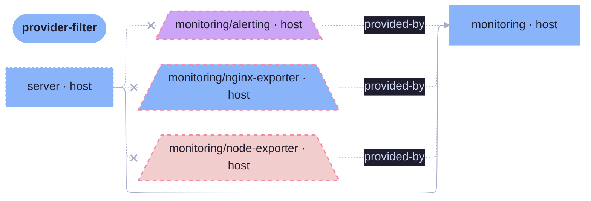

# Adapter Impact: provider-filter

```mermaid
%%{init: {"elk":{"mergeEdges":true,"nodePlacementStrategy":"BRANDES_KOEPF"},"layout":"elk","theme":"base","themeVariables":{"activationBkgColor":"#313244","activationBorderColor":"#6c7086","actorBkg":"#313244","actorBorder":"#a6adc8","actorLineColor":"#a6adc8","actorTextColor":"#cdd6f4","background":"#1e1e2e","classText":"#cdd6f4","clusterBkg":"#313244","clusterBorder":"#6c7086","edgeLabelBackground":"#1e1e2e","labelBoxBkgColor":"#313244","labelBoxBorderColor":"#a6adc8","labelTextColor":"#cdd6f4","lineColor":"#a6adc8","loopTextColor":"#cdd6f4","mainBkg":"#313244","nodeBkg":"#313244","nodeBorder":"#a6adc8","nodeTextColor":"#cdd6f4","noteBkgColor":"#313244","noteBorderColor":"#6c7086","noteTextColor":"#cdd6f4","pie1":"#f38ba8","pie2":"#fab387","pie3":"#f9e2af","pie4":"#a6e3a1","pie5":"#94e2d5","pie6":"#89b4fa","pie7":"#cba6f7","pie8":"#f2cdcd","pieLegendTextColor":"#cdd6f4","pieOuterStrokeColor":"#6c7086","pieSectionTextColor":"#cdd6f4","pieStrokeColor":"#6c7086","pieTitleTextColor":"#cdd6f4","primaryBorderColor":"#a6adc8","primaryColor":"#313244","primaryTextColor":"#cdd6f4","secondBkg":"#313244","secondaryBorderColor":"#6c7086","secondaryColor":"#313244","secondaryTextColor":"#cdd6f4","sequenceNumberColor":"#1e1e2e","signalColor":"#a6adc8","signalTextColor":"#cdd6f4","tertiaryBorderColor":"#6c7086","tertiaryColor":"#313244","tertiaryTextColor":"#cdd6f4","textColor":"#cdd6f4","titleColor":"#cdd6f4"}}}%%
graph LR
  provider_filter([provider-filter]):::root
  monitoring__alerting[/"monitoring/alerting · host"\]:::monitoring__alerting_c
  monitoring["monitoring · host"]:::monitoring_c
  monitoring__nginx_exporter[/"monitoring/nginx-exporter · host"\]:::monitoring__nginx_exporter_c
  monitoring__node_exporter[/"monitoring/node-exporter · host"\]:::monitoring__node_exporter_c
  server["server · host"]:::server_c

  server -.-x monitoring__alerting
  server --> monitoring
  server -.-x monitoring__nginx_exporter
  server -.-x monitoring__node_exporter
  monitoring__node_exporter -.->|provided-by| monitoring
  monitoring__nginx_exporter -.->|provided-by| monitoring
  monitoring__alerting -.->|provided-by| monitoring

  classDef root fill:#89b4fa,stroke:#89b4fa,color:#1e1e2e,font-weight:bold
  classDef monitoring__alerting_c fill:#cba6f7,stroke:#f38ba8,color:#1e1e2e,stroke-dasharray: 5 5,stroke-width:2px
  classDef monitoring_c fill:#89b4fa,stroke:#89b4fa,color:#1e1e2e,stroke-width:2px
  classDef monitoring__nginx_exporter_c fill:#89b4fa,stroke:#f38ba8,color:#1e1e2e,stroke-dasharray: 5 5,stroke-width:2px
  classDef monitoring__node_exporter_c fill:#f2cdcd,stroke:#f38ba8,color:#1e1e2e,stroke-dasharray: 5 5,stroke-width:2px
  classDef server_c fill:#89b4fa,stroke:#89b4fa,color:#1e1e2e,stroke-dasharray: 3 3,stroke-width:1px
```
