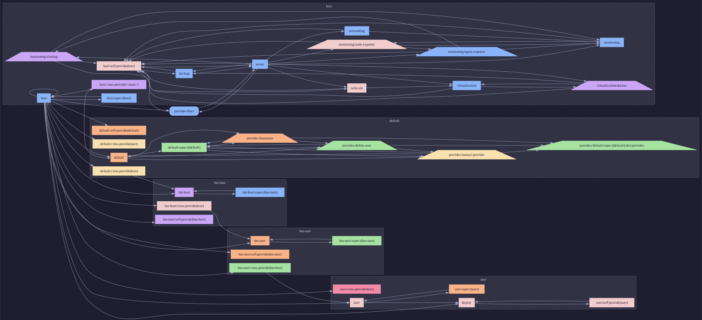
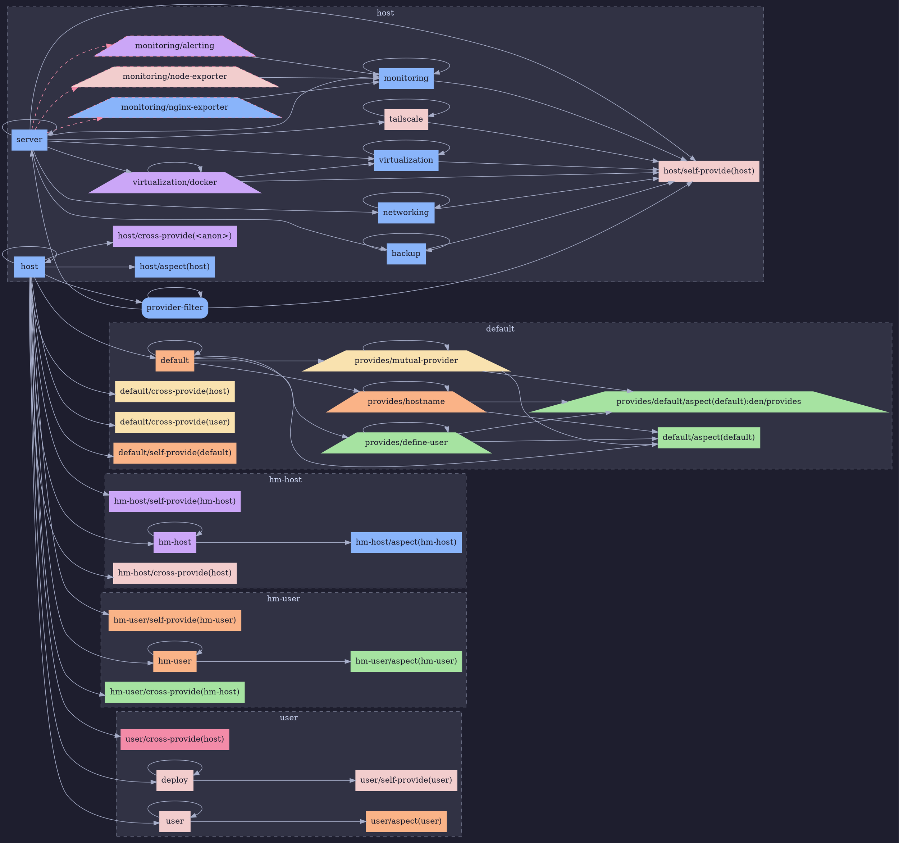
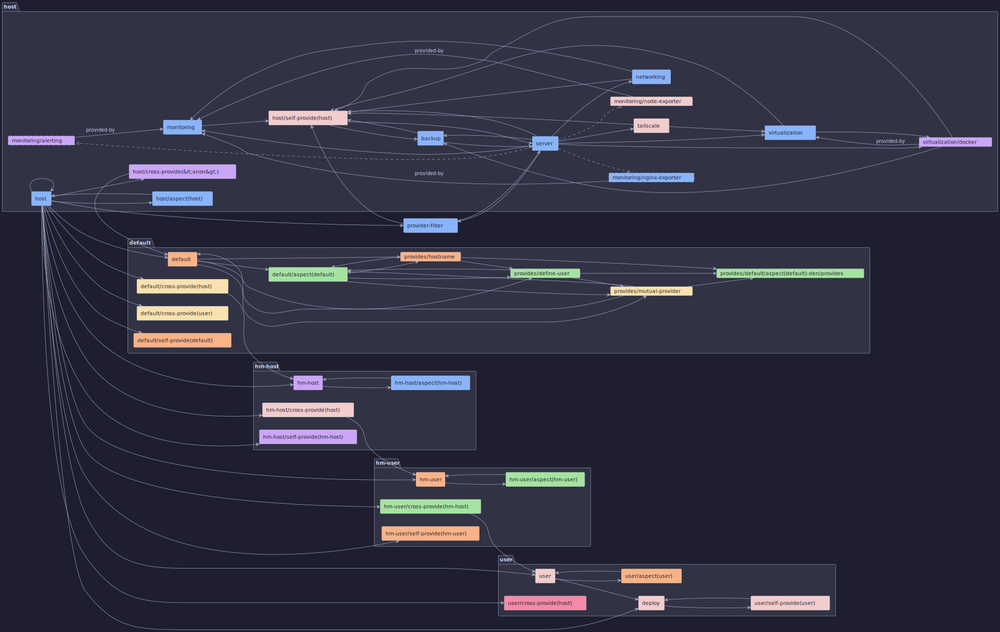

# Full DAG: provider-filter

## Mermaid

```mermaid
%%{init: {"elk":{"mergeEdges":true,"nodePlacementStrategy":"BRANDES_KOEPF"},"layout":"elk","theme":"base","themeVariables":{"activationBkgColor":"#313244","activationBorderColor":"#6c7086","actorBkg":"#313244","actorBorder":"#a6adc8","actorLineColor":"#a6adc8","actorTextColor":"#cdd6f4","background":"#1e1e2e","classText":"#cdd6f4","clusterBkg":"#313244","clusterBorder":"#6c7086","edgeLabelBackground":"#1e1e2e","labelBoxBkgColor":"#313244","labelBoxBorderColor":"#a6adc8","labelTextColor":"#cdd6f4","lineColor":"#a6adc8","loopTextColor":"#cdd6f4","mainBkg":"#313244","nodeBkg":"#313244","nodeBorder":"#a6adc8","nodeTextColor":"#cdd6f4","noteBkgColor":"#313244","noteBorderColor":"#6c7086","noteTextColor":"#cdd6f4","pie1":"#f38ba8","pie2":"#fab387","pie3":"#f9e2af","pie4":"#a6e3a1","pie5":"#94e2d5","pie6":"#89b4fa","pie7":"#cba6f7","pie8":"#f2cdcd","pieLegendTextColor":"#cdd6f4","pieOuterStrokeColor":"#6c7086","pieSectionTextColor":"#cdd6f4","pieStrokeColor":"#6c7086","pieTitleTextColor":"#cdd6f4","primaryBorderColor":"#a6adc8","primaryColor":"#313244","primaryTextColor":"#cdd6f4","secondBkg":"#313244","secondaryBorderColor":"#6c7086","secondaryColor":"#313244","secondaryTextColor":"#cdd6f4","sequenceNumberColor":"#1e1e2e","signalColor":"#a6adc8","signalTextColor":"#cdd6f4","tertiaryBorderColor":"#6c7086","tertiaryColor":"#313244","tertiaryTextColor":"#cdd6f4","textColor":"#cdd6f4","titleColor":"#cdd6f4"}}}%%
graph LR
  provider_filter([provider-filter]):::root

  subgraph ctx_host["host"]
  monitoring__alerting[/"monitoring/alerting"\]:::monitoring__alerting_c
  backup["backup"]:::backup_c
  virtualization__docker[/"virtualization/docker"\]:::virtualization__docker_c
  host["host"]:::host_c
  host__aspect_host_["host/aspect(host)"]:::host__aspect_host__c
  host__cross_provide__anon__["host/cross-provide(<anon>)"]:::host__cross_provide__anon___c
  host__self_provide_host_["host/self-provide(host)"]:::host__self_provide_host__c
  monitoring["monitoring"]:::monitoring_c
  networking["networking"]:::networking_c
  monitoring__nginx_exporter[/"monitoring/nginx-exporter"\]:::monitoring__nginx_exporter_c
  monitoring__node_exporter[/"monitoring/node-exporter"\]:::monitoring__node_exporter_c
  server["server"]:::server_c
  tailscale["tailscale"]:::tailscale_c
  virtualization["virtualization"]:::virtualization_c
  backup --> backup
  backup --> host__self_provide_host_
  host --> n_default
  host --> default__cross_provide_host_
  host --> default__cross_provide_user_
  host --> default__self_provide_default_
  host --> deploy
  host --> hm_host
  host --> hm_host__cross_provide_host_
  host --> hm_host__self_provide_hm_host_
  host --> hm_user
  host --> hm_user__cross_provide_hm_host_
  host --> hm_user__self_provide_hm_user_
  host --> host
  host --> host__aspect_host_
  host --> host__cross_provide__anon__
  host --> provider_filter
  host --> user
  host --> user__cross_provide_host_
  monitoring --> host__self_provide_host_
  monitoring --> monitoring
  networking --> host__self_provide_host_
  networking --> networking
  provider_filter --> host__self_provide_host_
  provider_filter --> provider_filter
  provider_filter --> server
  server -.-x monitoring__alerting
  server --> backup
  server --> virtualization__docker
  server --> host__self_provide_host_
  server --> monitoring
  server --> networking
  server -.-x monitoring__nginx_exporter
  server -.-x monitoring__node_exporter
  server --> server
  server --> tailscale
  server --> virtualization
  tailscale --> host__self_provide_host_
  tailscale --> tailscale
  virtualization --> host__self_provide_host_
  virtualization --> virtualization
  virtualization__docker --> virtualization__docker
  virtualization__docker --> host__self_provide_host_
  monitoring__node_exporter -.->|provided-by| monitoring
  monitoring__nginx_exporter -.->|provided-by| monitoring
  monitoring__alerting -.->|provided-by| monitoring
  virtualization__docker -.->|provided-by| virtualization
  end
  subgraph ctx_default["default"]
  n_default["default"]:::n_default_c
  default__aspect_default_["default/aspect(default)"]:::default__aspect_default__c
  den__provides__default__aspect_default__den__provides[/"provides/default/aspect(default):den/provides"\]:::den__provides__default__aspect_default__den__provides_c
  default__cross_provide_host_["default/cross-provide(host)"]:::default__cross_provide_host__c
  default__cross_provide_user_["default/cross-provide(user)"]:::default__cross_provide_user__c
  default__self_provide_default_["default/self-provide(default)"]:::default__self_provide_default__c
  den__provides__define_user[/"provides/define-user"\]:::den__provides__define_user_c
  den__provides__hostname[/"provides/hostname"\]:::den__provides__hostname_c
  den__provides__mutual_provider[/"provides/mutual-provider"\]:::den__provides__mutual_provider_c
  n_default --> n_default
  n_default --> default__aspect_default_
  n_default --> den__provides__define_user
  n_default --> den__provides__hostname
  n_default --> den__provides__mutual_provider
  den__provides__define_user --> default__aspect_default_
  den__provides__define_user --> den__provides__default__aspect_default__den__provides
  den__provides__define_user --> den__provides__define_user
  den__provides__hostname --> default__aspect_default_
  den__provides__hostname --> den__provides__default__aspect_default__den__provides
  den__provides__hostname --> den__provides__hostname
  den__provides__mutual_provider --> default__aspect_default_
  den__provides__mutual_provider --> den__provides__default__aspect_default__den__provides
  den__provides__mutual_provider --> den__provides__mutual_provider
  end
  subgraph ctx_hm_host["hm-host"]
  hm_host["hm-host"]:::hm_host_c
  hm_host__aspect_hm_host_["hm-host/aspect(hm-host)"]:::hm_host__aspect_hm_host__c
  hm_host__cross_provide_host_["hm-host/cross-provide(host)"]:::hm_host__cross_provide_host__c
  hm_host__self_provide_hm_host_["hm-host/self-provide(hm-host)"]:::hm_host__self_provide_hm_host__c
  hm_host --> hm_host
  hm_host --> hm_host__aspect_hm_host_
  end
  subgraph ctx_hm_user["hm-user"]
  hm_user["hm-user"]:::hm_user_c
  hm_user__aspect_hm_user_["hm-user/aspect(hm-user)"]:::hm_user__aspect_hm_user__c
  hm_user__cross_provide_hm_host_["hm-user/cross-provide(hm-host)"]:::hm_user__cross_provide_hm_host__c
  hm_user__self_provide_hm_user_["hm-user/self-provide(hm-user)"]:::hm_user__self_provide_hm_user__c
  hm_user --> hm_user
  hm_user --> hm_user__aspect_hm_user_
  end
  subgraph ctx_user["user"]
  deploy["deploy"]:::deploy_c
  user["user"]:::user_c
  user__aspect_user_["user/aspect(user)"]:::user__aspect_user__c
  user__cross_provide_host_["user/cross-provide(host)"]:::user__cross_provide_host__c
  user__self_provide_user_["user/self-provide(user)"]:::user__self_provide_user__c
  deploy --> deploy
  deploy --> user__self_provide_user_
  user --> user
  user --> user__aspect_user_
  end


  classDef root fill:#89b4fa,stroke:#89b4fa,color:#1e1e2e,font-weight:bold
  classDef monitoring__alerting_c fill:#cba6f7,stroke:#f38ba8,color:#1e1e2e,stroke-dasharray: 5 5,stroke-width:2px
  classDef backup_c fill:#89b4fa,stroke:#89b4fa,color:#1e1e2e,stroke-dasharray: 3 3,stroke-width:1px
  classDef n_default_c fill:#fab387,stroke:#fab387,color:#1e1e2e,stroke-width:2px
  classDef default__aspect_default__c fill:#a6e3a1,stroke:#a6e3a1,color:#1e1e2e,stroke-width:2px
  classDef den__provides__default__aspect_default__den__provides_c fill:#a6e3a1,stroke:#a6e3a1,color:#1e1e2e,stroke-width:2px
  classDef default__cross_provide_host__c fill:#f9e2af,stroke:#f9e2af,color:#1e1e2e,stroke-dasharray: 3 3,stroke-width:1px
  classDef default__cross_provide_user__c fill:#f9e2af,stroke:#f9e2af,color:#1e1e2e,stroke-dasharray: 3 3,stroke-width:1px
  classDef default__self_provide_default__c fill:#fab387,stroke:#fab387,color:#1e1e2e,stroke-dasharray: 3 3,stroke-width:1px
  classDef den__provides__define_user_c fill:#a6e3a1,stroke:#a6e3a1,color:#1e1e2e,stroke-dasharray: 3 3,stroke-width:1px
  classDef deploy_c fill:#f2cdcd,stroke:#f2cdcd,color:#1e1e2e,stroke-width:2px
  classDef virtualization__docker_c fill:#cba6f7,stroke:#cba6f7,color:#1e1e2e,stroke-width:2px
  classDef hm_host_c fill:#cba6f7,stroke:#cba6f7,color:#1e1e2e,stroke-dasharray: 3 3,stroke-width:1px
  classDef hm_host__aspect_hm_host__c fill:#89b4fa,stroke:#89b4fa,color:#1e1e2e,stroke-dasharray: 3 3,stroke-width:1px
  classDef hm_host__cross_provide_host__c fill:#f2cdcd,stroke:#f2cdcd,color:#1e1e2e,stroke-dasharray: 3 3,stroke-width:1px
  classDef hm_host__self_provide_hm_host__c fill:#cba6f7,stroke:#cba6f7,color:#1e1e2e,stroke-width:2px
  classDef hm_user_c fill:#fab387,stroke:#fab387,color:#1e1e2e,stroke-dasharray: 3 3,stroke-width:1px
  classDef hm_user__aspect_hm_user__c fill:#a6e3a1,stroke:#a6e3a1,color:#1e1e2e,stroke-dasharray: 3 3,stroke-width:1px
  classDef hm_user__cross_provide_hm_host__c fill:#a6e3a1,stroke:#a6e3a1,color:#1e1e2e,stroke-dasharray: 3 3,stroke-width:1px
  classDef hm_user__self_provide_hm_user__c fill:#fab387,stroke:#fab387,color:#1e1e2e,stroke-width:2px
  classDef host_c fill:#89b4fa,stroke:#89b4fa,color:#1e1e2e,stroke-dasharray: 3 3,stroke-width:1px
  classDef host__aspect_host__c fill:#89b4fa,stroke:#89b4fa,color:#1e1e2e,stroke-dasharray: 3 3,stroke-width:1px
  classDef host__cross_provide__anon___c fill:#cba6f7,stroke:#cba6f7,color:#1e1e2e,stroke-dasharray: 3 3,stroke-width:1px
  classDef host__self_provide_host__c fill:#f2cdcd,stroke:#f2cdcd,color:#1e1e2e,stroke-dasharray: 3 3,stroke-width:1px
  classDef den__provides__hostname_c fill:#fab387,stroke:#fab387,color:#1e1e2e,stroke-dasharray: 3 3,stroke-width:1px
  classDef monitoring_c fill:#89b4fa,stroke:#89b4fa,color:#1e1e2e,stroke-width:2px
  classDef den__provides__mutual_provider_c fill:#f9e2af,stroke:#f9e2af,color:#1e1e2e,stroke-dasharray: 3 3,stroke-width:1px
  classDef networking_c fill:#89b4fa,stroke:#89b4fa,color:#1e1e2e,stroke-width:2px
  classDef monitoring__nginx_exporter_c fill:#89b4fa,stroke:#f38ba8,color:#1e1e2e,stroke-dasharray: 5 5,stroke-width:2px
  classDef monitoring__node_exporter_c fill:#f2cdcd,stroke:#f38ba8,color:#1e1e2e,stroke-dasharray: 5 5,stroke-width:2px
  classDef provider_filter_c fill:#89b4fa,stroke:#89b4fa,color:#1e1e2e,stroke-width:2px
  classDef server_c fill:#89b4fa,stroke:#89b4fa,color:#1e1e2e,stroke-dasharray: 3 3,stroke-width:1px
  classDef tailscale_c fill:#f2cdcd,stroke:#f2cdcd,color:#1e1e2e,stroke-width:2px
  classDef user_c fill:#f2cdcd,stroke:#f2cdcd,color:#1e1e2e,stroke-dasharray: 3 3,stroke-width:1px
  classDef user__aspect_user__c fill:#fab387,stroke:#fab387,color:#1e1e2e,stroke-dasharray: 3 3,stroke-width:1px
  classDef user__cross_provide_host__c fill:#f38ba8,stroke:#f38ba8,color:#1e1e2e,stroke-dasharray: 3 3,stroke-width:1px
  classDef user__self_provide_user__c fill:#f2cdcd,stroke:#f2cdcd,color:#1e1e2e,stroke-dasharray: 3 3,stroke-width:1px
  classDef virtualization_c fill:#89b4fa,stroke:#89b4fa,color:#1e1e2e,stroke-width:2px
style ctx_host fill:#313244,stroke:#6c7086,stroke-width:2px
style ctx_default fill:#313244,stroke:#6c7086,stroke-width:2px
style ctx_hm_host fill:#313244,stroke:#6c7086,stroke-width:2px
style ctx_hm_user fill:#313244,stroke:#6c7086,stroke-width:2px
style ctx_user fill:#313244,stroke:#6c7086,stroke-width:2px
```





## Graphviz DOT





## PlantUML



```plantuml
@startuml
left to right direction
skinparam backgroundColor #1e1e2e
skinparam defaultFontColor #cdd6f4
skinparam defaultFontName "JetBrains Mono,monospace"
skinparam arrowColor #a6adc8
skinparam arrowFontColor #cdd6f4
skinparam RectangleBackgroundColor #313244
skinparam RectangleBorderColor #a6adc8
skinparam RectangleFontColor #1e1e2e
skinparam HexagonBackgroundColor #313244
skinparam HexagonBorderColor #a6adc8
skinparam HexagonFontColor #1e1e2e
skinparam CardBackgroundColor #313244
skinparam CardBorderColor #a6adc8
skinparam CardFontColor #1e1e2e
skinparam PackageBackgroundColor #313244
skinparam PackageBorderColor #6c7086
skinparam PackageFontColor #cdd6f4
skinparam NoteBackgroundColor #313244
skinparam NoteBorderColor #6c7086
skinparam NoteFontColor #cdd6f4

rectangle "provider-filter" as provider_filter #89b4fa
package "host" as stage_host {
  card "monitoring/alerting" as monitoring__alerting #cba6f7;line.dashed
  rectangle "backup" as backup #89b4fa
  card "virtualization/docker" as virtualization__docker #cba6f7
  rectangle "host" as host #89b4fa
  rectangle "host/aspect(host)" as host__aspect_host_ #89b4fa
  rectangle "host/cross-provide(&lt;anon&gt;)" as host__cross_provide__anon__ #cba6f7
  rectangle "host/self-provide(host)" as host__self_provide_host_ #f2cdcd
  rectangle "monitoring" as monitoring #89b4fa
  rectangle "networking" as networking #89b4fa
  card "monitoring/nginx-exporter" as monitoring__nginx_exporter #89b4fa;line.dashed
  card "monitoring/node-exporter" as monitoring__node_exporter #f2cdcd;line.dashed
  rectangle "server" as server #89b4fa
  rectangle "tailscale" as tailscale #f2cdcd
  rectangle "virtualization" as virtualization #89b4fa
}
package "default" as stage_default {
  rectangle "default" as n_default #fab387
  rectangle "default/aspect(default)" as default__aspect_default_ #a6e3a1
  card "provides/default/aspect(default):den/provides" as den__provides__default__aspect_default__den__provides #a6e3a1
  rectangle "default/cross-provide(host)" as default__cross_provide_host_ #f9e2af
  rectangle "default/cross-provide(user)" as default__cross_provide_user_ #f9e2af
  rectangle "default/self-provide(default)" as default__self_provide_default_ #fab387
  card "provides/define-user" as den__provides__define_user #a6e3a1
  card "provides/hostname" as den__provides__hostname #fab387
  card "provides/mutual-provider" as den__provides__mutual_provider #f9e2af
}
package "hm-host" as stage_hm_host {
  rectangle "hm-host" as hm_host #cba6f7
  rectangle "hm-host/aspect(hm-host)" as hm_host__aspect_hm_host_ #89b4fa
  rectangle "hm-host/cross-provide(host)" as hm_host__cross_provide_host_ #f2cdcd
  rectangle "hm-host/self-provide(hm-host)" as hm_host__self_provide_hm_host_ #cba6f7
}
package "hm-user" as stage_hm_user {
  rectangle "hm-user" as hm_user #fab387
  rectangle "hm-user/aspect(hm-user)" as hm_user__aspect_hm_user_ #a6e3a1
  rectangle "hm-user/cross-provide(hm-host)" as hm_user__cross_provide_hm_host_ #a6e3a1
  rectangle "hm-user/self-provide(hm-user)" as hm_user__self_provide_hm_user_ #fab387
}
package "user" as stage_user {
  rectangle "deploy" as deploy #f2cdcd
  rectangle "user" as user #f2cdcd
  rectangle "user/aspect(user)" as user__aspect_user_ #fab387
  rectangle "user/cross-provide(host)" as user__cross_provide_host_ #f38ba8
  rectangle "user/self-provide(user)" as user__self_provide_user_ #f2cdcd
}

backup --> backup
backup --> host__self_provide_host_
n_default --> n_default
n_default --> default__aspect_default_
n_default --> den__provides__define_user
n_default --> den__provides__hostname
n_default --> den__provides__mutual_provider
den__provides__define_user --> default__aspect_default_
den__provides__define_user --> den__provides__default__aspect_default__den__provides
den__provides__define_user --> den__provides__define_user
den__provides__hostname --> default__aspect_default_
den__provides__hostname --> den__provides__default__aspect_default__den__provides
den__provides__hostname --> den__provides__hostname
den__provides__mutual_provider --> default__aspect_default_
den__provides__mutual_provider --> den__provides__default__aspect_default__den__provides
den__provides__mutual_provider --> den__provides__mutual_provider
deploy --> deploy
deploy --> user__self_provide_user_
hm_host --> hm_host
hm_host --> hm_host__aspect_hm_host_
hm_user --> hm_user
hm_user --> hm_user__aspect_hm_user_
host --> n_default
host --> default__cross_provide_host_
host --> default__cross_provide_user_
host --> default__self_provide_default_
host --> deploy
host --> hm_host
host --> hm_host__cross_provide_host_
host --> hm_host__self_provide_hm_host_
host --> hm_user
host --> hm_user__cross_provide_hm_host_
host --> hm_user__self_provide_hm_user_
host --> host
host --> host__aspect_host_
host --> host__cross_provide__anon__
host --> provider_filter
host --> user
host --> user__cross_provide_host_
monitoring --> host__self_provide_host_
monitoring --> monitoring
networking --> host__self_provide_host_
networking --> networking
provider_filter --> host__self_provide_host_
provider_filter --> provider_filter
provider_filter --> server
server ..x monitoring__alerting
server --> backup
server --> virtualization__docker
server --> host__self_provide_host_
server --> monitoring
server --> networking
server ..x monitoring__nginx_exporter
server ..x monitoring__node_exporter
server --> server
server --> tailscale
server --> virtualization
tailscale --> host__self_provide_host_
tailscale --> tailscale
user --> user
user --> user__aspect_user_
virtualization --> host__self_provide_host_
virtualization --> virtualization
virtualization__docker --> virtualization__docker
virtualization__docker --> host__self_provide_host_
monitoring__node_exporter --> monitoring : provided-by
monitoring__nginx_exporter --> monitoring : provided-by
monitoring__alerting --> monitoring : provided-by
virtualization__docker --> virtualization : provided-by
@enduml
```
