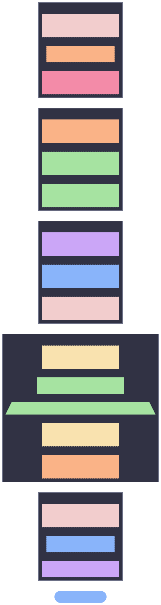

# Resolution Pipeline (machinery): provider-filter

```mermaid
%%{init: {"elk":{"mergeEdges":true,"nodePlacementStrategy":"BRANDES_KOEPF"},"layout":"elk","theme":"base","themeVariables":{"activationBkgColor":"#313244","activationBorderColor":"#6c7086","actorBkg":"#313244","actorBorder":"#a6adc8","actorLineColor":"#a6adc8","actorTextColor":"#cdd6f4","background":"#1e1e2e","classText":"#cdd6f4","clusterBkg":"#313244","clusterBorder":"#6c7086","edgeLabelBackground":"#1e1e2e","labelBoxBkgColor":"#313244","labelBoxBorderColor":"#a6adc8","labelTextColor":"#cdd6f4","lineColor":"#a6adc8","loopTextColor":"#cdd6f4","mainBkg":"#313244","nodeBkg":"#313244","nodeBorder":"#a6adc8","nodeTextColor":"#cdd6f4","noteBkgColor":"#313244","noteBorderColor":"#6c7086","noteTextColor":"#cdd6f4","pie1":"#f38ba8","pie2":"#fab387","pie3":"#f9e2af","pie4":"#a6e3a1","pie5":"#94e2d5","pie6":"#89b4fa","pie7":"#cba6f7","pie8":"#f2cdcd","pieLegendTextColor":"#cdd6f4","pieOuterStrokeColor":"#6c7086","pieSectionTextColor":"#cdd6f4","pieStrokeColor":"#6c7086","pieTitleTextColor":"#cdd6f4","primaryBorderColor":"#a6adc8","primaryColor":"#313244","primaryTextColor":"#cdd6f4","secondBkg":"#313244","secondaryBorderColor":"#6c7086","secondaryColor":"#313244","secondaryTextColor":"#cdd6f4","sequenceNumberColor":"#1e1e2e","signalColor":"#a6adc8","signalTextColor":"#cdd6f4","tertiaryBorderColor":"#6c7086","tertiaryColor":"#313244","tertiaryTextColor":"#cdd6f4","textColor":"#cdd6f4","titleColor":"#cdd6f4"}}}%%
graph LR
  provider_filter([provider-filter]):::root

  subgraph ctx_host["host"]
  host__aspect_host_["host/aspect(host)"]:::host__aspect_host__c
  host__cross_provide__anon__["host/cross-provide(<anon>)"]:::host__cross_provide__anon___c
  host__self_provide_host_["host/self-provide(host)"]:::host__self_provide_host__c

  end
  subgraph ctx_default["default"]
  default__aspect_default_["default/aspect(default)"]:::default__aspect_default__c
  den__provides__default__aspect_default__den__provides[/"provides/default/aspect(default):den/provides"\]:::den__provides__default__aspect_default__den__provides_c
  default__cross_provide_host_["default/cross-provide(host)"]:::default__cross_provide_host__c
  default__cross_provide_user_["default/cross-provide(user)"]:::default__cross_provide_user__c
  default__self_provide_default_["default/self-provide(default)"]:::default__self_provide_default__c

  end
  subgraph ctx_hm_host["hm-host"]
  hm_host__aspect_hm_host_["hm-host/aspect(hm-host)"]:::hm_host__aspect_hm_host__c
  hm_host__cross_provide_host_["hm-host/cross-provide(host)"]:::hm_host__cross_provide_host__c
  hm_host__self_provide_hm_host_["hm-host/self-provide(hm-host)"]:::hm_host__self_provide_hm_host__c

  end
  subgraph ctx_hm_user["hm-user"]
  hm_user__aspect_hm_user_["hm-user/aspect(hm-user)"]:::hm_user__aspect_hm_user__c
  hm_user__cross_provide_hm_host_["hm-user/cross-provide(hm-host)"]:::hm_user__cross_provide_hm_host__c
  hm_user__self_provide_hm_user_["hm-user/self-provide(hm-user)"]:::hm_user__self_provide_hm_user__c

  end
  subgraph ctx_user["user"]
  user__aspect_user_["user/aspect(user)"]:::user__aspect_user__c
  user__cross_provide_host_["user/cross-provide(host)"]:::user__cross_provide_host__c
  user__self_provide_user_["user/self-provide(user)"]:::user__self_provide_user__c

  end


  classDef root fill:#89b4fa,stroke:#89b4fa,color:#1e1e2e,font-weight:bold
  classDef default__aspect_default__c fill:#a6e3a1,stroke:#a6e3a1,color:#1e1e2e,stroke-width:2px
  classDef den__provides__default__aspect_default__den__provides_c fill:#a6e3a1,stroke:#a6e3a1,color:#1e1e2e,stroke-width:2px
  classDef default__cross_provide_host__c fill:#f9e2af,stroke:#f9e2af,color:#1e1e2e,stroke-dasharray: 3 3,stroke-width:1px
  classDef default__cross_provide_user__c fill:#f9e2af,stroke:#f9e2af,color:#1e1e2e,stroke-dasharray: 3 3,stroke-width:1px
  classDef default__self_provide_default__c fill:#fab387,stroke:#fab387,color:#1e1e2e,stroke-dasharray: 3 3,stroke-width:1px
  classDef hm_host__aspect_hm_host__c fill:#89b4fa,stroke:#89b4fa,color:#1e1e2e,stroke-dasharray: 3 3,stroke-width:1px
  classDef hm_host__cross_provide_host__c fill:#f2cdcd,stroke:#f2cdcd,color:#1e1e2e,stroke-dasharray: 3 3,stroke-width:1px
  classDef hm_host__self_provide_hm_host__c fill:#cba6f7,stroke:#cba6f7,color:#1e1e2e,stroke-width:2px
  classDef hm_user__aspect_hm_user__c fill:#a6e3a1,stroke:#a6e3a1,color:#1e1e2e,stroke-dasharray: 3 3,stroke-width:1px
  classDef hm_user__cross_provide_hm_host__c fill:#a6e3a1,stroke:#a6e3a1,color:#1e1e2e,stroke-dasharray: 3 3,stroke-width:1px
  classDef hm_user__self_provide_hm_user__c fill:#fab387,stroke:#fab387,color:#1e1e2e,stroke-width:2px
  classDef host__aspect_host__c fill:#89b4fa,stroke:#89b4fa,color:#1e1e2e,stroke-dasharray: 3 3,stroke-width:1px
  classDef host__cross_provide__anon___c fill:#cba6f7,stroke:#cba6f7,color:#1e1e2e,stroke-dasharray: 3 3,stroke-width:1px
  classDef host__self_provide_host__c fill:#f2cdcd,stroke:#f2cdcd,color:#1e1e2e,stroke-dasharray: 3 3,stroke-width:1px
  classDef user__aspect_user__c fill:#fab387,stroke:#fab387,color:#1e1e2e,stroke-dasharray: 3 3,stroke-width:1px
  classDef user__cross_provide_host__c fill:#f38ba8,stroke:#f38ba8,color:#1e1e2e,stroke-dasharray: 3 3,stroke-width:1px
  classDef user__self_provide_user__c fill:#f2cdcd,stroke:#f2cdcd,color:#1e1e2e,stroke-dasharray: 3 3,stroke-width:1px
style ctx_host fill:#313244,stroke:#6c7086,stroke-width:2px
style ctx_default fill:#313244,stroke:#6c7086,stroke-width:2px
style ctx_hm_host fill:#313244,stroke:#6c7086,stroke-width:2px
style ctx_hm_user fill:#313244,stroke:#6c7086,stroke-width:2px
style ctx_user fill:#313244,stroke:#6c7086,stroke-width:2px
```
