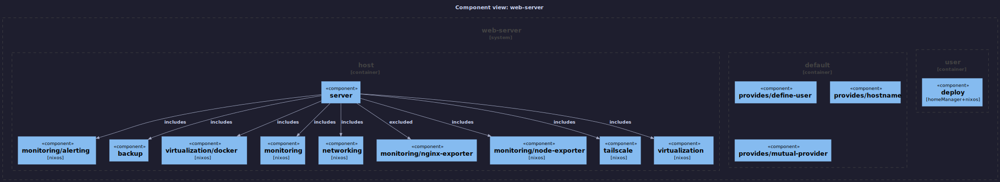

# C4 Component View: web-server

```plantuml
@startuml
!include <C4/C4_Component>
skinparam backgroundColor #1e1e2e
skinparam defaultFontColor #cdd6f4
skinparam defaultFontName "JetBrains Mono,monospace"
skinparam arrowColor #a6adc8
skinparam arrowFontColor #cdd6f4
skinparam PersonBackgroundColor #313244
skinparam PersonBorderColor #a6adc8
skinparam PersonFontColor #cdd6f4
skinparam SystemBackgroundColor #313244
skinparam SystemBorderColor #a6adc8
skinparam SystemFontColor #cdd6f4
skinparam ContainerBackgroundColor #313244
skinparam ContainerBorderColor #a6adc8
skinparam ContainerFontColor #cdd6f4
skinparam ComponentBackgroundColor #313244
skinparam ComponentBorderColor #a6adc8
skinparam ComponentFontColor #cdd6f4
skinparam BoundaryBackgroundColor #313244
skinparam BoundaryBorderColor #6c7086
skinparam BoundaryFontColor #cdd6f4
skinparam RectangleBackgroundColor #313244
skinparam RectangleBorderColor #a6adc8
skinparam RectangleFontColor #cdd6f4


title Component view: web-server

System_Boundary(web_server, "web-server") {
  Container_Boundary(host, "host") {
    Component(monitoring__alerting, "monitoring/alerting", "nixos")
    Component(backup, "backup", "")
    Component(virtualization__docker, "virtualization/docker", "nixos")
    Component(monitoring, "monitoring", "nixos")
    Component(networking, "networking", "nixos")
    Component(monitoring__nginx_exporter, "monitoring/nginx-exporter", "")
    Component(monitoring__node_exporter, "monitoring/node-exporter", "nixos")
    Component(server, "server", "")
    Component(tailscale, "tailscale", "nixos")
    Component(virtualization, "virtualization", "nixos")
}
  Container_Boundary(c4_default, "default") {
    Component(den__provides__define_user, "provides/define-user", "")
    Component(den__provides__hostname, "provides/hostname", "")
    Component(den__provides__mutual_provider, "provides/mutual-provider", "")
}
  Container_Boundary(user, "user") {
    Component(deploy, "deploy", "homeManager+nixos")
}
}

Rel(server, monitoring__alerting, "includes")
Rel(server, backup, "includes")
Rel(server, virtualization__docker, "includes")
Rel(server, monitoring, "includes")
Rel(server, networking, "includes")
Rel(server, monitoring__nginx_exporter, "excluded")
Rel(server, monitoring__node_exporter, "includes")
Rel(server, tailscale, "includes")
Rel(server, virtualization, "includes")
@enduml
```
