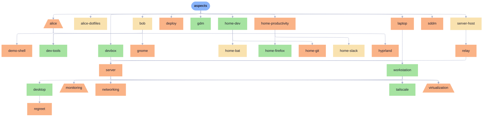

# Aspect Namespace (declarations)

```mermaid
%%{init: {"elk":{"mergeEdges":true,"nodePlacementStrategy":"BRANDES_KOEPF"},"flowchart":{"wrappingWidth":600},"layout":"elk","theme":"base","themeVariables":{"activationBkgColor":"#313244","activationBorderColor":"#6c7086","actorBkg":"#313244","actorBorder":"#a6adc8","actorLineColor":"#a6adc8","actorTextColor":"#cdd6f4","background":"#1e1e2e","classText":"#cdd6f4","clusterBkg":"#313244","clusterBorder":"#6c7086","edgeLabelBackground":"#1e1e2e","labelBoxBkgColor":"#313244","labelBoxBorderColor":"#a6adc8","labelTextColor":"#cdd6f4","lineColor":"#a6adc8","loopTextColor":"#cdd6f4","mainBkg":"#313244","nodeBkg":"#313244","nodeBorder":"#a6adc8","nodeTextColor":"#cdd6f4","noteBkgColor":"#313244","noteBorderColor":"#6c7086","noteTextColor":"#cdd6f4","pie1":"#f38ba8","pie2":"#fab387","pie3":"#f9e2af","pie4":"#a6e3a1","pie5":"#94e2d5","pie6":"#89b4fa","pie7":"#cba6f7","pie8":"#f2cdcd","pieLegendTextColor":"#cdd6f4","pieOuterStrokeColor":"#6c7086","pieSectionTextColor":"#cdd6f4","pieStrokeColor":"#6c7086","pieTitleTextColor":"#cdd6f4","primaryBorderColor":"#a6adc8","primaryColor":"#313244","primaryTextColor":"#cdd6f4","secondBkg":"#313244","secondaryBorderColor":"#6c7086","secondaryColor":"#313244","secondaryTextColor":"#cdd6f4","sequenceNumberColor":"#1e1e2e","signalColor":"#a6adc8","signalTextColor":"#cdd6f4","tertiaryBorderColor":"#6c7086","tertiaryColor":"#313244","tertiaryTextColor":"#cdd6f4","textColor":"#cdd6f4","titleColor":"#cdd6f4"}}}%%
graph TD
  aspects([aspects]):::root
  alice[/"alice"\]:::alice_c
  alice_dotfiles["alice-dotfiles"]:::alice_dotfiles_c
  bob["bob"]:::bob_c
  demo_shell["demo-shell"]:::demo_shell_c
  deploy["deploy"]:::deploy_c
  desktop["desktop"]:::desktop_c
  dev_tools["dev-tools"]:::dev_tools_c
  devbox["devbox"]:::devbox_c
  gdm["gdm"]:::gdm_c
  gnome["gnome"]:::gnome_c
  home_bat["home-bat"]:::home_bat_c
  home_dev["home-dev"]:::home_dev_c
  home_firefox["home-firefox"]:::home_firefox_c
  home_git["home-git"]:::home_git_c
  home_productivity["home-productivity"]:::home_productivity_c
  home_slack["home-slack"]:::home_slack_c
  hyprland["hyprland"]:::hyprland_c
  laptop["laptop"]:::laptop_c
  monitoring[/"monitoring"\]:::monitoring_c
  networking["networking"]:::networking_c
  regreet["regreet"]:::regreet_c
  relay["relay"]:::relay_c
  sddm["sddm"]:::sddm_c
  server["server"]:::server_c
  server_host["server-host"]:::server_host_c
  tailscale["tailscale"]:::tailscale_c
  virtualization[/"virtualization"\]:::virtualization_c
  workstation["workstation"]:::workstation_c

  aspects --> alice
  aspects --> alice_dotfiles
  aspects --> bob
  aspects --> deploy
  aspects --> devbox
  aspects --> gdm
  aspects --> home_dev
  aspects --> home_productivity
  aspects --> laptop
  aspects --> sddm
  aspects --> server_host
  alice --> demo_shell
  alice --> hyprland
  alice --> dev_tools
  bob --> gnome
  bob --> dev_tools
  desktop --> regreet
  devbox --> workstation
  devbox --> server
  home_dev --> home_git
  home_dev --> home_bat
  home_productivity --> home_firefox
  home_productivity --> home_slack
  laptop --> workstation
  relay --> server
  server --> networking
  server --> monitoring
  server --> tailscale
  server --> virtualization
  server_host --> relay
  workstation --> networking
  workstation --> tailscale
  workstation --> desktop
  workstation --> virtualization

  classDef root fill:#89b4fa,stroke:#89b4fa,color:#1e1e2e,font-weight:bold
  classDef alice_c fill:#fab387,stroke:#fab387,color:#1e1e2e,stroke-width:2px
  classDef alice_dotfiles_c fill:#f9e2af,stroke:#f9e2af,color:#1e1e2e,stroke-width:2px
  classDef bob_c fill:#f9e2af,stroke:#f9e2af,color:#1e1e2e,stroke-width:2px
  classDef demo_shell_c fill:#fab387,stroke:#fab387,color:#1e1e2e,stroke-width:2px
  classDef deploy_c fill:#fab387,stroke:#fab387,color:#1e1e2e,stroke-width:2px
  classDef desktop_c fill:#a6e3a1,stroke:#a6e3a1,color:#1e1e2e,stroke-width:2px
  classDef dev_tools_c fill:#a6e3a1,stroke:#a6e3a1,color:#1e1e2e,stroke-width:2px
  classDef devbox_c fill:#a6e3a1,stroke:#a6e3a1,color:#1e1e2e,stroke-width:3px
  classDef gdm_c fill:#a6e3a1,stroke:#a6e3a1,color:#1e1e2e,stroke-width:2px
  classDef gnome_c fill:#fab387,stroke:#fab387,color:#1e1e2e,stroke-width:2px
  classDef home_bat_c fill:#f9e2af,stroke:#f9e2af,color:#1e1e2e,stroke-width:2px
  classDef home_dev_c fill:#a6e3a1,stroke:#a6e3a1,color:#1e1e2e,stroke-width:2px
  classDef home_firefox_c fill:#a6e3a1,stroke:#a6e3a1,color:#1e1e2e,stroke-width:2px
  classDef home_git_c fill:#fab387,stroke:#fab387,color:#1e1e2e,stroke-width:2px
  classDef home_productivity_c fill:#fab387,stroke:#fab387,color:#1e1e2e,stroke-width:2px
  classDef home_slack_c fill:#f9e2af,stroke:#f9e2af,color:#1e1e2e,stroke-width:2px
  classDef hyprland_c fill:#fab387,stroke:#fab387,color:#1e1e2e,stroke-width:2px
  classDef laptop_c fill:#fab387,stroke:#fab387,color:#1e1e2e,stroke-width:2px
  classDef monitoring_c fill:#fab387,stroke:#fab387,color:#1e1e2e,stroke-width:2px
  classDef networking_c fill:#fab387,stroke:#fab387,color:#1e1e2e,stroke-width:2px
  classDef regreet_c fill:#fab387,stroke:#fab387,color:#1e1e2e,stroke-width:2px
  classDef relay_c fill:#fab387,stroke:#fab387,color:#1e1e2e,stroke-width:2px
  classDef sddm_c fill:#fab387,stroke:#fab387,color:#1e1e2e,stroke-width:2px
  classDef server_c fill:#fab387,stroke:#fab387,color:#1e1e2e,stroke-width:2px
  classDef server_host_c fill:#f9e2af,stroke:#f9e2af,color:#1e1e2e,stroke-width:3px
  classDef tailscale_c fill:#a6e3a1,stroke:#a6e3a1,color:#1e1e2e,stroke-width:2px
  classDef virtualization_c fill:#fab387,stroke:#fab387,color:#1e1e2e,stroke-width:2px
  classDef workstation_c fill:#a6e3a1,stroke:#a6e3a1,color:#1e1e2e,stroke-width:2px
```
