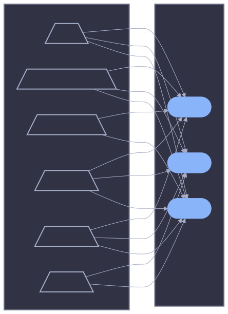

# Fleet Provider Matrix

```mermaid
%%{init: {"theme":"base","themeVariables":{"activationBkgColor":"#313244","activationBorderColor":"#6c7086","actorBkg":"#313244","actorBorder":"#a6adc8","actorLineColor":"#a6adc8","actorTextColor":"#cdd6f4","background":"#1e1e2e","classText":"#cdd6f4","clusterBkg":"#313244","clusterBorder":"#6c7086","edgeLabelBackground":"#1e1e2e","labelBoxBkgColor":"#313244","labelBoxBorderColor":"#a6adc8","labelTextColor":"#cdd6f4","lineColor":"#a6adc8","loopTextColor":"#cdd6f4","mainBkg":"#313244","nodeBkg":"#313244","nodeBorder":"#a6adc8","nodeTextColor":"#cdd6f4","noteBkgColor":"#313244","noteBorderColor":"#6c7086","noteTextColor":"#cdd6f4","pie1":"#f38ba8","pie2":"#fab387","pie3":"#f9e2af","pie4":"#a6e3a1","pie5":"#94e2d5","pie6":"#89b4fa","pie7":"#cba6f7","pie8":"#f2cdcd","pieLegendTextColor":"#cdd6f4","pieOuterStrokeColor":"#6c7086","pieSectionTextColor":"#cdd6f4","pieStrokeColor":"#6c7086","pieTitleTextColor":"#cdd6f4","primaryBorderColor":"#a6adc8","primaryColor":"#313244","primaryTextColor":"#cdd6f4","secondBkg":"#313244","secondaryBorderColor":"#6c7086","secondaryColor":"#313244","secondaryTextColor":"#cdd6f4","sequenceNumberColor":"#1e1e2e","signalColor":"#a6adc8","signalTextColor":"#cdd6f4","tertiaryBorderColor":"#6c7086","tertiaryColor":"#313244","tertiaryTextColor":"#cdd6f4","textColor":"#cdd6f4","titleColor":"#cdd6f4"}}}%%
graph LR
  subgraph providers["Providers"]
    p_den[/"den"\]:::provider_c
    p_virtualization[/"virtualization"\]:::provider_c
    p_monitoring[/"monitoring"\]:::provider_c
    p_hm_host[/"hm-host"\]:::provider_c
    p_hm_user[/"hm-user"\]:::provider_c
    p_alice[/"alice"\]:::provider_c
  end

  subgraph hostsCluster["Hosts"]
    h_devbox(["devbox"]):::matrixhost_c
    h_laptop(["laptop"]):::matrixhost_c
    h_server(["server"]):::matrixhost_c
  end

  p_den --> h_devbox
  p_virtualization --> h_devbox
  p_monitoring --> h_devbox
  p_hm_host --> h_devbox
  p_hm_user --> h_devbox
  p_alice --> h_devbox
  p_virtualization --> h_laptop
  p_den --> h_laptop
  p_hm_host --> h_laptop
  p_hm_user --> h_laptop
  p_alice --> h_laptop
  p_monitoring --> h_server
  p_virtualization --> h_server
  p_den --> h_server
  p_hm_host --> h_server
  p_hm_user --> h_server

  classDef provider_c fill:#313244,stroke:#a6adc8,color:#cdd6f4,stroke-width:2px
  classDef matrixhost_c fill:#89b4fa,stroke:#89b4fa,color:#1e1e2e,font-weight:bold
  style providers fill:#313244,stroke:#6c7086,stroke-width:2px
  style hostsCluster fill:#313244,stroke:#6c7086,stroke-width:2px
```
