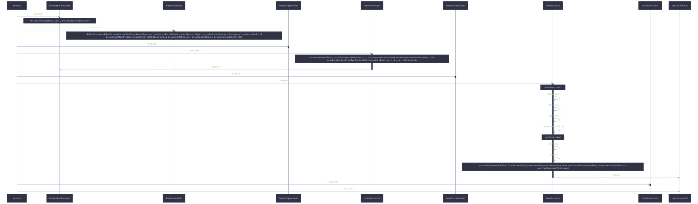

# Policy Sequence: devbox

```mermaid
%%{init: {"theme":"base","themeVariables":{"activationBkgColor":"#313244","activationBorderColor":"#6c7086","actorBkg":"#313244","actorBorder":"#a6adc8","actorLineColor":"#a6adc8","actorTextColor":"#cdd6f4","background":"#1e1e2e","classText":"#cdd6f4","clusterBkg":"#313244","clusterBorder":"#6c7086","edgeLabelBackground":"#1e1e2e","labelBoxBkgColor":"#313244","labelBoxBorderColor":"#a6adc8","labelTextColor":"#cdd6f4","lineColor":"#a6adc8","loopTextColor":"#cdd6f4","mainBkg":"#313244","nodeBkg":"#313244","nodeBorder":"#a6adc8","nodeTextColor":"#cdd6f4","noteBkgColor":"#313244","noteBorderColor":"#6c7086","noteTextColor":"#cdd6f4","pie1":"#f38ba8","pie2":"#fab387","pie3":"#f9e2af","pie4":"#a6e3a1","pie5":"#94e2d5","pie6":"#89b4fa","pie7":"#cba6f7","pie8":"#f2cdcd","pieLegendTextColor":"#cdd6f4","pieOuterStrokeColor":"#6c7086","pieSectionTextColor":"#cdd6f4","pieStrokeColor":"#6c7086","pieTitleTextColor":"#cdd6f4","primaryBorderColor":"#a6adc8","primaryColor":"#313244","primaryTextColor":"#cdd6f4","secondBkg":"#313244","secondaryBorderColor":"#6c7086","secondaryColor":"#313244","secondaryTextColor":"#cdd6f4","sequenceNumberColor":"#1e1e2e","signalColor":"#a6adc8","signalTextColor":"#cdd6f4","tertiaryBorderColor":"#6c7086","tertiaryColor":"#313244","tertiaryTextColor":"#cdd6f4","textColor":"#cdd6f4","titleColor":"#cdd6f4"}}}%%
sequenceDiagram
    participant root as devbox
    participant hm_host_to_hm_user as hm-host-to-hm-user
    participant host_to_default as host-to-default
    participant host_to_hjem_host as host-to-hjem-host
    participant host_to_hm_host as host-to-hm-host
    participant host_to_maid_host as host-to-maid-host
    participant host_to_users as host-to-users
    participant host_to_wsl_host as host-to-wsl-host
    participant user_to_default as user-to-default

    root ->> hm_host_to_hm_user: dispatch
    activate hm_host_to_hm_user
    Note over hm_host_to_hm_user: hm-user/hm-user(host, user), hm-user/resolve(hm-user)
    deactivate hm_host_to_hm_user

    root ->> host_to_default: dispatch
    activate host_to_default
    Note over host_to_default: default/resolve(default), provides/default/resolve(define-user):den/provides, default/resolve(devbox)(host), provides/default/resolve(hostname):den/provides(host)<br/>provides/default/resolve(mutual-provider):den/provides, provides/define-user, provides/hostname, provides/mutual-provider
    deactivate host_to_default

    root ->> host_to_hjem_host: dispatch
    activate host_to_hjem_host
    deactivate host_to_hjem_host

    root ->> host_to_hm_host: dispatch
    activate host_to_hm_host
    Note over host_to_hm_host: hm-host/hm-host(host), hm-host/resolve(alice,devbox), hm-host/resolve(devbox), hm-host/resolve(hm-host)(host, user)<br/>provides/hm-host/resolve(hm-host):den/provides(host, user), hm-user, alice/to-hosts
    host_to_hm_host -->> hm_host_to_hm_user: chains
    deactivate host_to_hm_host

    root ->> host_to_maid_host: dispatch
    activate host_to_maid_host
    deactivate host_to_maid_host

    root ->> host_to_users: dispatch
    activate host_to_users
    Note over host_to_users: alice(host, user)
    host_to_users ->> host_to_users: demo-shell
    host_to_users ->> host_to_users: dev-tools
    host_to_users ->> host_to_users: hyprland
    host_to_users ->> host_to_users: user/resolve(alice)
    Note over host_to_users: bob(host, user)
    host_to_users ->> host_to_users: dev-tools
    host_to_users ->> host_to_users: gnome
    Note over host_to_users: provides/unfree(nvidia-x11,nvidia-settings)(class), provides/unfree(vscode)(class), user/resolve(alice,devbox), user/resolve(bob,devbox)<br/>user/resolve(user)(host, user)
    host_to_users -->> user_to_default: chains
    deactivate host_to_users

    root ->> host_to_wsl_host: dispatch
    activate host_to_wsl_host
    deactivate host_to_wsl_host

    root ->> user_to_default: dispatch
```
