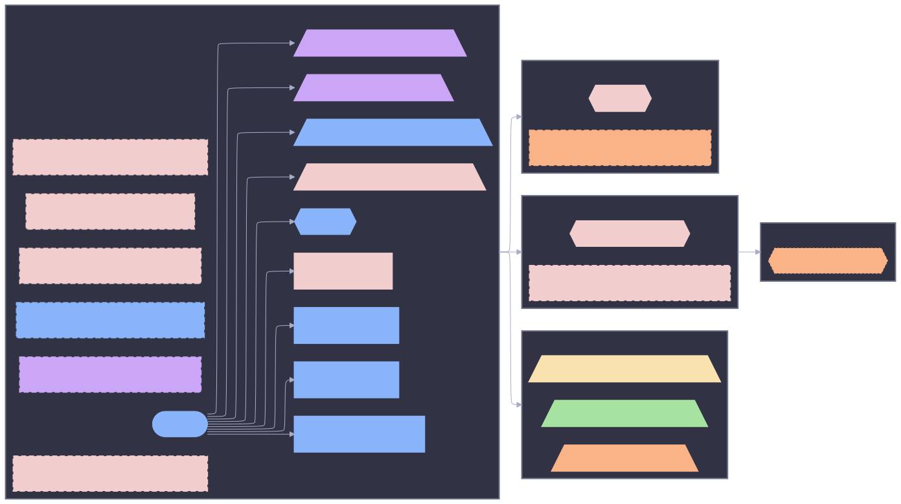

# Aspect Hierarchy: server

```mermaid
%%{init: {"elk":{"mergeEdges":true,"nodePlacementStrategy":"BRANDES_KOEPF"},"flowchart":{"wrappingWidth":600},"layout":"elk","theme":"base","themeVariables":{"activationBkgColor":"#313244","activationBorderColor":"#6c7086","actorBkg":"#313244","actorBorder":"#a6adc8","actorLineColor":"#a6adc8","actorTextColor":"#cdd6f4","background":"#1e1e2e","classText":"#cdd6f4","clusterBkg":"#313244","clusterBorder":"#6c7086","edgeLabelBackground":"#1e1e2e","labelBoxBkgColor":"#313244","labelBoxBorderColor":"#a6adc8","labelTextColor":"#cdd6f4","lineColor":"#a6adc8","loopTextColor":"#cdd6f4","mainBkg":"#313244","nodeBkg":"#313244","nodeBorder":"#a6adc8","nodeTextColor":"#cdd6f4","noteBkgColor":"#313244","noteBorderColor":"#6c7086","noteTextColor":"#cdd6f4","pie1":"#f38ba8","pie2":"#fab387","pie3":"#f9e2af","pie4":"#a6e3a1","pie5":"#94e2d5","pie6":"#89b4fa","pie7":"#cba6f7","pie8":"#f2cdcd","pieLegendTextColor":"#cdd6f4","pieOuterStrokeColor":"#6c7086","pieSectionTextColor":"#cdd6f4","pieStrokeColor":"#6c7086","pieTitleTextColor":"#cdd6f4","primaryBorderColor":"#a6adc8","primaryColor":"#313244","primaryTextColor":"#cdd6f4","secondBkg":"#313244","secondaryBorderColor":"#6c7086","secondaryColor":"#313244","secondaryTextColor":"#cdd6f4","sequenceNumberColor":"#1e1e2e","signalColor":"#a6adc8","signalTextColor":"#cdd6f4","tertiaryBorderColor":"#6c7086","tertiaryColor":"#313244","tertiaryTextColor":"#cdd6f4","textColor":"#cdd6f4","titleColor":"#cdd6f4"}}}%%
graph LR
  server([server]):::root

  subgraph ctx_host["host"]
  monitoring__alerting[/"monitoring/alerting"\]:::monitoring__alerting_c
  backup{{"backup"}}:::backup_c
  virtualization__docker[/"virtualization/docker"\]:::virtualization__docker_c
  monitoring["monitoring"]:::monitoring_c
  networking["networking"]:::networking_c
  monitoring__nginx_exporter[/"monitoring/nginx-exporter"\]:::monitoring__nginx_exporter_c
  monitoring__node_exporter[/"monitoring/node-exporter"\]:::monitoring__node_exporter_c
  policy_host_to_default["policy:host-to-default"]:::policy_host_to_default_c
  policy_host_to_hjem_host["policy:host-to-hjem-host"]:::policy_host_to_hjem_host_c
  policy_host_to_hm_host["policy:host-to-hm-host"]:::policy_host_to_hm_host_c
  policy_host_to_maid_host["policy:host-to-maid-host"]:::policy_host_to_maid_host_c
  policy_host_to_users["policy:host-to-users"]:::policy_host_to_users_c
  policy_host_to_wsl_host["policy:host-to-wsl-host"]:::policy_host_to_wsl_host_c
  tailscale["tailscale"]:::tailscale_c
  virtualization["virtualization"]:::virtualization_c
  server --> monitoring__alerting
  server --> backup
  server --> virtualization__docker
  server --> monitoring
  server --> networking
  server --> monitoring__nginx_exporter
  server --> monitoring__node_exporter
  server --> tailscale
  server --> virtualization
  end
  subgraph ctx_default["default"]
  den__provides__define_user[/"provides/define-user"\]:::den__provides__define_user_c
  den__provides__hostname[/"provides/hostname"\]:::den__provides__hostname_c
  den__provides__mutual_provider[/"provides/mutual-provider"\]:::den__provides__mutual_provider_c

  end
  subgraph ctx_hm_host["hm-host"]
  hm_host__hm_host{{"hm-host/hm-host"}}:::hm_host__hm_host_c
  policy_hm_host_to_hm_user["policy:hm-host-to-hm-user"]:::policy_hm_host_to_hm_user_c

  end
  subgraph ctx_hm_user["hm-user"]
  hm_user__hm_user{{"hm-user/hm-user"}}:::hm_user__hm_user_c

  end
  subgraph ctx_user["user"]
  deploy{{"deploy"}}:::deploy_c
  policy_user_to_default["policy:user-to-default"]:::policy_user_to_default_c

  end

  ctx_host --> ctx_default
  ctx_host --> ctx_hm_host
  ctx_hm_host --> ctx_hm_user
  ctx_host --> ctx_user

  classDef root fill:#89b4fa,stroke:#89b4fa,color:#1e1e2e,font-weight:bold
  classDef monitoring__alerting_c fill:#cba6f7,stroke:#cba6f7,color:#1e1e2e,stroke-width:3px
  classDef backup_c fill:#89b4fa,stroke:#89b4fa,color:#1e1e2e,stroke-width:2px
  classDef den__provides__define_user_c fill:#a6e3a1,stroke:#a6e3a1,color:#1e1e2e,stroke-width:3px
  classDef deploy_c fill:#f2cdcd,stroke:#f2cdcd,color:#1e1e2e,stroke-width:3px
  classDef virtualization__docker_c fill:#cba6f7,stroke:#cba6f7,color:#1e1e2e,stroke-width:3px
  classDef hm_host__hm_host_c fill:#f2cdcd,stroke:#f2cdcd,color:#1e1e2e,stroke-width:2px
  classDef hm_user__hm_user_c fill:#fab387,stroke:#fab387,color:#1e1e2e,stroke-dasharray: 3 3,stroke-width:1px
  classDef den__provides__hostname_c fill:#fab387,stroke:#fab387,color:#1e1e2e,stroke-width:3px
  classDef monitoring_c fill:#89b4fa,stroke:#89b4fa,color:#1e1e2e,stroke-width:3px
  classDef den__provides__mutual_provider_c fill:#f9e2af,stroke:#f9e2af,color:#1e1e2e,stroke-width:3px
  classDef networking_c fill:#89b4fa,stroke:#89b4fa,color:#1e1e2e,stroke-width:3px
  classDef monitoring__nginx_exporter_c fill:#89b4fa,stroke:#89b4fa,color:#1e1e2e,stroke-width:3px
  classDef monitoring__node_exporter_c fill:#f2cdcd,stroke:#f2cdcd,color:#1e1e2e,stroke-width:3px
  classDef policy_hm_host_to_hm_user_c fill:#f2cdcd,stroke:#f2cdcd,color:#1e1e2e,stroke-width:2px,stroke-dasharray: 8 4
  classDef policy_host_to_default_c fill:#cba6f7,stroke:#cba6f7,color:#1e1e2e,stroke-width:2px,stroke-dasharray: 8 4
  classDef policy_host_to_hjem_host_c fill:#f2cdcd,stroke:#f2cdcd,color:#1e1e2e,stroke-width:2px,stroke-dasharray: 8 4
  classDef policy_host_to_hm_host_c fill:#f2cdcd,stroke:#f2cdcd,color:#1e1e2e,stroke-width:2px,stroke-dasharray: 8 4
  classDef policy_host_to_maid_host_c fill:#f2cdcd,stroke:#f2cdcd,color:#1e1e2e,stroke-width:2px,stroke-dasharray: 8 4
  classDef policy_host_to_users_c fill:#f2cdcd,stroke:#f2cdcd,color:#1e1e2e,stroke-width:2px,stroke-dasharray: 8 4
  classDef policy_host_to_wsl_host_c fill:#89b4fa,stroke:#89b4fa,color:#1e1e2e,stroke-width:2px,stroke-dasharray: 8 4
  classDef policy_user_to_default_c fill:#fab387,stroke:#fab387,color:#1e1e2e,stroke-width:2px,stroke-dasharray: 8 4
  classDef server_c fill:#89b4fa,stroke:#89b4fa,color:#1e1e2e,stroke-width:3px
  classDef tailscale_c fill:#f2cdcd,stroke:#f2cdcd,color:#1e1e2e,stroke-width:3px
  classDef virtualization_c fill:#89b4fa,stroke:#89b4fa,color:#1e1e2e,stroke-width:3px
style ctx_host fill:#313244,stroke:#6c7086,stroke-width:2px
style ctx_default fill:#313244,stroke:#6c7086,stroke-width:2px
style ctx_hm_host fill:#313244,stroke:#6c7086,stroke-width:2px
style ctx_hm_user fill:#313244,stroke:#6c7086,stroke-width:2px
style ctx_user fill:#313244,stroke:#6c7086,stroke-width:2px
```
