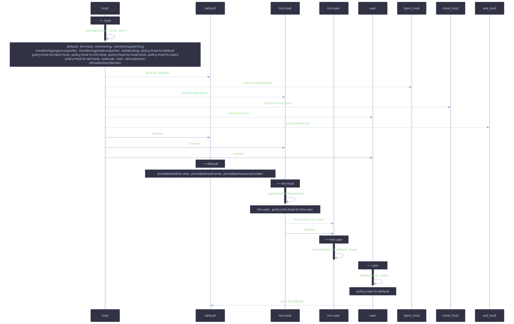
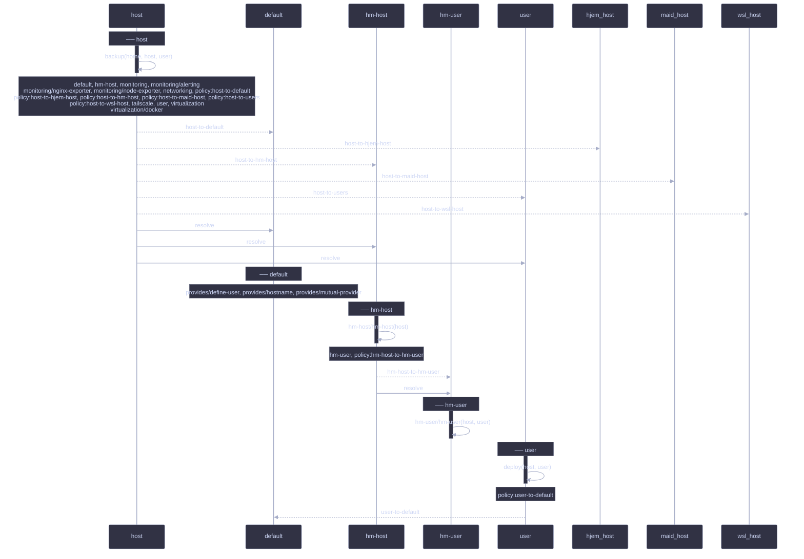

# Stage Sequence (expanded): server

```mermaid
%%{init: {"theme":"base","themeVariables":{"activationBkgColor":"#313244","activationBorderColor":"#6c7086","actorBkg":"#313244","actorBorder":"#a6adc8","actorLineColor":"#a6adc8","actorTextColor":"#cdd6f4","background":"#1e1e2e","classText":"#cdd6f4","clusterBkg":"#313244","clusterBorder":"#6c7086","edgeLabelBackground":"#1e1e2e","labelBoxBkgColor":"#313244","labelBoxBorderColor":"#a6adc8","labelTextColor":"#cdd6f4","lineColor":"#a6adc8","loopTextColor":"#cdd6f4","mainBkg":"#313244","nodeBkg":"#313244","nodeBorder":"#a6adc8","nodeTextColor":"#cdd6f4","noteBkgColor":"#313244","noteBorderColor":"#6c7086","noteTextColor":"#cdd6f4","pie1":"#f38ba8","pie2":"#fab387","pie3":"#f9e2af","pie4":"#a6e3a1","pie5":"#94e2d5","pie6":"#89b4fa","pie7":"#cba6f7","pie8":"#f2cdcd","pieLegendTextColor":"#cdd6f4","pieOuterStrokeColor":"#6c7086","pieSectionTextColor":"#cdd6f4","pieStrokeColor":"#6c7086","pieTitleTextColor":"#cdd6f4","primaryBorderColor":"#a6adc8","primaryColor":"#313244","primaryTextColor":"#cdd6f4","secondBkg":"#313244","secondaryBorderColor":"#6c7086","secondaryColor":"#313244","secondaryTextColor":"#cdd6f4","sequenceNumberColor":"#1e1e2e","signalColor":"#a6adc8","signalTextColor":"#cdd6f4","tertiaryBorderColor":"#6c7086","tertiaryColor":"#313244","tertiaryTextColor":"#cdd6f4","textColor":"#cdd6f4","titleColor":"#cdd6f4"}}}%%
sequenceDiagram
    participant host as host
    participant p_default as default
    participant hm_host as hm-host
    participant hm_user as hm-user
    participant user as user

    Note over host: ── host
    activate host
    host ->> host: backup(home, host, user)
    deactivate host
    Note over host: default, hm-host, monitoring, monitoring/alerting<br/>monitoring/nginx-exporter, monitoring/node-exporter, networking, policy:host-to-default<br/>policy:host-to-hjem-host, policy:host-to-hm-host, policy:host-to-maid-host, policy:host-to-users<br/>policy:host-to-wsl-host, tailscale, user, virtualization<br/>virtualization/docker

    host -->> p_default: host-to-default
    host -->> hjem_host: host-to-hjem-host
    host -->> hm_host: host-to-hm-host
    host -->> maid_host: host-to-maid-host
    host -->> user: host-to-users
    host -->> wsl_host: host-to-wsl-host

    host ->> p_default: resolve
    host ->> hm_host: resolve
    host ->> user: resolve

    Note over p_default: ── default
    Note over p_default: provides/define-user, provides/hostname, provides/mutual-provider

    Note over hm_host: ── hm-host
    activate hm_host
    hm_host ->> hm_host: hm-host/hm-host(host)
    deactivate hm_host
    Note over hm_host: hm-user, policy:hm-host-to-hm-user

    hm_host -->> hm_user: hm-host-to-hm-user

    hm_host ->> hm_user: resolve

    Note over hm_user: ── hm-user
    activate hm_user
    hm_user ->> hm_user: hm-user/hm-user(host, user)
    deactivate hm_user

    Note over user: ── user
    activate user
    user ->> user: deploy(host, user)
    deactivate user
    Note over user: policy:user-to-default

    user -->> p_default: user-to-default
```
