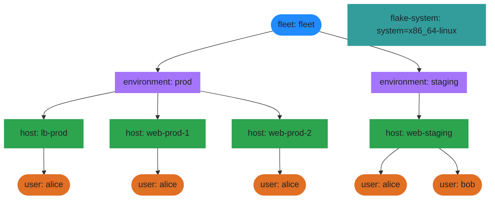
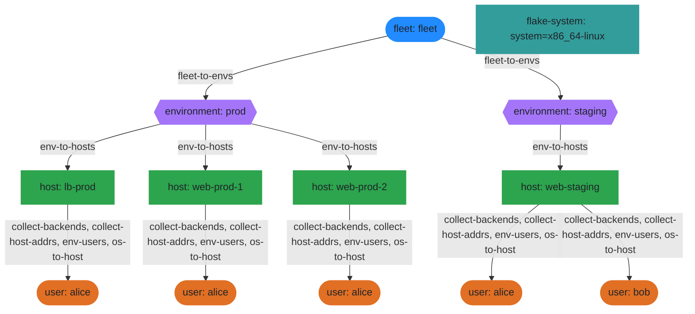
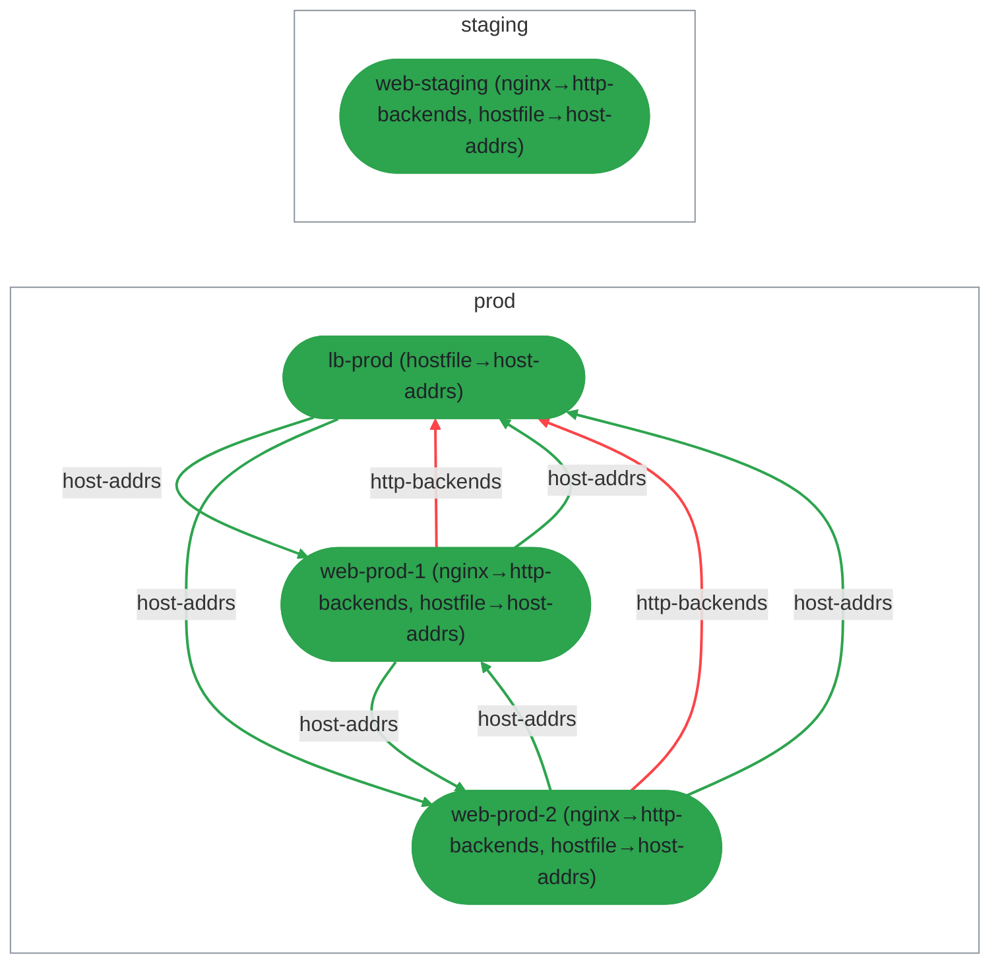
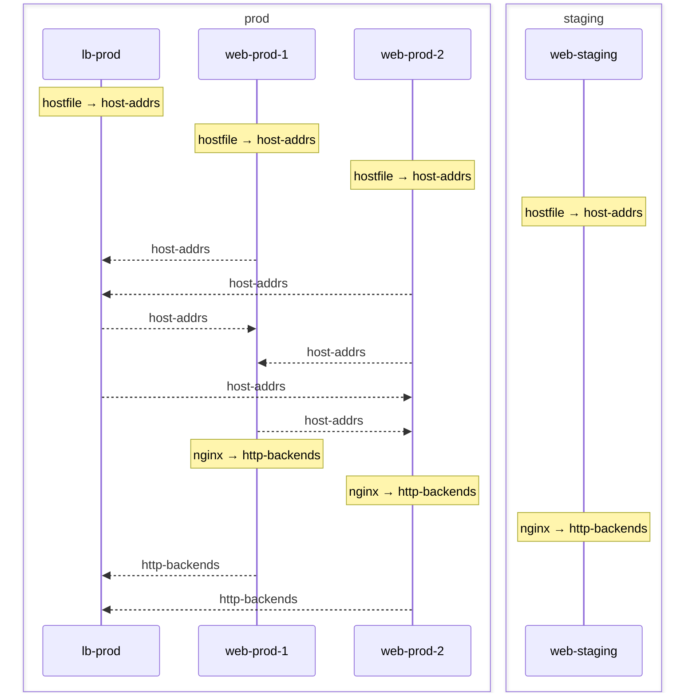
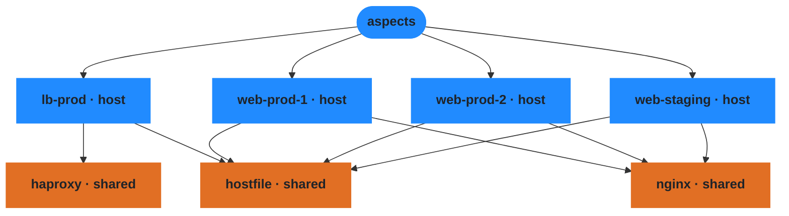

# Fleet Demo

A multi-host NixOS fleet managed by den,
demonstrating environment-based topology, cross-host data sharing, and
policy-driven user access from a centralized registry.

## What This Builds

Four NixOS hosts across two environments:

| Host | Environment | Role |
|------|-------------|------|
| `lb-prod` | prod | HAProxy load balancer — collects backend addresses from peers |
| `web-prod-1` | prod | Nginx web server — emits backend address for load balancing |
| `web-prod-2` | prod | Nginx web server — emits backend address for load balancing |
| `web-staging` | staging | Nginx web server — staging environment |

Each host gets a complete `nixosConfiguration` with networking, service
config, and user accounts — all derived from the same set of aspects and
policies.

## Custom Entity Types

Den has built-in entity kinds (host, user), but this demo defines two
additional entity types entirely in user space — no framework changes
required.

### Environments

`environments.nix` defines a custom `environment` entity type by setting
`den.schema.environment.isEntity = true` and creating a typed option
`fleet.environments` whose submodule imports `den.schema.environment`.
Each environment carries a `domain-name` and is registered as an instance:

```nix
fleet.environments = {
  prod    = { domain-name = "example.com"; };
  staging = { domain-name = "staging.example.com"; };
};
```

The host schema is extended with `environment` and `addr` options via
`den.schema.host.imports`, so every host declares which environment it
belongs to.

### Users as Entities

`users.nix` promotes users to real entities (`den.schema.user.isEntity = true`)
and extends the user schema with `email`, `groups`, and `ssh-keys` options.
The registry type imports `den.schema.user` so each entry is a proper user
entity with `userName`, `classes`, and `aspect` — not a plain attrset.

## Policy-Driven Scope Tree

Den's default policies walk `den.hosts` and create host scopes directly
under `flake-system`. This demo replaces that with a custom scope tree:

```
flake → fleet → environment → host → user
```

This is built by a chain of policies in `policies/fleet.nix`, each firing
at a specific scope level and resolving child entities:

| Policy | Fires at | Resolves | Mechanism |
|--------|----------|----------|-----------|
| `to-fleet` | flake | fleet | `resolve.to "fleet"` — creates a single fleet entity |
| `fleet-to-envs` | fleet | environments | `resolve.to "environment"` — one per `fleet.environments` entry |
| `env-to-hosts` | environment | hosts | `resolve.to "host"` — filters `den.hosts` by matching `host.environment` |
| `env-users` | host | users | `resolve.to "user"` — filters `den.users.registry` by environment group grant |
| `host-users` | host | users | `resolve.to "user"` — filters `den.users.registry` by host-specific group grant |

Each `resolve.to` call creates a named child scope. The entity's context
bindings (`host`, `user`, `environment`, etc.) are available to all aspects
and policies that fire within that scope.

### Disabling Default Policies

Den's core provides built-in policies for common patterns. This demo
disables two of them to take full control of the scope tree:

- **`den.policies.to-os-outputs`** and **`den.policies.to-hm-outputs`** are
  excluded from `den.schema.flake-system` — the fleet policies handle host
  instantiation explicitly via `den.lib.policy.instantiate`, so the default
  per-system output walk is unnecessary.

- **`den.policies.host-to-users`** is excluded from `den.schema.host` — this
  core policy walks `host.users` (inline user definitions) and resolves them
  via `resolve.shared`. Since this demo resolves users from the external
  registry via `resolve.to "user"`, the default policy would be a no-op but
  is excluded for clarity.

## User Registry and Group-Based Access

Users are defined once in `den.users.registry` with identity metadata:

```nix
den.users.registry = {
  alice = {
    email = "alice@example.com";
    groups = [ "admin" ];
    ssh-keys = [ "ssh-ed25519 AAAAC3... alice@workstation" ];
  };
  bob = {
    email = "bob@example.com";
    groups = [ "deploy" ];
    ssh-keys = [ "ssh-ed25519 AAAAC3... bob@laptop" ];
  };
};
```

Access is controlled by `fleet.user-access`, which maps group names to
environments or specific hosts:

```nix
fleet.user-access.by-environment = {
  prod    = { groups = [ "admin" ]; };
  staging = { groups = [ "admin" "deploy" ]; };
};
```

The `env-users` policy fires at each host scope, looks up the access
grant for `host.environment`, and filters the registry for users whose
`groups` intersect the granted set. Each match becomes a `resolve.to "user"`
call, creating a user scope on that host.

| User | Groups | Prod (grants admin) | Staging (grants admin + deploy) |
|------|--------|---------------------|-------------------------------|
| alice | admin | yes | yes |
| bob | deploy | no | yes |

The `host-users` policy provides the same mechanism scoped to individual
hosts via `fleet.user-access.by-host`, allowing per-host overrides on top
of environment-level grants.

The `ssh-keys` battery fires in every user scope and sets
`users.users.${user.userName}.openssh.authorizedKeys.keys` from
`user.ssh-keys`. Because user scopes only exist on hosts where access
was granted, keys are provisioned exactly where they should be — nowhere
else.

## Pipes and Cross-Host Data Sharing

Pipes allow sibling hosts within the same environment to share data
declaratively. They are built on den's quirk system.

### Declaring Pipes

`policies/pipes.nix` declares two quirks as pipes:

```nix
den.quirks.http-backends = {
  description = "HTTP backend addresses for load balancer aggregation";
};
den.quirks.host-addrs = {
  description = "Host address entries for /etc/hosts generation";
};
```

Each host includes `pipe.collect` policies that gather these quirks
from all peers in the same environment:

```nix
den.policies.collect-backends = { host, ... }: [
  (pipe.from "http-backends" [ (pipe.collect ({ host, ... }: true)) ])
];
```

### Emitting and Consuming

Aspects participate in pipes by defining a key matching the quirk name.

**Emitting** — the `nginx` aspect emits an `http-backends` entry:

```nix
den.aspects.nginx = {
  nixos = { ... }: { services.nginx.enable = true; /* ... */ };
  http-backends = { host, ... }: { inherit (host) addr; port = host.httpPort; };
};
```

**Consuming** — the `haproxy` aspect receives the collected list:

```nix
den.aspects.haproxy = {
  nixos = { http-backends, lib, ... }:
    let
      backendLines = lib.imap1 (i: b:
        "  server backend${toString i} ${b.addr}:${toString b.port} check"
      ) http-backends;
    in { /* haproxy config using backendLines */ };
};
```

The `http-backends` argument in the haproxy NixOS module is automatically
populated by `pipe.collect` with entries from all sibling hosts that emit
the `http-backends` quirk. Adding a new web server host to `prod` automatically
adds it to haproxy's backend list — no manual wiring.

The same pattern is used for `host-addrs`: every host emits its IP/hostname
pair, and the `hostfile` aspect collects them to generate `/etc/hosts`.

## Module Layout

```
modules/
  den.nix                     — host definitions, defaults, systems
  environments.nix            — environment entity type + instances (prod, staging)
  users.nix                   — user registry, schema extension, access mappings
  policies/
    fleet.nix                 — scope tree: flake → fleet → env → host → user
    pipes.nix                 — pipe declarations + collection policies
  aspects/
    features/
      haproxy.nix             — HAProxy config from collected http-backends
      nginx.nix               — Nginx server + http-backends emission
      hostfile.nix            — /etc/hosts from collected host-addrs
    hosts/
      lb-prod.nix             — includes haproxy + hostfile
      web-prod-{1,2}.nix      — includes nginx + hostfile
      web-staging.nix         — includes nginx + hostfile
    users/
      ssh-keys.nix            — SSH key provisioning battery
```

## Usage

Build a host configuration:

```bash
nix build .#nixosConfigurations.lb-prod.config.system.build.toplevel
```

Regenerate diagrams:

```bash
nix run .#write-diagrams
```

---

# Diagrams

The following visualizations are generated from the fleet's actual
aspect-resolution pipeline. They show the same topology from different
angles.

## Legend

| Concept | Description |
|---------|-------------|
| **Scope** | A context (node in the scope tree) where aspects and policies evaluate. Scopes inherit parent bindings. |
| **Policy** | A function that fires at a scope and produces effects: resolving child entities, providing config, or collecting data. |
| **Aspect** | A reusable unit of configuration. Aspects emit class modules (NixOS, Home Manager) and quirk data. |
| **Pipe / Quirk** | A data channel between sibling scopes. One aspect emits a quirk, siblings collect it via `pipe.collect`. |
| **Entity** | A named scope with identity: fleet, environment, host, or user. Created by `resolve.to`. |
| **Registry** | A typed attrset of entity definitions. `fleet.environments` and `den.users.registry` are registries. |
| **Battery** | A reusable include that generates per-entity aspect identities (e.g., `define-user`, `ssh-keys`). |

## Scope Topology

The scope tree shows how den organizes entities hierarchically.
Each node is a scope — a context in which aspects and policies are
evaluated. Child scopes inherit their parent's context bindings.

In this fleet, the tree is: flake → fleet → environment → host → user.
Environment and host scopes are created by policies that walk the
`fleet.environments` and `den.hosts` registries. User scopes are
created by access policies that match registry users by group membership.



## Policy Resolution

Policies are functions that run at each scope and produce effects:
resolving child entities, providing configuration, or collecting data.
This diagram shows which policies fire at each scope level and what
they produce.

The arrows show the resolution chain — how `to-fleet` creates the
fleet scope, `fleet-to-envs` fans out environments, `env-to-hosts`
walks hosts, and `env-users`/`host-users` resolve registry users
onto their granted hosts.



## Pipe Flow

Pipes (quirks declared with `pipe.collect`) allow sibling hosts to
share data. Each host that includes an aspect emitting a quirk
contributes to a collected dataset available to peers in the same
environment.

This diagram shows two pipes in the fleet:
- **http-backends** — nginx aspects emit backend addresses, collected
  by the haproxy aspect on `lb-prod` to generate load balancer config.
- **host-addrs** — every host emits its address, collected by the
  hostfile aspect to generate `/etc/hosts` entries.



## Pipe Sequence

A sequence diagram showing the emit → collect flow for each pipe.
Each host that participates in a pipe is shown as a lifeline, with
arrows indicating data flow direction.

> **Note:** The ordering of emitters in this diagram is arbitrary —
> `pipe.collect` gathers all peer emissions as an unordered list.
> The sequence is for visualization only; there is no guaranteed
> evaluation order between sibling hosts.



## Aspect Namespace

The global registry of all declared aspects and their hierarchy.
Each node is an aspect — a reusable unit of configuration that can
be included by hosts or users. Edges show the `includes` relationship:
`lb-prod` includes `haproxy` and `hostfile`, web servers include
`nginx` and `hostfile`.



## Fleet Summary

A tabular overview of the fleet's resolved topology: environment
membership, aspect distribution per host, pipe producer/collector
relationships, and which policies fired during resolution. This is
the same data the diagrams above visualize, presented as text tables
for quick reference or machine consumption.

# Fleet Summary

## Topology

- **2** environments, **4** hosts, **5** users
- Scope chain: flake → flake-system → fleet → user → host → environment
- Trace entries: 245

## Environments

| Environment | Hosts | Host Count | Users |
| ------------- | ------- | ------------ | ------- |
| prod | lb-prod, web-prod-1, web-prod-2 | 3 | 3 |
| staging | web-staging | 1 | 2 |

## Aspects by Host

| Host | Aspect Count | Aspects |
| ------ | -------------- | --------- |
| lb-prod | 5 | haproxy, hostfile, insecure-predicate/os, lb-prod, unfree-predicate/os |
| web-prod-1 | 5 | hostfile, insecure-predicate/os, nginx, unfree-predicate/os, web-prod-1 |
| web-prod-2 | 5 | hostfile, insecure-predicate/os, nginx, unfree-predicate/os, web-prod-2 |
| web-staging | 5 | hostfile, insecure-predicate/os, nginx, unfree-predicate/os, web-staging |

## Pipes

| Pipe | Scope Boundary | Producers | Collectors |
| ------ | ---------------- | ----------- | ------------ |
| host-addrs | environment: prod | lb-prod, web-prod-1, web-prod-2 | lb-prod, web-prod-1, web-prod-2 |
| host-addrs | environment: staging | web-staging | web-staging |
| http-backends | environment: prod | web-prod-1, web-prod-2 | lb-prod |
| http-backends | environment: staging | web-staging | web-staging |

## Policies

| Policy | Fires at |
| -------- | ---------- |
| to-fleet | flake |
| to-systems | flake |
| fleet-to-envs | fleet |
| env-to-hosts | environment |
| collect-backends | host |
| collect-host-addrs | host |
| env-users | host |
| os-to-host | host |
| user-to-host | user |
| to-apps | flake-system |
| to-checks | flake-system |
| to-devShells | flake-system |
| to-legacyPackages | flake-system |
| to-packages | flake-system |
