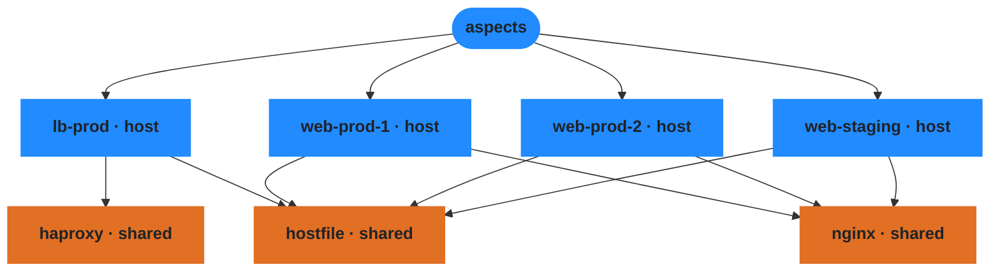

## Aspect Namespace

The global registry of all declared aspects and their hierarchy.
Each node is an aspect — a reusable unit of configuration that can
be included by hosts or users. Edges show the `includes` relationship:
`lb-prod` includes `haproxy` and `hostfile`, web servers include
`nginx` and `hostfile`.

