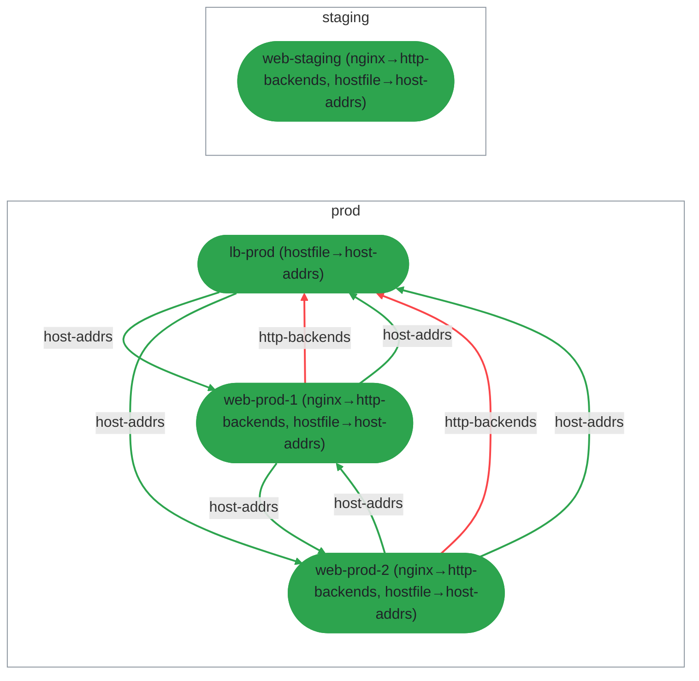

## Pipe Flow

Pipes (quirks declared with `pipe.collect`) allow sibling hosts to
share data. Each host that includes an aspect emitting a quirk
contributes to a collected dataset available to peers in the same
environment.

This diagram shows two pipes in the fleet:
- **http-backends** — nginx aspects emit backend addresses, collected
  by the haproxy aspect on `lb-prod` to generate load balancer config.
- **host-addrs** — every host emits its address, collected by the
  hostfile aspect to generate `/etc/hosts` entries.

