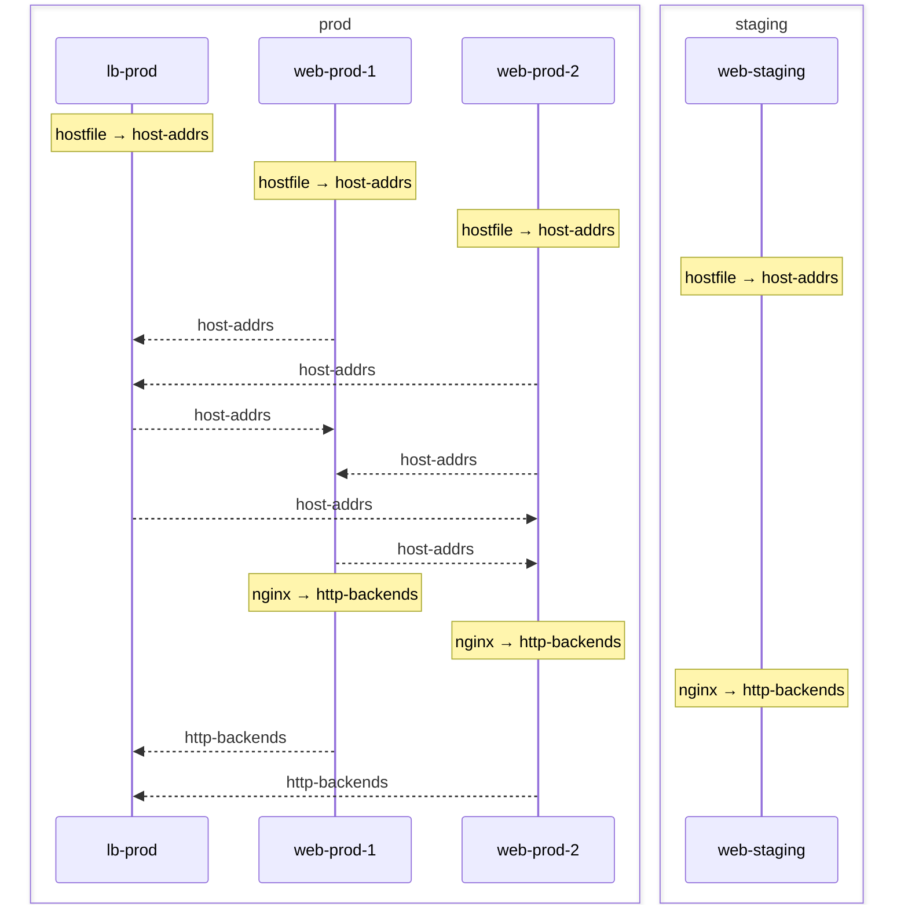

## Pipe Sequence

A sequence diagram showing the emit → collect flow for each pipe.
Each host that participates in a pipe is shown as a lifeline, with
arrows indicating data flow direction.

> **Note:** The ordering of emitters in this diagram is arbitrary —
> `pipe.collect` gathers all peer emissions as an unordered list.
> The sequence is for visualization only; there is no guaranteed
> evaluation order between sibling hosts.

