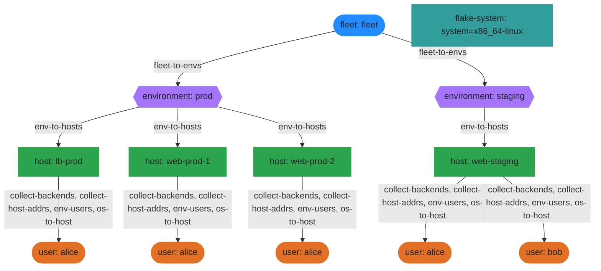

## Policy Resolution

Policies are functions that run at each scope and produce effects:
resolving child entities, providing configuration, or collecting data.
This diagram shows which policies fire at each scope level and what
they produce.

The arrows show the resolution chain — how `to-fleet` creates the
fleet scope, `fleet-to-envs` fans out environments, `env-to-hosts`
walks hosts, and `env-users`/`host-users` resolve registry users
onto their granted hosts.

