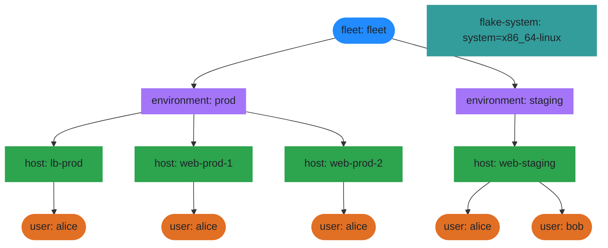

## Scope Topology

The scope tree shows how den organizes entities hierarchically.
Each node is a scope — a context in which aspects and policies are
evaluated. Child scopes inherit their parent's context bindings.

In this fleet, the tree is: flake → fleet → environment → host → user.
Environment and host scopes are created by policies that walk the
`fleet.environments` and `den.hosts` registries. User scopes are
created by access policies that match registry users by group membership.

