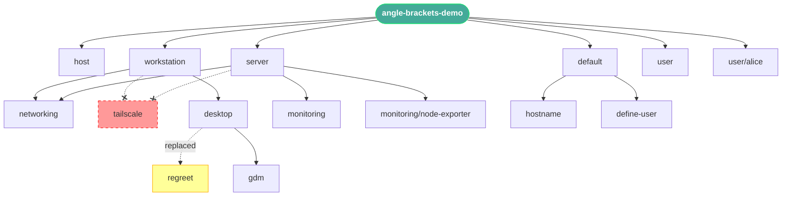
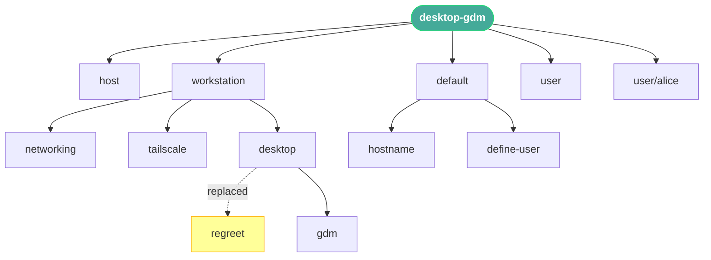
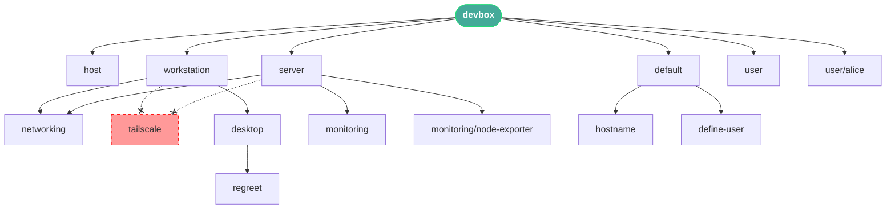
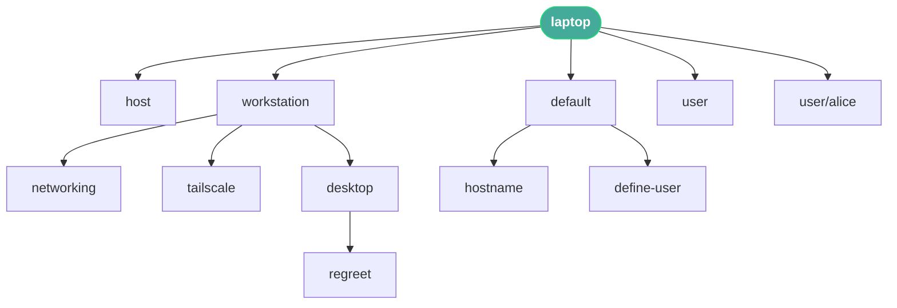
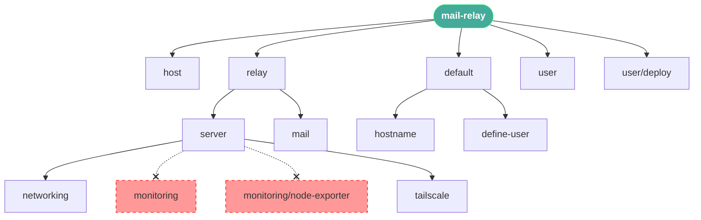
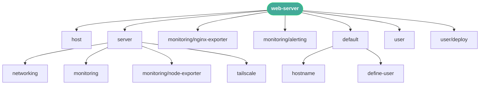

# Showcase: Aspect Transforms, Excludes, and Trace

Demonstrates den's aspect transform system: entity-level excludes,
the `substitute` transformer, and resolution tracing with Mermaid visualization.

## Hosts

| Host          | Role        | Notes                                                              |
| ------------- | ----------- | ------------------------------------------------------------------ |
| `laptop`      | Workstation | Desktop with regreet greeter and tailscale                         |
| `desktop-gdm` | Workstation | Same as laptop; use the substitute transformer to swap the greeter |
| `web-server`  | Server      | Headless with monitoring and tailscale                             |
| `mail-relay`  | Relay       | Server role with monitoring excluded at the host level             |

## Usage

```bash
nix run .#write-files     # writes traces/ and this README
nix build .#trace-laptop  # individual trace derivation
```

## Rendered Traces

Generated by `nix run .#write-files`.

### angle-brackets-demo



### desktop-gdm



### devbox



### laptop



### mail-relay



### web-server



## Notes

Excludes can be declared on host entities (`den.hosts.*.excludes`)
or on aspects (`den.aspects.*.excludes`). Both propagate into
nested includes. See `devbox` for an example of aspect-level
excludes removing `tailscale` from both `workstation` and `server`.

To swap a nested aspect (like a greeter), use the `substitute`
transformer via `resolve'`. See `desktop-gdm` for an example.
