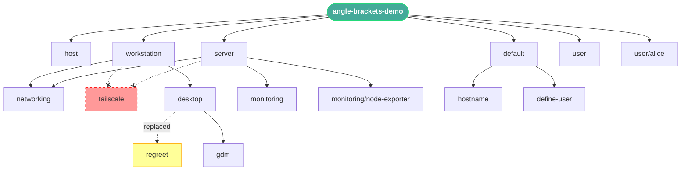

# Aspect Hierarchy: angle-brackets-demo

```mermaid
graph TD
  angle_brackets_demo([angle-brackets-demo]):::host
  host[host]
  workstation[workstation]
  networking[networking]
  tailscale[tailscale]:::excluded
  desktop[desktop]
  regreet[regreet]:::replaced
  gdm[gdm]
  server[server]
  monitoring[monitoring]
  node_exporter[monitoring/node-exporter]
  default[default]
  hostname[hostname]
  define_user[define-user]
  user[user]
  alice[user/alice]

  angle_brackets_demo --> host
  angle_brackets_demo --> workstation
  workstation --> networking
  workstation -.-x tailscale
  workstation --> desktop
  desktop -.->|replaced| regreet
  desktop --> gdm
  angle_brackets_demo --> server
  server --> networking
  server --> monitoring
  server --> node_exporter
  server -.-x tailscale
  angle_brackets_demo --> default
  default --> hostname
  default --> define_user
  angle_brackets_demo --> user
  angle_brackets_demo --> alice

  classDef host fill:#4a9,stroke:#2d7,color:#fff,font-weight:bold
  classDef excluded fill:#f99,stroke:#f00,stroke-dasharray: 5 5
  classDef replaced fill:#ff9,stroke:#fa0
```
