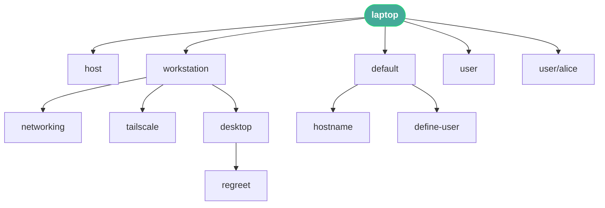

# Aspect Hierarchy: laptop

```mermaid
graph TD
  laptop([laptop]):::host
  host[host]
  workstation[workstation]
  networking[networking]
  tailscale[tailscale]
  desktop[desktop]
  regreet[regreet]
  default[default]
  hostname[hostname]
  define_user[define-user]
  user[user]
  alice[user/alice]

  laptop --> host
  laptop --> workstation
  workstation --> networking
  workstation --> tailscale
  workstation --> desktop
  desktop --> regreet
  laptop --> default
  default --> hostname
  default --> define_user
  laptop --> user
  laptop --> alice

  classDef host fill:#4a9,stroke:#2d7,color:#fff,font-weight:bold
  classDef excluded fill:#f99,stroke:#f00,stroke-dasharray: 5 5
  classDef replaced fill:#ff9,stroke:#fa0
```
