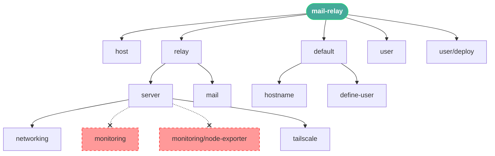

# Aspect Hierarchy: mail-relay

```mermaid
graph TD
  mail_relay([mail-relay]):::host
  host[host]
  relay[relay]
  server[server]
  networking[networking]
  monitoring[monitoring]:::excluded
  node_exporter[monitoring/node-exporter]:::excluded
  tailscale[tailscale]
  mail[mail]
  default[default]
  hostname[hostname]
  define_user[define-user]
  user[user]
  deploy[user/deploy]

  mail_relay --> host
  mail_relay --> relay
  relay --> server
  server --> networking
  server -.-x monitoring
  server -.-x node_exporter
  server --> tailscale
  relay --> mail
  mail_relay --> default
  default --> hostname
  default --> define_user
  mail_relay --> user
  mail_relay --> deploy

  classDef host fill:#4a9,stroke:#2d7,color:#fff,font-weight:bold
  classDef excluded fill:#f99,stroke:#f00,stroke-dasharray: 5 5
  classDef replaced fill:#ff9,stroke:#fa0
```
