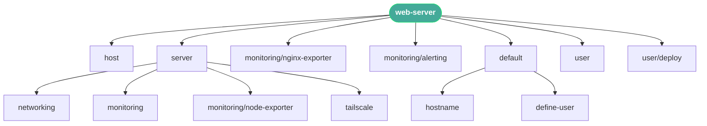

# Aspect Hierarchy: web-server

```mermaid
graph TD
  web_server([web-server]):::host
  host[host]
  server[server]
  networking[networking]
  monitoring[monitoring]
  node_exporter[monitoring/node-exporter]
  tailscale[tailscale]
  nginx_exporter[monitoring/nginx-exporter]
  alerting[monitoring/alerting]
  default[default]
  hostname[hostname]
  define_user[define-user]
  user[user]
  deploy[user/deploy]

  web_server --> host
  web_server --> server
  server --> networking
  server --> monitoring
  server --> node_exporter
  server --> tailscale
  web_server --> nginx_exporter
  web_server --> alerting
  web_server --> default
  default --> hostname
  default --> define_user
  web_server --> user
  web_server --> deploy

  classDef host fill:#4a9,stroke:#2d7,color:#fff,font-weight:bold
  classDef excluded fill:#f99,stroke:#f00,stroke-dasharray: 5 5
  classDef replaced fill:#ff9,stroke:#fa0
```
